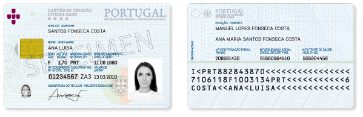
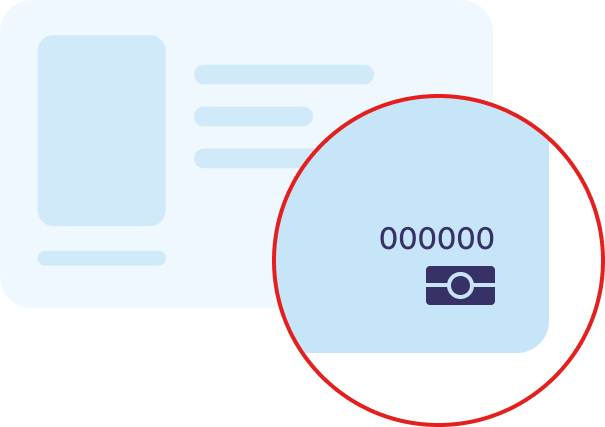

# Manual do SDK – Middleware do Cartão de Cidadão <!-- omit in toc -->

# Versão 3 <!-- omit in toc -->



# Table of Contents <!-- omit in toc -->
- [Introdução](#introdução)
- [Abreviaturas e acrónimos](#abreviaturas-e-acrónimos)
- [Novidades](#novidades)
- [Instalação](#instalação)
  - [Sistemas Operativos suportados](#sistemas-operativos-suportados)
  - [Linguagens de programação](#linguagens-de-programação)
  - [Compiladores](#compiladores)
  - [Instalação do SDK](#instalação-do-sdk)
    - [Windows](#windows)
    - [Linux](#linux)
    - [MacOS](#macos)
- [Procedimentos](#procedimentos)
  - [Pré-condições](#pré-condições)
  - [Inicialização / Finalização do SDK](#inicialização--finalização-do-sdk)
  - [Configurar modo de teste](#configurar-modo-de-teste)
  - [Acesso ao *smartcard* Cartão de Cidadão](#acesso-ao-smartcard-cartão-de-cidadão)
    - [Eventos de inserção / remoção de cartões](#eventos-de-inserção--remoção-de-cartões)
    - [Acesso Contactless](#acesso-contactless)
  - [Dados pessoais do cidadão](#dados-pessoais-do-cidadão)
    - [Obtenção da Identificação](#obtenção-da-identificação)
    - [Obtenção da fotografia](#obtenção-da-fotografia)
    - [Obtenção da morada](#obtenção-da-morada)
    - [Leitura e escrita das notas pessoais](#leitura-e-escrita-das-notas-pessoais)
    - [Leitura dos dados de identidade do Cidadão e da Morada](#leitura-dos-dados-de-identidade-do-cidadão-e-da-morada)
    - [Obtenção dos dados do cartão em formato XML](#obtenção-dos-dados-do-cartão-em-formato-xml)
  - [PINs](#pins)
    - [Verificação e alteração do PIN](#verificação-e-alteração-do-pin)
  - [Assinatura Digital](#assinatura-digital)
    - [Formato XML Advanced Electronic Signatures (XAdES)](#formato-xml-advanced-electronic-signatures-xades)
    - [Adicionar uma assinatura (XAdES) a um pacote ASiC](#adicionar-uma-assinatura-xades-a-um-pacote-asic)
    - [Ficheiros PDF](#ficheiros-pdf)
    - [Assinatura de vários documentos PDF com uma única introdução de PIN](#assinatura-de-vários-documentos-pdf-com-uma-única-introdução-de-pin)
    - [Customização do selo de assinatura visível](#customização-do-selo-de-assinatura-visível)
    - [Configurar o servidor de selo temporal](#configurar-o-servidor-de-selo-temporal)
    - [Bloco de dados](#bloco-de-dados)
  - [Certificados digitais](#certificados-digitais)
    - [Leitura dos certificados digitais no cartão de cidadão ou da Chave Móvel Digital](#leitura-dos-certificados-digitais-no-cartão-de-cidadão-ou-da-chave-móvel-digital)
  - [Sessão segura](#sessão-segura)
  - [Leitura de documentos de viagem ICAO](#leitura-de-documentos-de-viagem-ICAO)
- [Atualizações do Middleware](#atualizações-do-middleware)
- [Tratamento de erros](#tratamento-de-erros)
- [API PKCS#11](#api-pkcs11)
- [API MacOS](#api-macos)
- [Compatibilidade com o SDK da versão 1](#compatibilidade-com-o-sdk-da-versão-1)
  - [Métodos removidos](#métodos-removidos)
  - [Diferenças no comportamento de alguns métodos](#diferenças-no-comportamento-de-alguns-métodos)
  - [Códigos de Erro](#códigos-de-erro)
- [Serviços online usados pelo Middleware](#serviços-online-usados-pelo-middleware)

<!--- Content_begin -->

# Introdução

Este documento destina-se a programadores e analistas de sistemas que
tencionam desenvolver soluções informáticas com base no SDK do
middleware versão 3 do Cartão de Cidadão.

Esta versão do SDK disponibiliza a mesma interface (API) que a
disponibilizada na versão 1 e 2 do SDK. Desta forma, pretende-se obter a
retro-compatibilidade com versões anteriores do SDK. Embora a API
anterior continue disponível, esta é desaconselhada pois a nova API
cobre a maior parte dos casos de uso da anterior e tem funcionalidades
novas.

A secção [**Compatibilidade com o SDK da versão 1**](#compatibilidade-com-o-sdk-da-versão-1)
contém informações relativamente à continuação da
compatibilidade com a versão 1, descreve as diferenças comportamentais,
os métodos removidos e os códigos de erro disponíveis.

O SDK do cartão de cidadão consiste num conjunto de bibliotecas
utilizadas no acesso e suporte ao cartão de cidadão. Este SDK foi
desenvolvido em C++, sendo providenciado o suporte a três diferentes
tipos de sistemas operativos de 32/64 bits:

  - Windows;

  - Linux;

  - MacOS;

Através dos exemplos presentes neste documento será possível
desenvolver uma aplicação simples que interaja com o Cartão de
Cidadão.

O desenvolvimento aplicacional utilizando o SDK pode ser realizado em
C++ ou alternativamente em Java ou C\# através de *wrappers*
providenciados com o SDK.

Este manual serve de referência e ilustra alguns exemplos de utilização
do SDK, para obter a documentação completa da API
visite <https://github.com/amagovpt/autenticacao.gov> onde encontrará a
documentação.

Para questões, sugestões ou comentários relativos à utilização do SDK,
entre em contacto através da página:
[Contactos](https://www.autenticacao.gov.pt/contactos?appRedirect=AutenticacaoGovDesktop).

# Abreviaturas e acrónimos

| Acrónimos / abreviaturas | Definição                          |
| ------------------------ | ---------------------------------- |
| API                      | Application Programming Interface  |
| SDK                      | Software Development Kit           |
| PDF                      | Portable Document Format           |
| XML                      | Extensible Markup Language         |
| XAdES                    | XML Advanced Electronic Signatures |
| PAdES                    | PDF Advanced Electronic Signatures |
| PKCS#11                  | Public Key Cryptography Standards #11 - Cryptographic Token Interface |

# Novidades

> **Suporte ao novo Cartão de Cidadão**
>
> Desde a versão 3.12.0 do SDK é suportado o novo Cartão de Cidadão que, como meio de identificação eletrónica, inclui a possibilidade de operações com interface contactless segundo a norma ISO/IEC 14443
> e a utilização do algoritmo ECDSA nas chaves e certificados do cidadão.
>
> É recomendada a consulta da nova secção [Acesso Contactless](#acesso-contactless) e se necessário a configuração do [modo de testes](#configurar-modo-de-teste).

# Instalação

## Sistemas Operativos suportados

  - Sistemas operativos Windows:

      - Windows 7
      - Windows 8/8.1
      - Windows 10
      - Windows 11

  - Distribuições de Linux:

      - Ubuntu: 20.04 e superiores
      - OpenSuse Leap 15.2 e superiores 
      - Fedora 38 e superiores

  - Sistemas operativos Apple MacOS:

     - MacOS High Sierra (10.13) e superiores

## Linguagens de programação

A lista de linguagens de programação suportadas são:

  - C++: Em Windows, Linux e MacOS;
  - Java: Em Windows, Linux e MacOS;
  - C\#: Em Windows, Linux e MacOS;

## Compiladores

A lista de compiladores suportados são:

  - C++:

    - Windows: Visual Studio 2017 (incluindo Visual C++ e .Net Framework 4);
    - Linux: GCC ou LLVM (clang);
    - MacOS: Compilador distribuído pela Apple no pacote *Command Line Tools for XCode* e no *XCode*: LLVM (clang).

  - Java - JDK 8 ou superior

## Instalação do SDK

O SDK é distribuído nos pacotes de instalação Autenticação.gov que incluem também a aplicação GUI para o utilizador final.
Os referidos pacotes de instalação são disponibilizados pela AMA em <https://www.autenticacao.gov.pt/web/guest/cc-aplicacao>

### Windows

Para instalar o SDK basta efectuar o *download* do ficheiro MSI de
instalação e executar.

As bibliotecas C++ (pteidlibCpp.lib e respectivos *header files*), Java
e C\# ficarão disponíveis por defeito em `C:\Program Files\PortugalIdentity Card\sdk\`
ou na directoria seleccionada durante a instalação da aplicação,
neste caso o SDK estará disponível em `{directoria_seleccionada}\sdk\`.

É também possível instalar em Windows apenas os ficheiros necessários à utilização do SDK, excluíndo a aplicação Autenticação.gov.
Para isto deverá utilizar-se uma instalação customizada seleccionando as _opções avançadas_ do instalador ou através do seguinte comando:

* Em sistemas com Windows 10 ou superior: `msiexec /i Autenticacao.gov_Win_*.msi /qn /norestart ADDLOCAL=PteidRuntime,Crypto`
* Em sistemas anteriores ao Windows 10:   `msiexec /i Autenticacao.gov_Win_*.msi /qn /norestart ADDLOCAL=VCRedist,PteidRuntime,Crypto`

### Linux

Para poder usar o sdk no Linux é necessário compilar o código-fonte do projeto e instalar as bibliotecas.

A biblioteca C++ libpteidlib.so ficará
disponível em `/usr/local/lib` e os respectivos C++
*header files* em `/usr/local/include`

O SDK Java ficará disponível em `/usr/local/lib/pteid_jni` 

Deve descarregar o código fonte disponível em <https://github.com/amagovpt/autenticacao.gov>  e seguir as
instruções de compilação que constam do ficheiro README do projeto.

Adicionalmente, se pretender instalar o SDK para .Net 8 ou superior terá de:
1. Assumindo que o comando `dotnet` está disponível no sistema, executar o script `eidmw/eidlibdotnetsdk/generate_cs_linux.sh`
2. Copiar as bibliotecas que foram geradas na pasta `eidmw/lib` com os nomes `libpteidlib_dotnet8+.so` e `pteidlib_dotnet8+.dll` para a pasta `/usr/local/lib`
3. Executar o comando `ldconfig` para atualizar a cache de bibliotecas nativas no sistema

### MacOS

Para instalar o SDK é necessário efectuar o *download* do pacote de
instalação e executar.

O SDK Java ficará disponível em `/usr/local/lib/pteid_jni` .
No que diz respeito ao SDK C++, os
*header files* ficam localizados em `/usr/local/include` e a
biblioteca à qual as aplicações deverão linkar está no
caminho `/usr/local/lib/libpteidlib.dylib` .

O SDK .net ficará disponível em `/usr/local/lib/pteidlib_dotnet8/(arm64/x64)`. Existem 2 versões da DLL `pteidlib_dotnet8+` deverá referenciar a versão adequada ao seu sistema MacOS.

# Procedimentos

## Pré-condições

1\. **C/C++**

  - Windows/Visual Studio.
  - Adicionar a import library **pteidlibCpp.lib** ao projecto.
  - Por forma a conseguir incluir os *header files* do SDK adicionar a
    directoria `C:\Program Files\Portugal Identity Card\sdk` nas
    propriedades do projecto em "C/C++" → "General" →
    "Additional Include Directories".

2\. **Java**

  - Incluir o ficheiro **pteidlibj.jar** como biblioteca no projecto.
  - Em sistemas MacOS ou Linux, adicionar à propriedade de sistema `java.library.path` do projecto/aplicação Java a localização das bibliotecas nativas do SDK: `/usr/local/lib`
  - As classes e métodos de
  compatibilidade com o middleware versão 1.x estão disponíveis no package **pteidlib** enquanto que
  as novas classes estão no *package* **pt.gov.cartaodecidadao**.

3\. **C\#**

  Apenas no Windows, é possivel usar .net framework, com a biblioteca **pteidlib_dotnet.dll**.
  
  Desde a versão 3.13.0 é possível usar .net 8.0 ou superior no Windows, macOS e Linux, com a biblioteca **pteidlib_dotnet8+.dll**.
  - Adicionar a biblioteca **pteidlib_dotnet.dll** ou **pteidlib_dotnet8+.dll** às *references* do
  projecto Visual Studio.
  - As classes e métodos de compatibilidade estão no namespace **eidpt**
  enquanto que as novas classes estão no namespace **pt.portugal.eid**.

## Inicialização / Finalização do SDK

A biblioteca **pteidlib** é inicializada através da invocação do método
**PTEID_initSDK()** (não é contudo obrigatório efectuar a inicialização). 
A finalização do SDK é obrigatória e deve ser efectuada através da
invocação do método **PTEID_releaseSDK()**, este método
garante que todas as *threads* em segundo plano são terminadas e que a
memória alocada para objectos internos do SDK é libertada.

1.  Exemplo em C++

```c++
#include "eidlib.h"

int main(int argc, char **argv){
    PTEID_InitSDK();
    // (...) - Código restante
    PTEID_ReleaseSDK();
}
```
2.  Exemplo em Java

```java
package pteidsample;
import pt.gov.cartaodecidadao.*;

/* NOTA: o bloco estático seguinte é estritamente necessário uma vez
que é preciso carregar explicitamente a biblioteca JNI que implementa
as funcionalidades do wrapper Java.*/

public class SamplePTEID {
    static {
        try {
            System.loadLibrary("pteidlibj");
        } catch (UnsatisfiedLinkError e) {
            System.err.println("Native code library failed to load. \n" + e);
            System.exit(1);
        }
    }

    public static void main(String[] args) {
        PTEID_ReaderSet.initSDK();
        // (...) - Código restante
        PTEID_ReaderSet.releaseSDK();
    }
}
```

1.  Exemplo em C\#

```c
namespace PTEIDSample {
	class Sample{
		public static void Main(string[] args){
			PTEID_ReaderSet.initSDK();
			// (...) - Código restante
			PTEID_ReaderSet.releaseSDK();
		}
	}
}
```

## Configurar modo de teste

Para alterar as configurações de forma a poder utilizar cartões de teste, deve usar-se o método estático **SetTestMode(*bool* bTestMode)** da classe **PTEID_Config**.

Com o valor do parâmetro *bTestMode* a *true*, os seguintes exemplos ativam o modo de teste.

1.  Exemplo C++

```c++
(...)
PTEID_Config::SetTestMode(true);
```

1.  Exemplo Java

```java
(...)
PTEID_Config.SetTestMode(true);
```

2.  Exemplo C\#

```c
(...)
PTEID_Config.SetTestMode(true);
```

É também necessário adicionar os certificados raíz da PKI de testes em formato DER e extensão ".der" numa diretoria dependente do sistema operativo:
* Windows: `C:\Program Files\Portugal Identity Card\eidstore\certs_test`
* MacOS ou Linux: `/usr/local/share/certs_test`

Os certificados devem ser descarregados da seguinte página: <https://pki2.teste.cartaodecidadao.pt/publico/entidade-certificacao-cc/certificados>


## Acesso ao *smartcard* Cartão de Cidadão

Para aceder ao Cartão de Cidadão programaticamente devem ser efectuados
os seguinte passos:

  - Obter a lista de leitores de *smartcards* no sistema;
  - Seleccionar um leitor de *smartcards*;
  - Verificar se o leitor tem um cartão inserido;
  - Obter o objecto que fornece acesso ao cartão;
  - Obter o objecto que contém os dados pretendidos;

A classe **PTEID_ReaderSet** representa a lista de leitores de cartões
disponíveis no sistema, esta classe disponibiliza uma variedade de
métodos relativos aos leitores de cartões disponíveis. Através da lista
de leitores, um leitor de cartões pode ser seleccionado resultando na
criação de um objecto de contexto especifico ao leitor em questão, a
partir do qual é possível aceder ao cartão.

O objecto de contexto do leitor faculta o acesso ao cartão (se este
estiver presente no leitor). O acesso ao cartão é obtido através do
método **PTEID_ReaderContext.getEIDCard()** que devolve um objecto do tipo
**PTEID_EIDCard**.

1.  Exemplo C++

```c++
PTEID_ReaderSet& readerSet = PTEID_ReaderSet::instance();
for( int i=0; i < readerSet.readerCount(); i++){
  PTEID_ReaderContext& context = readerSet.getReaderByNum(i);
  if (context.isCardPresent()){
    PTEID_EIDCard &card = context.getEIDCard();
    (...)
  }
}
```

1.  Exemplo Java

```java
PTEID_EIDCard card;
PTEID_ReaderContext context;
PTEID_ReaderSet readerSet;
readerSet = PTEID_ReaderSet.instance();
for( int i=0; i < readerSet.readerCount(); i++){
	context = readerSet.getReaderByNum(i);
	if (context.isCardPresent()){
		card = context.getEIDCard();
		(...)
	}
}
```

2.  Exemplo C\#

```c
PTEID_EIDCard card;
PTEID_ReaderContext context;
PTEID_ReaderSet readerSet;
readerSet = PTEID_ReaderSet.instance();
for( int i=0; i < readerSet.readerCount(); i++){
	context = readerSet.getReaderByNum(i);
	if (context.isCardPresent()){
		card = context.getEIDCard();
		(...)
	}
}
```

**Nota:** Uma forma rápida de obter um objecto de contexto será utilizar
o método **getReader()**. Este método devolve o objecto de contexto do
primeiro leitor com cartão que for encontrado no sistema.
Alternativamente caso não existam cartões inseridos devolverá o primeiro
leitor que encontrar no sistema.

  - C++

    `PTEID_ReaderContext &readerContext = PTEID_ReaderSet.instance().getReader();`

  - Java

    `PTEID_ReaderContext readerContext = PTEID_ReaderSet.instance().getReader();`

  - C\#

    `PTEID_ReaderContext readerContext = PTEID_ReaderSet.instance().getReader();`

### Eventos de inserção / remoção de cartões

O SDK oferece uma forma de obter notificações dos eventos de cartão
inserido e removido através de uma função *callback* definida pela
aplicação.
Para tal é necessário invocar o método **SetEventCallback()** no objecto
**PTEID_ReaderContext** associado ao leitor que se pretende monitorizar.

A função de *callback* definida deve ter a seguinte assinatura em C++:

`void callback (long lRet, unsigned long ulState, void *callbackData)`

O parâmetro *ulState* é a combinação de dois valores:

1. contador de eventos no leitor em causa
2. flag que indica se foi inserido ou removido um cartão

O parâmetro *lRet* é um código de erro que em caso de sucesso no acesso
ao leitor terá sempre o valor 0.

O parâmetro *callbackData* é uma referência/ponteiro para o objecto que
terá sido associado ao *callback* através do segundo argumento do método **SetEventCallback()**.

1. Exemplo Java:

```java
class CardEventsCallback implements Callback {
	   @Override
      public void getEvent(long lRet, long ulState, Object callbackData) {
         int cardState = (int)ulState & 0x0000FFFF;
         int eventCounter = ((int)ulState) >> 16;

         System.err.println("DEBUG: Card Event:" +
                   " cardState: "+cardState + " Event Counter: "+ eventCounter);
         if ((cardState & 0x20) != 0)
         {
            System.out.println("Card inserted");
         }
         else {
              System.out.println("Card removed");
         }
      }
}

PTEID_ReaderSet readerSet = PTEID_ReaderSet.instance();
PTEID_ReaderContext context = readerSet.getReader();
long callbackId = context.SetEventCallback(new CardEventsCallback(), null);
(...)
context.StopEventCallback(callbackId);
```

2. Exemplo C\#:

```c
public static void CardEventsCallback(int lRet, uint ulState, IntPtr callbackData) {

	uint cardState = ulState & 0x0000FFFF;
       uint eventCounter = (ulState) >> 16;

       Console.WriteLine("DEBUG: Card Event: cardState: {1} Event Counter: {2}",
                         cardState,
                         eventCounter);

       if ((cardState & 0x20) != 0) {
             Console.WriteLine("Card inserted");
       }
       else {
             Console.WriteLine("Card removed");
       }
   }

   PTEID_ReaderSet readerSet = PTEID_ReaderSet.instance();
   IntPtr callbackData = (IntPtr)0;

   PTEID_ReaderContext context = readerSet.getReader();
   context.SetEventCallback(CardEventsCallback, callbackData);
```
### Acesso Contactless

**Importante**: Funcionalidade disponível desde a versão 3.12.0 do Middleware

A utilização do novo Cartão de Cidadão em interface contactless está protegida de acessos não autorizados através do protocolo de autenticação PACE.
Este protocolo está descrito no Documento 9303 parte 11 da ICAO (International Civil Aviation Organization) na secção 8.2.
Este documento pode ser consultado em [ICAO 9303-11](https://www.icao.int/publications/documents/9303_p11_cons_en.pdf)

Para usar a interface contactless do novo Cartão de Cidadão é necessário:
1. Obter o tipo de interface de comunicação e o tipo de cartão após verificar a sua presença no leitor. Estas informações podem ser obtidas atraves das funções `PTEID_ReaderContext.getCardContactInterface()` e `PTEID_ReaderContext.getCardType()`.
2. Se o tipo de cartão for `PTEID_CardType.PTEID_CARDTYPE_IAS5` e a interface de contacto for `PTEID_CardContactInterface.PTEID_CARD_CONTACTLESS` é necessário pedir o código CAN ao utilizador e depois usar esse CAN para a realizar a autenticação PACE através da função `PTEID_EIDCARD.initPaceAuthentication(secret,length,secretType)`.

**Notas:**
* O CAN (card access number) é o código de 6 dígitos que se encontra no canto inferior direito dos novos Cartões de Cidadão. 
* O CAN não bloqueia após 3 tentativas erradas tal como os PINs, no entanto este mecanismo de autenticação tem proteção no chip contra ataques de força bruta. 
* A classe PTEID_PACE_ERROR é usada para o tratamento de erros relacionados com a autenticação PACE. Cada objeto PTEID_PACE_ERROR contém uma mensagem e código de erro associado. Por exemplo, o código de erro EIDMW_PACE_ERR_BAD_TOKEN corresponde a introdução do CAN errado.

 Exemplo Java:
```java
    PTEID_CardType cardType = null;
    PTEID_CardContactInterface contactInterface = null;

    if(readerContext.isCardPresent()){
        contactInterface = readerContext.getCardContactInterface();
        cardType = readerContext.getCardType();
        System.out.println("Contact Interface:" + (contactInterface == PTEID_CardContactInterface.PTEID_CARD_CONTACTLESS ? "CONTACTLESS" : "CONTACT"));
    }

    eidCard = readerContext.getEIDCard();

    if (contactInterface == PTEID_CardContactInterface.PTEID_CARD_CONTACTLESS && cardType ==  PTEID_CardType.PTEID_CARDTYPE_IAS5){
        try{
          final String can = ...
          eidCard.initPaceAuthentication(can, can.length(),  PTEID_CardPaceSecretType.PTEID_CARD_SECRET_CAN);
        }
        catch(PTEID_PACE_ERROR ex){
          System.out.println("Caught exception during PACE Authentication. Error: " + ex.GetMessage());
          if(ex.GetError() == pteidlibJava_WrapperConstants.EIDMW_PACE_ERR_BAD_TOKEN) {
              System.out.println("Inseriu o CAN errado.");
          }
        }
    }

```

## Dados pessoais do cidadão

Os dados do cidadão e do cartão estão armazenados no cartão em múltiplos
ficheiros. Destacam-se os seguintes ficheiros:

  - ficheiro de identificação - contém os dados do cidadão/cartão
    impressos nas faces do cartão, incluindo a foto.
  - ficheiro de morada – contém a morada do cidadão, este ficheiro é
    de acesso condicionado.
  - ficheiros de certificados do cidadão – contêm os certificados de
    assinatura e autenticação do cidadão.
  - ficheiros de certificados CA's.
  - ficheiro de notas pessoais – é um ficheiro de leitura livre e de
    escrita condicionada onde o cidadão pode colocar até 1000 *bytes*.

### Obtenção da Identificação

Para obter o conteúdo do ficheiro de identificação,
o método **PTEID_EIDCard.getID()** deverá ser utilizado.

1.  Exemplo C++

```c++
(...)
PTEID_EIDCard& card = context.getEIDCard();
PTEID_EId& eid = card.getID();

std::string nome = eid.getGivenName();
std::string nrCC = eid.getDocumentNumber();
(...)
```

2.  Exemplo Java

```java
(...)
PTEID_EIDCard card = context.getEIDCard();
PTEID_EId eid = card.getID();

String nome = eid.getGivenName();
String nrCC = eid.getDocumentNumber();
(...)
```

3.  Exemplo C\#

```c
(...)
PTEID_EIDCard card = context.getEIDCard();
PTEID_EId eid = card.getID();

string nome = eid.getGivenName();
string nrCC = eid.getDocumentNumber();
(...)
```

### Obtenção da fotografia

A fotografia do cidadão está guardada no CC no formato
JPEG2000 mas o SDK disponibiliza a fotografia no formato original e alternativamente em
formato PNG.

1.  Exemplo C++

```c++
(...)
PTEID_EIDCard& card = context.getEIDCard();
PTEID_EId& eid = card.getID();
PTEID_Photo& photoObj = eid.getPhotoObj();
PTEID_ByteArray& praw = photoObj.getphotoRAW();	// formato JPEG2000
PTEID_ByteArray& ppng = photoObj.getphoto();	  // formato PNG
```

2.  Exemplo Java

```java
(...)
PTEID_EIDCard card = context.getEIDCard();
PTEID_EId eid = card.getID();
PTEID_Photo photoObj = eid.getPhotoObj();
PTEID_ByteArray praw = photoObj.getphotoRAW();	// formato JPEG2000
PTEID_ByteArray ppng = photoObj.getphoto();	    // formato PNG
```

3.  Exemplo C\#

```c
(...)
PTEID_EIDCard card = context.getEIDCard();
PTEID_EId eid = card.getID();
PTEID_Photo photoObj = eid.getPhotoObj();
PTEID_ByteArray praw = photoObj.getphotoRAW();	// formato JPEG2000
PTEID_ByteArray ppng = photoObj.getphoto();	    // formato PNG
(...)
```

### Obtenção da morada

O ficheiro da morada só pode ser lido após a verificação do pin da
morada correcto.

Para obter os dados da morada deverá ser utilizado o método **PTEID_EIDCard.getAddr()**.

**Importante**: Desde a versão 3.9.0 do Middleware a morada do CC é lida a partir dos serviços centrais
o que implica ligação à Internet funcional para a utilização da classe `PTEID_Address` para além da presença do cartão no leitor. É por isso necessário garantir que não existe *firewall* ou outro *software* na rede local que impeça a ligação ao endereço `morada.cartaodecidadao.pt` no porto 443.

Existem a partir da referida versão novos códigos de erro relacionados com a utilização deste serviço online e que seguidamente são descritos:

| Constante associada ao código de erro |                    Descrição                                          |
| ------------------------------------- | --------------------------------------------------------------------- |
|  `EIDMW_REMOTEADDR_CONNECTION_ERROR`  | Erro de ligação ao serviço devido a falha de rede ou do handshake TLS |
|  `EIDMW_REMOTEADDR_SERVER_ERROR`      | Erro retornado pelo serviço de leitura de morada   |
|  `EIDMW_REMOTEADDR_CONNECTION_TIMEOUT`| Timeout na obtenção de resposta do serviço         |
|  `EIDMW_REMOTEADDR_SMARTCARD_ERROR`   | Erro gerado pelo smartcard no processo de leitura de morada online |
|  `EIDMW_REMOTEADDR_UNKNOWN_ERROR`     | Erro inesperado no processo de leitura de morada online            |

Para mais informação sobre tratamento de erros gerados pelo SDK ver a secção [**Tratamento de Erros**](#tratamento-de-erros).


1.  Exemplo C++

```c++
// (...) - Inicialização 

PTEID_EIDCard& eidCard = PTEID_ReaderSet::instance().getReader().getEIDCard();
unsigned long triesLeft;

PTEID_Pins& pins = eidCard.getPins();
PTEID_Pin& pin = pins.getPinByPinRef(PTEID_Pin::ADDR_PIN); //ADDR_PIN - Código de Morada

if (pin.verifyPin("", triesLeft, true)){
    PTEID_Address& address = eidCard.getAddr();

    std::cout << "Country:                        " << address.getCountryCode() << std::endl;
    // (...) - Código restante
    std::cout << "Postal Locality:                " << address.getPostalLocality() << std::endl;
}  

// (...) - Finalização
```

2.  Exemplo Java

```java
// (...) - Inicialização 

PTEID_EIDCard eidCard = PTEID_ReaderSet.instance().getReader().getEIDCard();
PTEID_ulwrapper triesLeft = new PTEID_ulwrapper(-1);

PTEID_Pins pins = eidCard.getPins();
PTEID_Pin pin = pins.getPinByPinRef(PTEID_Pin.ADDR_PIN); //ADDR_PIN - Código de Morada

if (pin.verifyPin("", triesLeft, true)){
    PTEID_Address address = eidCard.getAddr();

    System.out.println("Country:                        " + address.getCountryCode());
    // (...) - Código restante
    System.out.println("Postal Locality:                " + address.getPostalLocality());
}

// (...) - Finalização 
```

3.  Exemplo C\#

```c
// (...) - Inicialização 

PTEID_EIDCard eidCard = PTEID_ReaderSet.instance().getReader().getEIDCard();
uint triesLeft = uint.MaxValue;

PTEID_Pins pins = eidCard.getPins();
PTEID_Pin pin = pins.getPinByPinRef(PTEID_Pin.ADDR_PIN); //ADDR_PIN - Código de Morada

if (pin.verifyPin("", ref triesLeft, true)){
    PTEID_Address address = eidCard.getAddr();

    System.out.println("Country:                        " + address.getCountryCode());
    // (...) - Código restante
    System.out.println("Postal Locality:                " + address.getPostalLocality());
}

// (...) - Finalização 
```

### Leitura e escrita das notas pessoais

Para ler as notas pessoais deverá ser utilizado o método
**PTEID_EIDCard.readPersonalNotes()**. Para a escrita de dados deverá ser
utilizado o método **PTEID_EIDCard.writePersonalNotes()**, sendo necessária
a introdução do PIN de autenticação. Neste momento, as notas pessoais
têm um limite de 1000 bytes (codificação recomendada: UTF-8).

1.  Exemplo C++

```c++
// (...) - Inicialização 

PTEID_EIDCard& eidCard = PTEID_ReaderSet::instance().getReader().getEIDCard();

//Ler notas atuais e imprimir na consola
const char *my_notes = eidCard.readPersonalNotes(); 
std::cout << "Current notes: " << my_notes << std::endl;

//Escrever novas notas
std::string notes("We wrote successfully to the card!");
PTEID_ByteArray personalNotes((const unsigned char*) notes.c_str(), notes.size() + 1);
bool ok;

PTEID_Pins& pins = eidCard.getPins();
PTEID_Pin& pin = pins.getPinByPinRef(PTEID_Pin::AUTH_PIN); // AUTH_PIN - Código de Autenticação

ok = eidCard.writePersonalNotes(personalNotes, &pin); 
std::cout << "Was writing successful? " << (ok ? "Yes!" : "No.") << std::endl;

// (...) - Finalização 
```

2.  Exemplo Java

```java
// (...) - Inicialização 

PTEID_EIDCard eidCard = PTEID_ReaderSet.instance().getReader().getEIDCard();

//Ler notas atuais e imprimir na consola
String my_notes = eidCard.readPersonalNotes(); 
System.out.println("Current notes: " + my_notes);

//Escrever novas notas
String notes = "We wrote successfully to the card!";
PTEID_ByteArray personalNotes = new PTEID_ByteArray(notes.getBytes(), notes.getBytes().length);
boolean ok;

PTEID_Pins pins = eidCard.getPins();
PTEID_Pin pin = pins.getPinByPinRef(PTEID_Pin.AUTH_PIN); // AUTH_PIN - Código de Autenticação

ok = eidCard.writePersonalNotes(personalNotes, pin); 
System.out.println("Was writing successful? " + (ok ? "Yes!" : "No."));
 
// (...) - Finalização 
```

3.  Exemplo C\#

```c
// (...) - Inicialização 

PTEID_EIDCard eidCard = PTEID_ReaderSet.instance().getReader().getEIDCard();

//Ler notas atuais e imprimir na consola
String my_notes = eidCard.readPersonalNotes(); 
Console.WriteLine("Current notes: " + my_notes);

//Escrever novas notas
String notes = "We wrote successfully to the card!";

byte[] notesBytes = Encoding.UTF8.GetBytes(notes);
PTEID_ByteArray personalNotes = new PTEID_ByteArray(notesBytes, (uint) notesBytes.Length);
Boolean ok;

PTEID_Pins pins = eidCard.getPins();
PTEID_Pin pin = pins.getPinByPinRef(PTEID_Pin.AUTH_PIN); // AUTH_PIN - Código de Autenticação

ok = eidCard.writePersonalNotes(personalNotes, pin);
Console.WriteLine("Was writing successful? " + (ok ? "Yes!" : "No."));

// (...) - Finalização   
```

### Leitura dos dados de identidade do Cidadão e da Morada

Para os métodos de prefixo "get" das classes **PTEID_EId** e **PTEID_Address** não
apresentamos exemplos já que estes métodos apenas são responsáveis pelas
tarefas de obtenção dos campos específicos dentro dos ficheiros de
identidade e morada e todos eles devolvem resultados do tipo `String` (no
caso de Java/C\#) ou `const char \*` (no caso da biblioteca C++)

**PTEID_Eid**

|         Método             |      Descrição                                                 |
| -------------------------- | ---------------------------------------------------------------|
| getDocumentVersion()       | versão do documento de identificação                           |
| getDocumentType()          | tipo de documento - "Cartão de cidadão"                        |
| getCountry()               | código do país no formato ISO3166                              |
| getGivenName()             | nomes próprios do titular do cartão                            |
| getSurname()               | apelidos do titular do cartão                                  |
| getGender()                | género do titular do cartão                                    |
| getDateOfBirth()           | data de nascimento                                             |
| getNationality()           | nacionalidade (código do país no formato ISO3166 )             |
| getDocumentPAN()           | número PAN do cartão (PAN - primary account number)            |
| getValidityBeginDate()     | data de emissão                                                |
| getValidityEndDate()       | data de validade                                               |
| getLocalofRequest()        | local de pedido do cartão                                      |
| getHeight()                | altura do titular do cartão                                    |
| getDocumentNumber()        | número do cartão de cidadão                                    |
| getCivilianIdNumber()      | número de identificação civil                                  |
| getTaxNo()                 | número de identificação fiscal                                 |
| getSocialSecurityNumber()  | número de segurança social                                     |
| getHealthNumber()          | número de utente de saúde                                      |
| getIssuingEntity()         | entidade emissora do cartão                                    |
| getGivenNameFather()       | nomes próprios do pai do titular do cartão                     |
| getSurnameFather()         | apelidos do pai do titular do cartão                           |
| getGivenNameMother()       | nomes próprios da mãe do titular do cartão                     |
| getSurnameMother()         | apelidos da mãe do titular do cartão                           |
| getParents()               | filiação do titular do cartão no seguinte formato "nome e      |
|                            | apelido do pai \* nome e apelido da mãe"                       |
| getPhotoObj()              | objecto que contém a foto do titular do cartão                 |
| getCardAuthKeyObj()        | chave pública do cartão                                        |
| getValidation()            | indica se cartão se encontra válido                            |
| getMRZ1()                  | primeira linha do campo MRZ                                    |
| getMRZ2()                  | segunda linha do campo MRZ                                     |
| getMRZ3()                  | terceira linha do campo MRZ                                    |
| getAccidentalIndications() | indicações eventuais                                           |

**PTEID_Address**

|       Método          |      Descrição                    |
| --------------------- | --------------------------------- |
| getCountryCode()      | código do país no formato ISO3166 |
| getDistrict()         | nome do distrito                  |
| getDistrictCode()     | código do distrito                |
| getMunicipality()     | nome do município                 |
| getMunicipalityCode() | código do município               |
| getCivilParish()      | nome da freguesia                 |
| getCivilParishCode()  | código da freguesia               |
| getAbbrStreetType()   | abreviatura do tipo de via        |
| getStreetType()       | tipo de via                       |
| getStreetName()       | nome da via                       |
| getAbbrBuildingType() | abreviatura do tipo de edifício   |
| getBuildingType()     | tipo do edifício                  |
| getDoorNo()           | número da entrada                 |
| getFloor()            | número do piso                    |
| getSide()             | lado                              |
| getLocality()         | localidade                        |
| getPlace()            | lugar                             |
| getZip4()             | código postal                     |
| getZip3()             | código postal                     |
| getPostalLocality()   | localidade postal                 |

**PTEID_Address** - Apenas aplicável a moradas estrangeiras

|         Método         |    Descrição  |
| ---------------------- | ------------- |
| getForeignCountry()    | país          |
| getForeignAddress()    | endereço      |
| getForeignCity()       | cidade        |
| getForeignRegion()     | região        |
| getForeignLocality()   | localidade    |
| getForeignPostalCode() | código postal |

**PTEID_Address** - Aplicável a ambas as moradas (nacionais e
estrangeiras)

|            Método         |                          Descrição                             |
| ------------------------- | -------------------------------------------------------------- |
| getGeneratedAddressCode() | código do endereço                                             |
| isNationalAddress()       | booleano que indica se é uma morada nacional                   |

### Obtenção dos dados do cartão em formato XML

Os dados do cidadão existentes no cartão podem ser extraidos em formato
XML. A fotografia é retornada em base-64 no formato aberto PNG. Para
além dos dados do cidadão é possível incluir também a área de notas
pessoais.

1.  Exemplo em C++

```c++
unsigned long triesLeft;
PTEID_EIDCard *card;
(...)
card->getPins().getPinByPinRef(PTEID_Pin::ADDR_PIN).verifyPin("", triesLeft, true);
PTEID_XmlUserRequestedInfo requestedInfo;
requestedInfo.add(XML_CIVIL_PARISH);
(...)
requestedInfo.add(XML_GENDER);
PTEID_CCXML_Doc &ccxml = card.getXmlCCDoc(requestedInfo);
const char * resultXml = ccxml.getCCXML();
```

2.  Exemplo em Java

```java
String resultXml;
PTEID_EIDCard card;
PTEID_ulwrapper triesLeft = new PTEID_ulwrapper(-1);
(...)
card.getPins().getPinByPinRef(PTEID_Pin.ADDR_PIN).verifyPin("", triesLeft, true);
PTEID_XmlUserRequestedInfo requestedInfo = new PTEID_XmlUserRequestedInfo();
requestedInfo.add(XMLUserData.XML_CIVIL_PARISH);
(...)
requestedInfo.add(XMLUserData.XML_GENDER);
PTEID_CCXML_Doc result = idCard.getXmlCCDoc(requestedInfo);
resultXml = result.getCCXML();
```

3.  Exemplo em C\#

```c
string resultXml;
PTEID_EIDCard card;
uint triesLeft;
(...)
card.getPins().getPinByPinRef(PTEID_Pin.ADDR_PIN).verifyPin("", ref triesLeft, true);
PTEID_XmlUserRequestedInfo requestedInfo = new PTEID_XmlUserRequestedInfo();
requestedInfo.add(XMLUserData.XML_CIVIL_PARISH);
(...)
requestedInfo.add(XMLUserData.XML_GENDER);
PTEID_CCXML_Doc result = idCard.getXmlCCDoc(requestedInfo);
resultXml = result.getCCXML();
```

## PINs

### Verificação e alteração do PIN

Para verificação do PIN deverá ser utilizado o método **verifyPin()**. Para
a sua alteração, deverá ser utilizado o método **changePin()**.

1.  Exemplo C++

```c++
PTEID_EIDCard& card;
unsigned long triesLeft;
(...)
PTEID_Pins &pins = card.getPins();
PTEID_Pin &pin = pins.getPinByPinRef(PTEID_Pin.ADDR_PIN);
if (pin.verifyPin("", &triesLeft, true)){
	bool bResult = pin.changePin("","", triesLeft, pin.getLabel());
	if (!bResult && -1 == triesLeft) return;
}
```

2.  Exemplo Java

```java
PTEID_EIDCard card;
PTEID_ulwrapper triesLeft = new PTEID_ulwrapper(-1);
(...)
PTEID_Pins pins = card.getPins();
PTEID_Pin pin = pins.getPinByPinRef(PTEID_Pin.ADDR_PIN);
if (pin.verifyPin("", triesLeft, true)){
	bool bResult = pin.changePin("","", triesLeft, pin.getLabel());
	if (!bResult && -1 == triesLeft) return;
}
```

3.  Exemplo C\#

```c
PTEID_EIDCard card;
uint triesLeft;
(...)
PTEID_Pins pins = card.getPins();
PTEID_Pin pin = pins.getPinByPinRef(PTEID_Pin.ADDR_PIN);
if (pin.verifyPin("", ref triesLeft, true)){
	bool bResult = pin.changePin("","", triesLeft, pin.getLabel());
	if (!bResult && -1 == triesLeft) return;
}
```
**Nota:** Se o primeiro parâmetro do método `verifyPin` for a string vazia, será aberta uma janela para introdução do PIN. Caso contrário, o primeiro parâmetro deverá ser a string com o PIN a ser verificado. Esta lógica aplica-se de modo análogo aos dois primeiros argumentos do método `changePin`.


## Assinatura Digital

A funcionalidade de assinatura está disponível para classes que implementam `PTEID_SigningDevice` como `PTEID_EIDCard` e `PTEID_CMDSignatureClient`. 

Ao assinar com `PTEID_EIDCard` será apresentada uma janela para introdução do PIN de assinatura do cartão inserido no leitor. 

Com `PTEID_CMDSignatureClient`, é apresentada uma janela para introdução do número de telemóvel e PIN associados à conta da Chave Móvel Digital do assinante seguido de uma janela para introdução do código de segurança enviado para o telemóvel. Antes de utilizar os serviços da CMD deve configurar as credenciais de acesso ao serviço através do método `setCredentials`. Para mais informação, deverá contactar a AMA através da página: [Contactos](https://www.autenticacao.gov.pt/contactos?appRedirect=AutenticacaoGovDesktop).

Para obter um `PTEID_SigningDevice` deve utilizar a classe `PTEID_SigningDeviceFactory`. Na chamada ao método `getSigningDevice` pode indicar qual dos tipos de `PTEID_SigningDevice` deseja obter. Se ativar múltiplas opções, será apresentada uma janela ao utilizador para escolher o método de assinatura: Cartão de Cidadão ou Chave Móvel Digital.

**NOTA:** As classes `PTEID_CMDSignatureClient`, `PTEID_SigningDevice` e `PTEID_SigningDeviceFactory` estão disponíveis a partir da versão 3.8.0 do Middleware. Em versões anteriores existiam apenas os métodos de assinatura da classe `PTEID_EIDCard` para assinar com Cartão de Cidadão.

1.  Exemplo C++

```c++
(...)
// Necessário para chamadas com PTEID_CMDSignatureClient
PTEID_CMDSignatureClient::setCredentials(BASIC_AUTH_USER, BASIC_AUTH_PASSWORD, BASIC_AUTH_APPID);
(...)
// Neste exemplo ambas as opções estão ativas e, por isso, será apresentada uma janela
PTEID_SigningDeviceFactory &factory = PTEID_SigningDeviceFactory::instance();
PTEID_SigningDevice &signingDev = factory.getSigningDevice(true, true);
(...)
```
2.  Exemplo Java

```java
(...)
// Necessário para chamadas com PTEID_CMDSignatureClient
PTEID_CMDSignatureClient.setCredentials(BASIC_AUTH_USER, BASIC_AUTH_PASSWORD, BASIC_AUTH_APPID);
(...)
// Neste exemplo ambas as opções estão ativas e, por isso, será apresentada uma janela
PTEID_SigningDeviceFactory factory = PTEID_SigningDeviceFactory.instance();
PTEID_SigningDevice signingDev = factory.getSigningDevice(true, true);
(...)
```

3.  Exemplo C#

```csharp
(...)
// Necessário para chamadas com PTEID_CMDSignatureClient
PTEID_CMDSignatureClient.setCredentials(BASIC_AUTH_USER, BASIC_AUTH_PASSWORD, BASIC_AUTH_APPID);
(...)
// Neste exemplo ambas as opções estão ativas e, por isso, será apresentada uma janela
PTEID_SigningDeviceFactory factory = PTEID_SigningDeviceFactory.instance();
PTEID_SigningDevice signingDev = factory.getSigningDevice(true, true);
(...)
```

**NOTA:** Para utilizar o serviço de assinatura com CMD em pré-produção, é necessária uma configuração no SDK se pretendemos utilizar outro ambiente da CMD. 

```
PTEID_Config config = new PTEID_Config(PTEID_Param.PTEID_PARAM_CMD_HOST);
config.setString("preprod.cmd.autenticacao.gov.pt");
```
Esta configuração através da classe **PTEID_Config** fica guardada localmente, o que significa que numa próxima execução no mesmo computador vai utilizar o **CMD_HOST** de pré-produção mesmo se retirar a chamada **PTEID_Config.setString()**.

A configuração local que deve rever em caso de dúvida fica guardada em **Windows** no registry em **HKEY_CURRENT_USER\SOFTWARE\PTEID\general** e em **MacOS** no ficheiro **$HOME/Library/Preferences/pteid.conf** 

### Formato XML Advanced Electronic Signatures (XAdES)

Esta funcionalidade permite assinar um ou múltiplos ficheiros em
qualquer formato utilizando ou não selos temporais.

O método **SignXades** produz um ficheiro .zip que contém os ficheiros assinados e um ficheiro XML
com a assinatura. O formato deste ficheiro .zip segue a
[norma europeia ASIC](https://www.etsi.org/deliver/etsi_ts/102900_102999/102918/01.01.01_60/ts_102918v010101p.pdf)
para *containers* de assinatura.

Será apresentado apenas um exemplo C++ para esta funcionalidade embora os wrappers Java e C\#
contenham exactamente as mesmas classes e métodos necessários **PTEID_SigningDevice.SignXades()**.

1.  Exemplo C++

```c++
const char *ficheiros[] = {"teste/Ficheiro1", "teste/Ficheiro2", "teste/Ficheiro3"};
const char *destino ="teste/ficheiros_assinados.asice";
int n_paths = 3; // tamanho do array de ficheiros

/* perfil da assinatura:
PTEID_LEVEL_BASIC (XAdES-B), PTEID_LEVEL_TIMESTAMP (XAdES-T), PTEID_LEVEL_LTV (XAdES-LTA) */
PTEID_SignatureLevel level = PTEID_LEVEL_BASIC;

// assinar (1 única assinatura para todos os ficheiros)
signingDev.SignXades(destino, ficheiros, n_paths, level);
(...)
```

**Nota:** Alternativamente é possível assinar individualmente cada
ficheiro da seguinte forma:

  - Sem selo temporal (XAdES-B):
    - C++

        `card.SignXadesIndividual( dirDestino, ficheiros, n_paths );`

    - Java/C\#

      `card.SignXadesIndividual( dirDestino, ficheiros, ficheiros.length );`

  - Com selo temporal (XAdES-T):
    - C++

        `card.SignXadesTIndividual( dirDestino, ficheiros, n_paths );`

    - Java/C\#

        `card.SignXadesTIndividual( dirDestino, ficheiros, ficheiros.length );`

  - Para arquivo de longo período temporal (XAdES-LTA):
    - C++

        `card.SignXadesAIndividual( dirDestino, ficheiros, n_paths );`

    - Java/C\#

        `card.SignXadesAIndividual( dirDestino, ficheiros, ficheiros.length );`

O parâmetro **dirDestino** contêm a directoria destino onde serão
colocados os ficheiros assinados.

**Nota 2:** Se for emitida a exceção com código ```EIDMW_TIMESTAMP_ERROR``` durante uma assinatura XAdES-T ou XAdES-LTA, significa que a aplicação do *timestamp* na assinatura falhou ou, no caso dos métodos de assinatura individual, que falhou para pelo menos uma das assinaturas. Neste caso, as assinaturas cujo *timestamping* falhou ficam com nível XAdES-B.

**Nota 3:** De modo semelhante à nota anterior, se for emitida a exceção com código ```EIDMW_LTV_ERROR``` numa assinatura XAdES-LTA, então a aplicação do *timestamp* sobre os dados de revogação não foi corretamente adicionado. Nesse caso, as assinaturas cujo *timestamping* falhou ficam com nível XAdES-T ou XAdES-LT.

### Adicionar uma assinatura (XAdES) a um pacote ASiC

Esta funcionalidade permite adicionar uma assinatura XAdES a um pacote ASiC existente, utilizando 
ou não selos temporais. Esta assinatura cobre todos os ficheiros de *input* incluídos no pacote ASiC.

O método **SignASiC** adiciona um ficheiro XML com a assinatura (XAdES-B/XAdES-T/XAdES-LTA), a um 
pacote ASiC existente, cujo formato siga a [norma europeia ASIC](https://www.etsi.org/deliver/etsi_ts/102900_102999/102918/01.01.01_60/ts_102918v010101p.pdf)
para *containers* de assinatura.  
Este método recebe como primeiro parâmetro o caminho para o pacote ASiC. Como segundo parâmetro o
nível/perfil da assinatura a incluir: XAdES-B (PTEID_LEVEL_BASIC), XAdES-T (PTEID_LEVEL_TIMESTAMP), 
XAdES-LTA (PTEID_LEVEL_LTV).

Será apresentado apenas um exemplo C++ para esta funcionalidade embora os wrappers Java e C\#
contenham exactamente as mesmas classes e métodos necessários **PTEID_SigningDevice.SignASiC()**.

1.  Exemplo C++

```c++
const char *container = "teste/exemplo.asics";
PTEID_SignatureLevel level = PTEID_LEVEL_BASIC;

signingDev.SignASiC(container, level);
(...)
```

### Ficheiros PDF

O SDK fornece métodos para assinatura de ficheiros PDF de acordo com os
standards PAdES (ETSI TS 102 778-1).

As assinaturas produzidas pelas bibliotecas do SDK podem ser validadas
com os referidos produtos da Adobe ou alternativas *opensource* como as
bibliotecas do projeto [Digital Signature Service](https://github.com/esig/dss) da Comissão Europeia ou iText ([http://itextpdf.com](http://itextpdf.com/)).

Os métodos de assinatura de PDF fornecem as seguintes opções:
  - Assinatura de acordo com a especificação dos seguintes perfis:
    - PAdES-B: O nível mais simples para assinaturas de validade limitada à data de validade do certificado de assinatura do CC (até 5 anos ou até 10 anos). Este perfil não inclui selo temporal.
    - PAdES-T: Inclui um *timestamp* que prova o momento em que foi realizada a assinatura.
    - PAdES-LT: Para além dos requisitos do nível PAdES-T, são adicionados os dados necessários para validar o certificado usado para a assinatura digital (respostas OCSP e CRLs).
    - PAdES-LTA: Este nível é recomendado a documentos que estão destinados a serem arquivados por um longo período de tempo. Inclui os requisitos do nível PAdES-LT e, adicionalmente, um *timestamp* que garante a integridade dos dados de validação. Deste modo, é possível provar no futuro que no momento da assinatura o certificado do cartão e respectiva cadeia não estavam revogados ou expirados.
  - Assinatura de vários ficheiros em *batch* (com apenas uma introdução
    de PIN).
  - Inclusão de detalhes adicionais como a localização ou motivo da
    assinatura.
  - Personalização do aspecto da assinatura no documento (página,
    localização na mesma e tamanho da assinatura).

A localização da assinatura, na página do documento a assinar, é definida
a partir do canto superior esquerdo do rectângulo de
assinatura através de coordenadas (x,y) expressas em percentagem da
largura/altura da página em que o ponto (0,0) se situa no canto
superior esquerdo da página. De notar que usando este método existem
localizações que produzem uma assinatura truncada na página já que o
método de assinatura não valida se a localização é válida para o
"selo de assinatura" a apresentar.
Se os valores das coordenadas forem negativos a assinatura fica sem "selo" visível.

Será apresentado apenas um exemplo C++ para esta funcionalidade embora
os wrappers Java e C\# contenham exactamente as mesmas classes e métodos
necessários **PTEID_PdfSignature()** e **PTEID_SigningDevice.SignPDF()**.

Exemplo C++:

```c++
#include "eidlib.h"
(...)
//Ficheiro PDF a assinar
PTEID_PDFSignature signature("/home/user/input.pdf");    

/* Adicionar uma imagem customizada à assinatura visível
   O array de bytes image_data deve conter uma imagem em formato
   JPEG com as dimensões obrigatórias: (351x77 px) */
PTEID_ByteArray jpeg_data(image_data, image_length);
signature.setCustomImage(jpeg_data);

// No caso de se querer o formato pequeno da assinatura
signature.enableSmallSignatureFormat();

/* Configurar o perfil da assinatura:
PAdES-B: PTEID_SignatureLevel::PTEID_LEVEL_BASIC (configurado por defeito)
PAdES-T: PTEID_SignatureLevel::PTEID_LEVEL_TIMESTAMP
PAdES-LT: PTEID_SignatureLevel::PTEID_LEVEL_LT
PAdES-LTA: PTEID_SignatureLevel::PTEID_LEVEL_LTV */
signature.setSignatureLevel(PTEID_SignatureLevel::PTEID_LEVEL_TIMESTAMP);

 //Especificar local da assinatura e motivo
const char * location = "Lisboa, Portugal";
const char * reason = "Concordo com o conteudo do documento";

//Especificar o número da página e a posição nessa mesma página onde a indicação visual da assinatura aparece
int page = 1;
double pos_x = 0.1; //Valores de 0 a 1
double pos_y = 0.1; //Valores de 0 a 1
eidCard.SignPDF(signature, page, pos_x, pos_y, location, reason, "/home/user/output.pdf");
```

**Nota:** Se for emitida a exceção com código ```EIDMW_TIMESTAMP_ERROR``` durante uma assinatura PAdES-T, PAdES-LT ou PAdES-LTA, significa que a aplicação do *timestamp* em uma ou mais assinaturas falhou. Neste caso, as assinaturas cujo *timestamping* falhou ficam com nível PAdES-B.

**Nota 2:** De modo semelhante à nota anterior, se for emitida a exceção com código ```EIDMW_LTV_ERROR``` numa assinatura PAdES-LT ou PAdES-LTA, significa que não foi possível adicionar os dados de revogação ou o selo temporal sobre esses dados. Nesse caso, as assinaturas cujo *timestamping* falhou ficam com nível PAdES-T ou PAdES-LT dependendo se os dados de revogação foram corretamente adicionados.

### Assinatura de vários documentos PDF com uma única introdução de PIN

Esta funcionalidade permite assinar vários documentos PDF introduzindo o PIN
somente uma vez. O selo visual de assinatura será aplicado na mesma página e localização em todos
os documentos, sendo que a localização é especificada tal como na assinatura simples.
Deverá ser utilizado o método **addToBatchSigning()** para construir a lista de documentos a assinar.

Será apresentado apenas um exemplo C++ para esta funcionalidade embora
os wrappers Java e C\# contenham exactamente as mesmas classes e métodos
necessários na classe **PTEID_PDFSignature()**.

Exemplo C++

```c++
#include "eidlib.h"
(...)
PTEID_PDFSignature signature;

//Para realizar uma assinatura em batch adicionar todos os ficheiros usando o seguinte método antes de invocar o signingDev.SignPDF()
signature.addToBatchSigning("File_to_Sign.pdf");
signature.addToBatchSigning("Other_File.pdf");
(...)

 //Especificar local da assinatura e motivo
const char * location = "Lisboa, Portugal";
const char * reason = "Concordo com o conteudo do documento";

//Especificar o número da página e a posição nessa mesma página onde a indicação visual da assinatura aparece
int page = 1;
double pos_x = 0.1; //Valores de 0 a 1
double pos_y = 0.1; //Valores de 0 a 1

//Para uma assinatura em batch, este parâmetro aponta para a directoria de destino
const char * output_folder = "/home/user/signed-documents/";
signingDev.SignPDF(signature,  page, pos_x, pos_y, location, reason, output_folder);
(...)
```

### Customização do selo de assinatura visível

Através do método `setCustomSealSize(width, height)`, é possível alterar as dimensões do selo de assinatura vísivel utilizando o SDK. Para tal, é só necessário chamar o método com as dimensões pretendidas, após inicializar uma instância de `PTEID_PDFSignature`. Este método pode ser chamado para a assinatura de um único ficheiro ou para multi-assinatura.
Exemplo C++

```c++
// (...) - Inicialização

//Inicializar assinatura
PTEID_PDFSignature signature;

// (...) - Adicionar ficheiros e outras configurações (motivo, localização, etc)


//Para definir as dimensões do selo de assinatura é necessário invocar o seguinte método com as dimensões pretendidas. 
signature.setCustomSealSize(200, 200);

// (...) - Assinar e Finalização
```

Exemplo Java

```java
// (...) - Inicialização

PTEID_PDFSignature signature = new PTEID_PDFSignature();

// (...) - Adicionar ficheiros e outras configurações (motivo, localização, etc)

//Para definir as dimensões do selo de assinatura é necessário invocar o seguinte método com as dimensões pretendidas. 
signature.setCustomSealSize(200, 200);

// (...) - Assinar e Finalização
```

Exemplo C#

```c
// (...) - Inicialização

PTEID_PDFSignature signature = new PTEID_PDFSignature();

// (...) - Adicionar ficheiros e outras configurações (motivo, localização, etc)


//Para definir as dimensões do selo de assinatura é necessário invocar o seguinte método com as dimensões pretendidas. 
signature.setCustomSealSize(200, 200);

// (...) - Assinar e Finalização
```

É também possível escolher incluir, ou não, a data de assinatura e o número de identificação civil através da aplicação, no menu `Personalização de Assinatura`, selecionando as respetivas checkboxes, ou através do ficheiro `~/.config/pteid.conf`, modificando o valor de `signature_seal_options`. Estas alterações são depois refletidas no selo da assinatura através do SDK.

### Configurar o servidor de selo temporal

O SDK permite seleccionar uma servidor diferente para a obtenção de
selos temporais, uma vez que o servidor por defeito do Cartão do Cidadão
([http://ts.cartaodecidadao.pt/tsa/server](http://ts.cartaodecidadao.pt/tsa/server))
tem um limite máximo de 20 pedidos em cada período de 20 minutos que
se podem efectuar. Se este valor for excedido o serviço será bloqueado durante 24 horas, 
sem prejuízo de outras consequências em caso de repetição de situações de bloqueio. 
(para mais informações sobre o serviço de selo temporal/timestamps
do Cartão do Cidadão, consulte a página
[https://pki.cartaodecidadao.pt](https://pki.cartaodecidadao.pt)).

Para usar um servidor diferente basta criar uma nova configuração, da
seguinte forma:

```
PTEID_Config config = new PTEID_Config(PTEID_PARAM_XSIGN_TSAURL);
config.setString("http://sha256timestamp.ws.symantec.com/sha256/timestamp");
```

Após esta configuração tanto as assinaturas de documentos PDF (PAdES)
bem como a assinaturas em formato XAdES vão usar este novo servidor
configurado para obter os selos temporais ao assinar.

### Bloco de dados

Esta funcionalidade permite assinar um bloco de dados usando ou não o
certificado de assinatura.

Para isso deverá ser utilizado o método **Sign()** duma classe que implemente **PTEID_SigningDevice**.

O Algoritmo de assinatura suportado é o **RSA-SHA256**, mas o *smartcard*
apenas implementa o algoritmo RSA e como tal o bloco de input deve ser o
*hash* **SHA-256** dos dados que se pretende assinar. 
Os novos cartões de Cidadão introduzidos em 2024 suportam o algoritmo de assinatura **ECDSA** utilizando a curva **secp256r1 (NIST P-256)**. No entanto, assinaturas realizadas com este algoritmo tem de ser convertidas para o formato **ASN1** durante a sua verificação.

1.  Exemplo C++

```c++
PTEID_ByteArray data_to_sign;
(...)
PTEID_ByteArray output = signingDev.Sign(data_to_sign, true);
(...)
```

2.  Exemplo Java

```java
PTEID_ByteArray data_to_sign;
(...)
PTEID_ByteArray output= signingDev.Sign(data_to_sign, true);
(...)
```

3.  Exemplo C\#

```c
PTEID_ByteArray data_to_sign, output;
(...)
PTEID_ByteArray output;
output = signingDev.Sign(data_to_sign, true);
(...)
```

## Certificados digitais

### Leitura dos certificados digitais no cartão de cidadão ou da Chave Móvel Digital

Os métodos para leitura dos certificados estão expostos nas classes que implementam `PTEID_SigningDevice`.

Os métodos `getRoot()`, `getCA()`, `getSignature()` e `getAuthentication()` estão descontinuados.  Para obter os certificados sugere-se invocar o método `getCertificates()` e obter o certificado/construir a cadeia manualmente.

Para `PTEID_EIDCard`, o método `getCertificates()` devolve uma instância `PTEID_Certificates` que contém os certificados do cartão inserido no leitor e das CAs necessárias à construção da cadeia completa.

Para `PTEID_CMDSignatureClient`, o método `getCertificates()` devolve uma instância `PTEID_Certificates` com a cadeia de certificados usada na última assinatura com essa instância de `PTEID_CMDSignatureClient`. Se nenhuma assinatura tiver sido efetuada, é mostrada uma janela para autenticar com a conta da Chave Móvel Digital para a qual se desejam obter os certificados. Este método requer credenciais de acesso ao serviço CMD tal como os métodos de assinatura (ver secção [Assinatura Digital](#assinatura-digital)).

1.  Exemplo C++

```c++
(...)
PTEID_Certificates &certificates = signingDev.getCertificates();
```

2.  Exemplo Java/C#

```java
(...)
PTEID_Certificates certs = card.getCertificates();
```

## Sessão segura

O Cartão de Cidadão permite o estabelecimento de sessões seguras. É
efectuada a autenticação entre ambas as partes (a aplicação e o cartão).
Após este processo as operações seguintes são efectuadas sobre
comunicação cifrada e autenticada.

A autenticação da aplicação é efectuada através de CVCs (Card Verifiable
Certificates). Estes certificados são emitidos somente a entidades que
estejam autorizadas em Lei a efectuar operações privilegiadas no cartão.

Existem duas operações privilegiadas que obrigam ao estabelecimento
prévio de uma sessão segura:

1. Leitura da morada sem introdução de PIN.
2. Alteração da morada.

Exemplo em C para a leitura da morada sem introdução do PIN
(utilizando a biblioteca OpenSSL para implementar a assinatura do
desafio enviado pelo cartão).

Foram omitidos do bloco de código seguinte as declarações de
\#*include* necessárias para utilizar as funções do OpenSSL. Para
mais informações sobre OpenSSL, consultar
a wiki do projecto em: [https://wiki.openssl.org](https://wiki.openssl.org).

Esta funcionalidade está apenas disponível nos métodos de
compatibilidade com a versão 1 do Middleware.

Em seguida é apresentado o exemplo em C mas a sequência de métodos
do SDK a utilizar em Java ou C\# será a mesma, isto é:

1.  **pteid.CVC_Init()**
2.  **pteid.CVC_Authenticate()**
3.  **pteid.CVC_ReadFile()** ou **pteid.CVC_GetAddr()**

```c++
//Função auxiliar para carregar a chave privada associada ao certificado CVC
RSA * loadPrivateKey(char * file_path) {
  FILE * fp = fopen(file_path, "r");
  if (fp == NULL)  {
    fprintf(stderr, "Failed to open private key file: %s!\n", file_path);
    return NULL;
  }
  RSA * key = PEM_read_RSAPrivateKey(fp, NULL, NULL, NULL);
  if (key == NULL)  {
        fprintf(stderr, "Failed to load private key file!\n");
  }
  return key;
}

//Init OpenSSL
OpenSSL_add_all_algorithms();
ERR_load_crypto_strings();
(...)
unsigned char challenge[128];
// challenge that was signed by the private key corresponding to the CVC
unsigned char signature[128];
unsigned char fileBuffer[2000];
long ret;
ret = PTEID_CVC_Init( cvcCert, cvcCert_len, challenge,      sizeof(challenge));
if ( ret != 0 ){
	PTEID_Exit(0);
	return 1;
}
// private_key_path – path for private key file in
RSA* rsa_key = loadPrivateKey(private_key_path);
RSA_private_encrypt( sizeof(challenge), challenge, signature, rsa_key, RSA_NO_PADDING);
ret = PTEID_CVC_Authenticate( signature, sizeof(signature) );
if ( ret != 0 ){
	PTEID_Exit(0);
	return 1;
}
unsigned char fileID[] = { /* address for file */ };
unsigned long outlen = sizeof(fileBuffer);
ret = PTEID_CVC_ReadFile( fileID, sizeof(fileID), fileBuffer, &outlen );
if ( ret != 0 ){
	PTEID_Exit(0);
	return 1;
}
(...)
PTEID_ADDR addrData; //For CVC_GetAddr()
ret = PTEID_CVC_GetAddr( &addrData );
if ( ret != 0 ){
	PTEID_Exit(0);
	return 1;
}
```

## Leitura de documentos de viagem ICAO

Desde a versão 3.14.0 do Middleware está disponível a funcionalidade de leitura de documentos de viagem eletrónicos que sejam compatíveis com a especificação Doc 9303 da ICAO (*Machine Readable Travel Documents*).
São exemplos deste tipo de documentos o novo Cartão de Cidadão introduzido em 2024, o Título de Residência e o Passaporte Eletrónico Português, entre muitos outros cartões de identidade e passaportes.

Estes documentos contêm sempre 2 grupos de dados obrigatórios no seu chip contactless: o grupo de dados 1 (DG1) que inclui os dados pessoais: nome, número de documento, data de nascimento, sexo, país emissor do documento e data de validade e o grupo de dados 2 (DG2) que inclui a fotografia do titular.
Para saber mais sobre os grupos de dados previstos na norma recomendamos a consulta [do documento ICAO 9303 - parte 10](https://www.icao.int/publications/pages/publication.aspx?docnum=9303).

No caso do novo Cartão de Cidadão esta informação é um sub-conjunto dos dados nacionais que ficam disponíveis para leitura no estrangeiro em contexto de viagem.

O controlo de acesso aos dados disponíveis no chip contactless do documento é realizado através da autenticação PACE com dados lidos da MRZ do documento (*Machine readable zone*) ou opcionalmente, no caso dos cartões, através do código CAN.
Adicionalmente a segurança dos dados neste tipo de documentos é garantida por um mecanismo de autenticação passiva dos datagroups (*Passive Authentication*) e autenticação do chip através dos mecanismos *Active Authentication* e/ou *Chip Authentication*. Os mecanismos de segurança estão descritos em detalhe na [parte 11 do documento ICAO 9303](https://www.icao.int/publications/pages/publication.aspx?docnum=9303).

No SDK o acesso a estes dados recorre a uma nova classe `ICAO_Card`.
Os eventuais erros na aplicação dos mecanismos de segurança são reportados através de classes tais como `PTEID_DocumentReport` ou no caso de um datagroup específico `PTEID_DataGroupReport`.
Por exemplo o `PTEID_DocumentReport` pode ser obtido pelo método `ICAO_Card.GetDocumentReport()`.

Exemplo de código em Java para leitura de um documento:

```java
            
      try {
          final String can = ...   // O código CAN deve ser fornecido pelo utilizador
          ICAO_Card card = reader.getICAOCard();
          // Este exemplo de chamada ao método initPaceAuthentication() é válido para documentos que têm um código de acesso CAN, tais como os cartões de identidade europeus.
          // Para os passaportes a autenticação PACE utiliza os dados da MRZ como "password"; estes dados podem ser lidos opticamente do documento físico na página de dados pessoais.
          // Nesse caso o argumento do tipo PTEID_CardPaceSecretType deve ser PTEID_CARD_SECRET_MRZ e deve ser passado no primeiro argumento a string completa da MRZ.
          card.initPaceAuthentication(can, can.length(), PTEID_CardPaceSecretType.PTEID_CARD_SECRET_CAN);

          PTEID_ICAO_DG1 dg1 = card.readDataGroup1();
          
          System.out.println("Datagroup 1 (DG1): ");

          System.out.println("Issuer Country: " + dg1.issuingState());
          System.out.println("Document number: " + dg1.documentNumber());
          System.out.println("Name: " + dg1.secondaryIdentifier() + " " + dg1.primaryIdentifier());
          System.out.println("Sex: " + dg1.sex());
          System.out.println("Date of birth: " +  dg1.dateOfBirth());
          System.out.println("Date of expiry: " + dg1.dateOfExpiry());

          PTEID_ICAO_DG2 dg2 = card.readDataGroup2();
          
          System.out.println("Datagroup 2 (DG2): ");
          // A fotografia do DG2 está contida numa estrutura de dados biométricos com vários metadados adicionais
          // Consultar o Doc 9303-10 para mais detalhes
          if (!dg2.biometricInstances().isEmpty()) {
              PTEID_FaceInfo faceInfo = dg2.biometricInstances().get(0).faceInfo();
              PTEID_FaceInfoData faceInfoData = faceInfo.faceInfoData().get(0);
              System.out.println(String.format("Photo size (%d:%d)", faceInfoData.imgWidth(), faceInfoData.imgHeight()));
              
              byte [] image_data = faceInfoData.photoRawData().GetBytes();
              short image_data_type = faceInfoData.imgDataType();
              if (image_data_type == 1) {
                  System.out.println("Image data in JPEG-2000 format (JP2");
              }
              else if (image_data_type == 0) {
                  System.out.println("Image data in JPEG format");
              }
          }
      }
      catch(PTEID_Exception e) {
          System.err.println("Failed to read ICAO card! Error: " + e.GetMessage());
      }
```

# Atualizações do Middleware

Os SDKs Java e .Net estão dependentes de bibliotecas nativas que são alteradas em cada nova versão do middleware.
Não é garantida a compatibilidade entre diferentes versões dos componentes Java/.Net e nativos.

A garantia de retro-compatibilidade deste projeto é apenas a nível da API Java ou .Net disponibilizada.

A recomendação que fazemos é que as aplicações Java que utilizem o SDK deverão carregar o `pteidlibj.jar` a partir da versão instalada pelo Middleware
em vez de incluir a versão inicial que existia no momento do desenvolvimento.

Para o **SDK Java** é apenas necessário adicionar à *classpath* da aplicação o caminho para o `pteidlibj.jar` que é indicado na secção [**Instalação do SDK**](#Instalação-do-SDK) e garantir que na instalação da aplicação não é incluída outra versão do mesmo JAR.

Para o **SDK .Net** recomendamos o seguinte método para fazer uma atualização do Middleware e garantir a compatibilidade com as aplicações:

Cenário: Foi adicionada uma referência para a versão X da DLL `pteidlib_dotnet` na aplicação e pretende-se atualizar o middleware para a versão X + Y.
  É possível fazê-lo sem alteração ou recompilação do projeto através do ficheiro de configuração da aplicação usando um *assembly binding redirect*
  Por exemplo, para atualizar para a versão 3.7.0 suportando uma aplicação desenvolvida com a 3.1.2, adicionar no ficheiro `Program.exe.config` o seguinte bloco:
```
<runtime>
   <assemblyBinding xmlns="urn:schemas-microsoft-com:asm.v1">
     <dependentAssembly>
         <assemblyIdentity name="pteidlib_dotnet"
                              publicKeyToken="1fa91d379e36932f"
                              culture="neutral" />
         <bindingRedirect oldVersion="3.1.2.3831" newVersion="3.7.0.4572"/>
         <codeBase version="3.7.0.4572" href="file:\\\c:\Program Files\Portugal Identity Card\sdk\dotnet\pteidlib_dotnet.dll" />
       </dependentAssembly>
   </assemblyBinding>
</runtime>
```

**Nota**: O procedimento descrito anteriormente só é possível se a `pteidlib_dotnet.dll` original era um *strong-named assembly*.
Isto pode ser confirmado verificando a identidade de uma determinada DLL com o comando `sn.exe -T pteidlib_dotnet.dll`. Deverá ser retornado o valor indicado no bloco de código acima: `1fa91d379e36932f`.
As versões da `pteidlib_dotnet.dll` anteriores à 3.0.15 (Setembro de 2018) não eram *strong-named assemblies* e como tal não podem ser atualizadas por este método, ou seja,
exigem uma recompilação da aplicação com a referida DLL atualizada.

Referência:
[SN.exe - Microsoft docs](https://docs.microsoft.com/en-us/dotnet/framework/tools/sn-exe-strong-name-tool)

# Tratamento de erros

O SDK do middleware trata os erros através
do lançamento de excepções qualquer que seja a linguagem utilizada: C++,
Java ou C\#.

Os métodos de compatibilidade com a versão 1
do Middleware (MW) usam outros mecanismos de tratamento de erros: para
mais detalhes consultar a secção [**Códigos de Erro**](#códigos-de-erro).

A classe base de todas as excepções do MW é
a classe **PTEID_Exception**.

Existem algumas subclasses de
**PTEID_Exception** para erros específicos como **PTEID_ExNoCardPresent** ou
**PTEID_ExCardBadType**.

Em todos os casos é sempre possível obter um
código de erro numérico para todos os erros que estão tipificados nos
métodos do MW através da chamada ao método **GetError()** da classe
**PTEID_Exception**.
Através do método GetMessage() é possível obter uma descrição legível do erro (em língua inglesa)

**Nota** para utilizadores do SDK C++: no Windows SDK existe uma definição de macro `GetMessage` que 
tem conflito de nome com o método `PTEID_Exception::GetMessage` o que origina erros de linkagem com a seguinte mensagem:
```cpp
unresolved external symbol "__declspec(dllimport) public: char const * __cdecl eIDMW::PTEID_Exception::GetMessageA(void)"
```
Recomendamos que não sejam utilizado #includes tais como `windows.h` ou `winuser.h` em conjunto com o método `PTEID_Exception::GetMessage`.

As constantes numéricas dos códigos de erro
estão expostas às aplicações em:

  - C++: no ficheiro de include **eidErrors.h**

  - C\#: membros públicos da classe **pteidlib_dotNet** com o prefixo EIDMW

  - Java: membros públicos da interface **pteidlib_JavaWrapperConstants**
  com o prefixo EIDMW

# API PKCS#11

É possível o acesso aos certificados e operações associadas do CC através de uma API standard e multi-plataforma para dispositivos criptográficos
que está descrita na norma [PKCS#11](http://docs.oasis-open.org/pkcs11/pkcs11-base/v2.40/os/pkcs11-base-v2.40-os.html).

Aplicações que possam utilizar vários tipos de certificados e/ou dispositivos de autenticação/assinatura podem deste modo aceder às operações disponibilizadas
pelo CC através de uma API comum se tiverem em conta as especificidades que indicamos em seguida.

## Suporte a múltiplas versões do Cartão de Cidadão

Existem atualmente duas versões principais do Cartão de Cidadão:

1. **Cartão de Cidadão v1**: Versão original que utiliza chaves RSA
2. **Cartão de Cidadão v2**: Nova versão lançada a partir de junho de 2024 que utiliza chaves ECDSA e suporta leitura contactless

## Acesso via PKCS#11 em Java

Por exemplo em aplicações Java é possível utilizar o módulo pteid-pkcs11 incluído no middleware do CC através do *Security Provider* "SunPKCS11"
da seguinte forma:

```java
    /* Exemplo de carregamento do "token" PKCS#11 que permite aceder às operações criptográficas do CC
       Foram omitidas as necessárias instruções import para as classes Java utilizadas, por exemplo: java.security.Provider.
     */
    
    /*
       O ficheiro de configuração indicado no método configure() serve para indicar o caminho no
       sistema atual onde se encontra o módulo PKCS#11 que pretendemos carregar.
       Por exemplo, num sistema Linux a configuração deve ter o seguinte conteúdo:
       
       name = PortugaleId
       library = /usr/local/lib/libpteidpkcs11.so

       Para sistemas Windows a propriedade library deve ter o valor C:\Windows\System32\pteidpkcs11.dll
       e em MacOS /usr/local/lib/libpteidpkcs11.dylib
    */
    Provider p = Security.getProvider("SunPKCS11");
    p = p.configure(config_file);

    Security.addProvider(p);

    KeyStore ks = KeyStore.getInstance ("PKCS11", p);
    try {

       // Initialize the PKCS#11 token
       ks.load (null, null);

    }
    catch (IOException | NoSuchAlgorithmException | CertificateException e) {
      System.err.println ("Exception while initializing PKCS#11 token:" + e );
    }

    /* O 2º parâmetro password que para outros módulos seria passado no método getKey()
       não corresponde ao PIN que protege o uso da chave privada do CC e por isso deve ser passado a null
       O módulo pteid-pkcs11 vai gerir internamente os pedidos de PIN ao utilizador através de
       janelas de diálogo idênticas às que são usadas nos métodos de assinatura do SDK, p.ex. 
       PTEID_EIDCard.Sign()

       Se pretender utilizar a chave privada de autenticação a label que se deve passar ao 
       método getKey() será "CITIZEN AUTHENTICATION CERTIFICATE" */

    Key key_handle = ks.getKey("CITIZEN SIGNATURE CERTIFICATE", null);

    /* Os algoritmos de assinatura suportados pelo Cartão de Cidadão via PKCS#11 são 
       os seguintes e podem ser especificados através do método Signature.getInstance():
      - SHA512WithRSA
      - SHA384WithRSA
      - SHA256withRSA  (recomendado por ser compatível com todos os cartões em circulação)
      - SHA512WithRSASSA-PSS
      - SHA384WithRSASSA-PSS
      - SHA256withRSASSA-PSS
      - SHA1withRSA    (Não utilizar a não ser por razões de retro-compatibilidade com sistemas antigos)

       Para os novos Cartões de Cidadão emitidos a partir de junho de 2024 os algoritmos suportados são diferentes devido à alteração do 
       tipo de chaves para ECDSA. É possível verificar o tipo de chave do cartão que está a utilizar através do método
       getAlgorithm() da classe java.security.Key. Este método devolve "RSA" para as chaves do CC versão 1 e "EC" para as chaves do novo Cartão de Cidadão.
       Para chaves com algoritmo identificado como "EC" estes são os algoritmos disponíveis:
      - SHA256withECDSA
      - SHA384withECDSA
      - SHA512withECDSA
      - SHA256withECDSAinP1363Format
      - SHA384withECDSAinP1363Format
      - SHA512withECDSAinP1363Format
    */
```

**NOTA:** Desde a versão 3.13.3 do SDK deixaram de ser devolvidos os certificados das autoridades de certificação intermédias quando utilizados Cartões de Cidadão do modelo v2 com o módulo PKCS#11.
Recomenda-se a obtenção das CAs intermédias descarregando estes certificados previamente da [página oficial da PKI](https://pki2.cartaodecidadao.pt/) ou descarregando no momento a partir do URL que existe em cada certificado na extensão _Authority Information Access_ (AIA). Apresentamos em seguida uma função Java para ler este endereço a partir dos dados do certificado, utilizando para isso a biblioteca BouncyCastle (bcprov-jdk18on-x.y.jar):

```java
      import org.bouncycastle.cert.X509CertificateHolder;
      import org.bouncycastle.asn1.x509.AccessDescription;
      import org.bouncycastle.asn1.x509.AuthorityInformationAccess;
      import org.bouncycastle.asn1.x509.Extensions;
      import org.bouncycastle.asn1.x509.GeneralName;

      public String getIssuerURL(byte[] cert_data) throws IOException {
        X509CertificateHolder bc_certificate = new X509CertificateHolder(cert_data);
        Extensions extensions = bc_certificate.getExtensions();

        AuthorityInformationAccess aia = AuthorityInformationAccess.fromExtensions(extensions);
        for (AccessDescription ad : aia.getAccessDescriptions()) {
            if (ad.getAccessMethod().equals(AccessDescription.id_ad_caIssuers)) {
                GeneralName issuer_url = ad.getAccessLocation();

                return issuer_url.getName().toString();
            }
        }

        throw new IllegalArgumentException("Issuer URL not found in AIA extension!");
      }

```


## Suporte à leitura contactless no Cartão de Cidadão v2

O novo Cartão de Cidadão v2 introduz a capacidade de leitura contactless, permitindo a interação com o cartão sem contacto físico direto. Para garantir a segurança destas operações, é necessário o uso de um código CAN (Card Access Number).

### Características do código CAN:
- Código numérico de 6 dígitos impresso fisicamente no cartão
- Necessário apenas para leituras em modo contactless
- Diferente dos PINs de autenticação, assinatura ou morada

### Uso do código CAN com PKCS#11

#### Na API C do PKCS#11:
Quando utilizar a função `C_Login` do módulo PKCS#11 em modo contactless com um Cartão de Cidadão v2, é necessário:
- Passar o código CAN como valor do parâmetro `pPin`
- O tamanho (`ulPinLen`) deve ser de 6 caracteres

#### Em Java usando SunPKCS11:
Para aplicações Java, o código CAN pode ser fornecido através do método `KeyStore.load`:

```java
    // Para Cartão de Cidadão v2 em modo contactless
    // O CAN é um código de 6 dígitos impresso no cartão
    char[] canCode = "123456".toCharArray(); // Substituir pelo CAN real
    
    try {
        // Passar o CAN como parâmetro "password" no método load
        ks.load(null, canCode);
    } catch (IOException | NoSuchAlgorithmException | CertificateException e) {
        System.err.println("Erro ao inicializar o token PKCS#11: " + e);
    }
```

**NOTA:** O código CAN como parâmetro do método Keystore.load() ou C_Login() só deve ser usado a partir da versão 3.13.3 do SDK.

### Deteção do tipo de cartão

Atualmente, não existe uma API dedicada no PKCS#11 para verificar diretamente o tipo de cartão (v1 ou v2) ou se está a ser utilizado em modo contactless. Os programadores devem implementar a sua própria lógica para detetar isto.

Uma abordagem possível seria tentar inicializar o cartão sem fornecer um PIN/CAN inicialmente. Se esta operação falhar, pode-se tentar novamente passando o código CAN. De momento, cabe ao programador implementar esta lógica de detecção de acordo com as necessidades específicas da sua aplicação.

### Notas:

1. O código CAN só é necessário para operações em modo contactless.
2. Em modo com contacto físico, mesmo os cartões v2 funcionam como os v1 para efeitos de inicialização PKCS#11.
3. Após a inicialização bem-sucedida com o CAN, as operações subsequentes que exigem autenticação (como assinar) ainda solicitarão o PIN de autenticação ou assinatura conforme apropriado.
4. O CAN não substitui os PINs de autenticação, assinatura ou morada - serve apenas para estabelecer um canal seguro na comunicação contactless inicial.

# API MacOS

É possível também o acesso aos certificados e operações de assinatura e autenticação através da Security Framework do MacOS.
Esta opção pode ser mais conveniente para aplicações macOS desenvolvidas nas linguagens suportadas pela Apple (Swift ou Objective-C).
O módulo de integração que implementa esta funcionalidade (módulo CryptoTokenKit) é distribuído como um plugin da aplicação GUI, e é automaticamente iniciado com a inserção de um Cartão de Cidadão no sistema.

Recomendamos a consulta do programa de exemplo disponível em [keyChainSign.swift](https://github.com/amagovpt/docs.autenticacao.gov/blob/main/SDK_Examples/MacOS-Swift/keychainSign.swift)


# Compatibilidade com o SDK da versão 1

## Métodos removidos

- ChangeAddress
- CancelChangeAddress
- GetChangeAddressProgress
- GetLastWebErrorCode
- GetLastWebErrorMessage
- CVC_Authenticate_SM101
- CVC_Init_SM101
- CVC_WriteFile
- CVC_WriteAddr
- CVC_WriteSOD
- CVC_WriteFile
- CVC_R_DH_Auth
- CVC_R_Init

## Diferenças no comportamento de alguns métodos

  - Método **pteid.GetCertificates()**

Na versão anterior 1.26, o certificado «*Baltimore CyberTrust Root*» não
está a ser retornado, ao contrário desta versão que obtém tal
certificado.

  - Método **pteid.GetPINs()**

As flags dos PINs retornadas possuem valores diferentes. A versão
anterior 1.26, neste momento, retorna o valor 47(base 10) (*0011
0001*)(binário) e esta versão retorna o valor 17(base 10) (*0001
0001*)(binário).

  - Método **pteid.ReadFile()**

O tamanho do *buffer* retornado com o conteúdo do ficheiro lido tem
tamanhos diferentes. A versão 1, retorna em blocos de 240 bytes,
enquanto esta versão retorna o tamanho total do ficheiro, que neste
momento é de 1000 bytes (para o caso do ficheiro de notas).

  - Métodos **pteid.WriteFile()** / **pteid.WriteFile_inOffset()**

Quando é necessário escrever no ficheiro PersoData (Notas) do Cartão de
Cidadão, o pedido de PIN é diferente. Na versão 1, o PIN é pedido uma
vez dentro de uma sessão, podendo ser efectuada várias escritas, sem ser
pedido novamente o PIN. Nesta versão, o PIN é sempre pedido quando é
feita uma nova escrita no ficheiro.

  - Métodos **pteid.VerifyPIN()**

Na versão 1, quando um PIN é introduzido incorrectamente, é lançada uma
excepção de imediato, enquanto que nesta versão tal não acontece. A
excepção é apenas lançada se o utilizador escolher a opção "Cancelar" no
diálogo de PIN errado que é mostrado.

## Códigos de Erro

Em vez de lançar excepções, as funções de compatibilidade para linguagem C mantêm a
compatibilidade com versões anteriores em que são devolvidos os códigos
descritos nas seguintes tabelas. Os códigos retornados pelo SDK estão
apresentados na seguinte tabela, também presentes no ficheiro
*eidlibcompat.h*.

| Código de retorno       | Valor | Descrição                               |
| ------------------------| ----- | --------------------------------------- |
| PTEID_OK                | 0     | Função executou com sucesso             |
| PTEID_E_BAD_PARAM       | 1     | Parâmetro inválido                      |
| PTEID_E_INTERNAL        | 2     | Ocorreu um erro de consistência interna |
| PTEID_E_NOT_INITIALIZED | 9     | A biblioteca não foi inicializada       |

Foi removida a dependência da biblioteca *pteidlibopensc* contudo um
conjunto de códigos de retorno, descritos na tabela abaixo, continuam a
ser mantidos para garantir retrocompatibilidade.

| Código de retorno            | Valor  | Notas                                            |
| ---------------------------- | ------ | -------------------------------------------------|
| SC_ERROR_NO_READERS_FOUND    | -1101 | Não existe um leitor conectado                    |
| SC_ERROR_CARD_NOT_PRESENT    | -1104 | O cartão de cidadão não está inserido no leitor   |
| SC_ERROR_KEYPAD_TIMEOUT      | -1108 | Expirou o tempo para introduzir o PIN             |
| SC_ERROR_KEYPAD_CANCELLED    | -1109 | O utilizador cancelou a acção de introduzir o PIN |
| SC_ERROR_AUTH_METHOD_BLOCKED | -1212 | O cartão tem o PIN bloqueado                      |
| SC_ERROR_PIN_CODE_INCORRECT  | -1214 | O código PIN ou PUK introduzido está incorrecto   |
| SC_ERROR_INTERNAL            | -1400 | Ocorreu um erro interno                           |
| SC_ERROR_OBJECT_NOT_VALID    | -1406 | A consistência da informação presente no cartão   |
|                              |       | está comprometida                                 |

# Serviços online usados pelo Middleware

Algumas funcionalidades requerem a ligação a serviços online para funcionarem corretamente. É por isso necessário garantir que não existe *firewall* ou outro *software* na rede local que impeça a ligação a estes serviços.

Os *hostnames* e respetivos portos utilizados são listados em seguida por funcionalidade.

**Validação de certificados:**

Servidores OCSP:
- ocsp.ecee.gov.pt   (porto 80 e 443)
- ocsp.multicert.com (porto 80)
- ocsp.root.cartaodecidadao.pt (porto 80)
- ocsp.auc.cartaodecidadao.pt  (porto 80)
- ocsp.asc.cartaodecidadao.pt  (porto 80)

Servidores CRL:
- crls.ecee.gov.pt (porto 80)
- pkiroot.multicert.com (porto 80)
- pki.cartaodecidadao.pt (porto 80)

**Selo temporal (por defeito):**

- ts.cartaodecidadao.pt (porto 80)

<!-- End_of_content -->
_________________

Desenvolvido pelo Estado Português<br>
(Agência para a Modernização Administrativa, IP e Instituto dos Registos e do Notariado, IP)<br>
© Copyright (C) 2010-2025
