# Manual de Utilização do Middleware do Cartão de Cidadão

{:.center}

{:.center}

# Tabela de conteúdos

- [Introdução](#introdu%c3%a7%c3%a3o)
- [Download, instalação e remoção do middleware](#download-instala%c3%a7%c3%a3o-e-remo%c3%a7%c3%a3o-do-middleware)
  - [Sistemas Operativos oficialmente suportados](#sistemas-operativos-oficialmente-suportados)
  - [Download do pacote de instalação do middleware](#download-do-pacote-de-instala%c3%a7%c3%a3o-do-middleware)
  - [Instalação do *middleware*](#instala%c3%a7%c3%a3o-do-middleware)
    - [Instalação em Microsoft Windows](#instala%c3%a7%c3%a3o-em-microsoft-windows)
    - [Instalação em Linux](#instala%c3%a7%c3%a3o-em-linux)
      - [Instalação através do *Software Center*:](#instala%c3%a7%c3%a3o-atrav%c3%a9s-do-software-center)
      - [Instalação através da linha de comandos:](#instala%c3%a7%c3%a3o-atrav%c3%a9s-da-linha-de-comandos)
    - [Instalação em Mac OS](#instala%c3%a7%c3%a3o-em-mac-os)
  - [Remoção do middleware](#remo%c3%a7%c3%a3o-do-middleware)
    - [Remoção em Microsoft Windows](#remo%c3%a7%c3%a3o-em-microsoft-windows)
    - [Remoção em Linux](#remo%c3%a7%c3%a3o-em-linux)
      - [Remoção através do Software Center](#remo%c3%a7%c3%a3o-atrav%c3%a9s-do-software-center)
      - [Remoção através da linha de comandos](#remo%c3%a7%c3%a3o-atrav%c3%a9s-da-linha-de-comandos)
    - [Remoção em MacOS](#remo%c3%a7%c3%a3o-em-macos)
- [Aplicação Utilitária “Autenticação.Gov”](#aplica%c3%a7%c3%a3o-utilit%c3%a1ria-autentica%c3%a7%c3%a3ogov)
  - [Apresentação da Aplicação](#apresenta%c3%a7%c3%a3o-da-aplica%c3%a7%c3%a3o)
  - [Funcionalidades da aplicação](#funcionalidades-da-aplica%c3%a7%c3%a3o)
    - [Menu Cartão](#menu-cart%c3%a3o)
      - [Identidade](#identidade)
      - [Outros dados](#outros-dados)
      - [Morada e Alteração de morada](#morada-e-altera%c3%a7%c3%a3o-de-morada)
      - [Notas](#notas)
      - [Imprimir](#imprimir)
    - [Assinatura digital](#assinatura-digital)
      - [Simples](#simples)
      - [Avançada](#avan%c3%a7ada)
      - [Introdução de chave](#introdu%c3%a7%c3%a3o-de-chave)
      - [Verificação de assinatura digital em documento PDF](#verifica%c3%a7%c3%a3o-de-assinatura-digital-em-documento-pdf)
    - [Segurança](#seguran%c3%a7a)
      - [Certificados](#certificados)
      - [Código PIN](#c%c3%b3digo-pin)
    - [Configurações](#configura%c3%a7%c3%b5es)
      - [Personalização da Assinatura](#personaliza%c3%a7%c3%a3o-da-assinatura)
      - [Atributos Profissionais](#atributos-profissionais)
      - [Configuração da aplicação](#configura%c3%a7%c3%a3o-da-aplica%c3%a7%c3%a3o)
      - [Configuração de assinaturas](#configura%c3%a7%c3%a3o-de-assinaturas)
      - [Dados da aplicação](#dados-da-aplica%c3%a7%c3%a3o)
      - [Atualizações](#atualiza%c3%a7%c3%b5es)
    - [Ajuda](#ajuda)
- [Integração com aplicações](#integra%c3%a7%c3%a3o-com-aplica%c3%a7%c3%b5es)
  - [Assinatura digital na suite *Microsoft Office*](#assinatura-digital-na-suite-microsoft-office)
  - [Assinatura digital na suite *LibreOffice / OpenOffice*](#assinatura-digital-na-suite-libreoffice--openoffice)
  - [Assinatura digital de email com *Microsoft Outlook*](#assinatura-digital-de-email-com-microsoft-outlook)
  - [Assinatura digital de email com Mozilla Thunderbird](#assinatura-digital-de-email-com-mozilla-thunderbird)
  - [Autenticação em portais WEB](#autentica%c3%a7%c3%a3o-em-portais-web)
- [Resolução de Problemas](#resolu%c3%a7%c3%a3o-de-problemas)
  - [Exibida mensagem de erro quando se tenta adicionar o módulo PKCS\#11 no *Firefox / Thunderbird*](#exibida-mensagem-de-erro-quando-se-tenta-adicionar-o-m%c3%b3dulo-pkcs11-no-firefox--thunderbird)
  - [Não é possível adicionar o módulo PKCS\#11 ao *Adobe Acrobat Reader* em *MacOS*](#n%c3%a3o-%c3%a9-poss%c3%advel-adicionar-o-m%c3%b3dulo-pkcs11-ao-adobe-acrobat-reader-em-macos)
  - [Impossibilidade de assinatura com *Adobe Reader*, *Microsoft Office* e *LibreOffice*](#impossibilidade-de-assinatura-com-adobe-reader-microsoft-office-e-libreoffice)
  - [O leitor de cartões está instalado mas não é detetado pela aplicação do Cartão de Cidadão](#o-leitor-de-cart%c3%b5es-est%c3%a1-instalado-mas-n%c3%a3o-%c3%a9-detetado-pela-aplica%c3%a7%c3%a3o-do-cart%c3%a3o-de-cidad%c3%a3o)
    - [Windows](#windows)
    - [Linux](#linux)
  - [Não são detetados quaisquer certificados durante a tentativa de assinatura na suite *LibreOffice / Apache OpenOffice*](#n%c3%a3o-s%c3%a3o-detetados-quaisquer-certificados-durante-a-tentativa-de-assinatura-na-suite-libreoffice--apache-openoffice)
  - [Problemas com placas gráficas integradas em *Windows*](#problemas-com-placas-gr%c3%a1ficas-integradas-em-windows)
- [Instruções de configuração em ambientes empresariais](#instru%c3%a7%c3%b5es-de-configura%c3%a7%c3%a3o-em-ambientes-empresariais)
  - [Configurações através de chaves de registo Windows](#configura%c3%a7%c3%b5es-atrav%c3%a9s-de-chaves-de-registo-windows)
  - [Configurações através de ficheiro de configuração em Linux e MacOS](#configura%c3%a7%c3%b5es-atrav%c3%a9s-de-ficheiro-de-configura%c3%a7%c3%a3o-em-linux-e-macos)
  - [Instalação automatizada em ambientes Windows](#instala%c3%a7%c3%a3o-automatizada-em-ambientes-windows)
  - [Informação sobre servidores de Proxy em *Windows*](#informa%c3%a7%c3%a3o-sobre-servidores-de-proxy-em-windows)

# Introdução

Este manual pretende descrever todas as funcionalidades providenciadas
pelo _middleware_ do Cartão de Cidadão.

O *middleware* do Cartão de Cidadão, pode definir-se como a “camada” de
software entre o computador e o seu Cartão de Cidadão. Através do
*middleware* são disponibilizadas ao sistema operativo e aplicações
funcionalidades de autenticação e assinatura eletrónica.

Além do *middleware*, existe também uma aplicação para a gestão do seu
Cartão de Cidadão, onde poderá visualizar as suas informações, editar as
suas notas, modificar os seus *PIN* pessoais e assinar digitalmente
ficheiros.

Este manual abrange três áreas fundamentais da utilização do
*middleware*:

-   Na primeira área (no capítulo dois), aborda o descarregamento,
    instalação e remoção do *middleware*;
-   Na segunda área (no capítulo três), descreve as funcionalidades da
    aplicação de gestão do Cartão de Cidadão e de assinatura digital de
    ficheiros;
-   Na terceira área (nos capítulos quatro e cinco), documenta as
    integrações do *middleware* com o sistema operativo e aplicações;
-   Na quarta área (no capítulo seis), documenta a instalação
    automatizada em ambientes Windows e configuração em ambientes
    empresariais;

# Download, instalação e remoção do middleware

Neste ponto são apresentadas as instruções para a instalação e remoção
do *middleware* do Cartão de Cidadão.

## Sistemas Operativos oficialmente suportados

A lista de sistemas operativos suportados, nas suas arquiteturas de 32 e
64 bits, são:

-   Sistemas operativos Microsoft:
    -   Microsoft Windows 7
    -   Microsoft Windows 8
    -   Microsoft Windows 8.1
    -   Windows 10
-   Distribuições de Linux suportadas:
    -   Fedora 28 e superiores
    -   OpenSuse Leap 15 e superiores
    -   Ubuntu 18.04 e superiores
-   Sistemas operativos Apple:
    -   Mac OSX Yosemite e superiores

## Download do pacote de instalação do middleware

Para obter o pacote de instalação do *middleware*, deverá aceder ao
sítio oficial do Cartão de Cidadão em
[http://www.autenticacao.gov.pt](http://www.autenticacao.gov.pt/)

{:.center}

Se escolher na barra de navegação a seguinte opção
“Cartão de Cidadão” → “Aplicação do Cartão de Cidadão” através dos dados
fornecidos pelo navegador será efetuada uma tentativa de identificar o
sistema operativo e na área de conteúdos do lado direito será
apresentada uma hiperligação que permite efetuar o descarregamento do
pacote de instalação adequado ao seu sistema.

Nos casos dos sistemas operativos *Linux*, não é possível identificar a
distribuição, deste modo será apresentada a lista das distribuições
suportadas para a arquitetura detetada.

A hiperligação “[*Para instalar outras versões ou aceder aos Manuais de
Utilização, carregue aqui*](https://www.autenticacao.gov.pt/cc-software)”
permite o acesso à lista de todos os pacotes de instalação dos sistemas operativos
suportados e manual de utilização.

{:.center}

Após efetuado o download da respetiva versão, avance
para o ponto seguinte – Instalação do *middleware*.

## Instalação do *middleware*

As instruções apresentadas de seguida pressupõem que o ficheiro de
instalação do *middleware* foi descarregado previamente da Internet.
Caso não tenha sido, efetue os passos descritos no ponto anterior –
Download do pacote de instalação do *middleware*.

Para a instalação do *middleware* do Cartão de Cidadão, deverão ser
executados os passos descritos nos pontos seguintes, relativos ao
sistema operativo utilizado.

### Instalação em Microsoft Windows

1.  Executar o pacote de instalação: Após ter descarregado o ficheiro de
    instalação, deverá fazer duplo clique sobre este, surgindo um ecrã
    semelhante aos apresentados de seguida:

    {:.center}

2.  Neste ecrã, deverá premir o botão **Seguinte** e marcar a caixa
    (com um certo, clicando no botão esquerdo do rato), para
    aceitar os termos e condições da aplicação.

    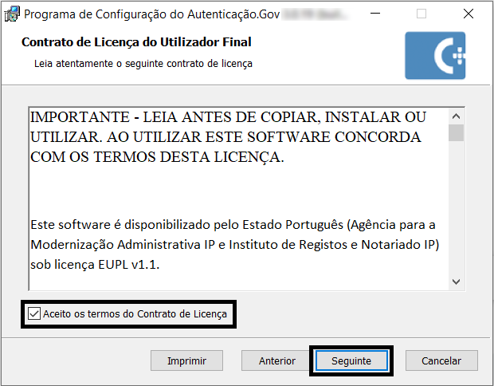{:.center}

3.  Neste passo, poderá escolher a pasta onde deseja instalar o
    *middleware*. Se desejar alterar a pasta predefinida, carrege em
    **Alterar** e na janela que surgir, navegue até à pasta de destino
    e carregue **OK**. Para continuar a instalação na pasta de destino,
    deverá premir o botão **Seguinte**.
4.  Deverá aparecer também um ecrã com a opção de **Instalar**, deverá
    premir esse botão.
5.  Após a conclusão deste assistente, este solicitará a reinicialização
    do computador.
6.  No próximo arranque do *Windows* a instalação do *middleware* estará
    finalizada.

### Instalação em Linux

Algumas distribuições de Linux, disponibilizam um gestor de aplicações -
“*Software Center*” - onde é possível instalar o software através de um
assistente gráfico. Este ecrã poderá variar consoante a distribuição,
neste manual apresenta-se as imagens da utilização do *Software Center*
em Linux Caixa Mágica 22 LTS.

Em alternativa, o *middleware* poderá também ser [instalado recorrendo à linha de comandos](#instala%c3%a7%c3%a3o-atrav%c3%a9s-da-linha-de-comandos).

#### Instalação através do *Software Center*:

{:.center}

1.  Executar o pacote de instalação: Após ter
    descarregado o ficheiro de instalação, deverá fazer duplo clique
    sobre este. O sistema deverá apresentar o ecrã de
    gestão de aplicações - “Software Center” - para a instalação do
    software. Este ecrã varia consoante a distribuição que está a
    utilizar, no entanto, as opções são semelhantes em todos. Nos ecrãs
    seguintes são apresentados os ecrãs utilizando Linux Caixa Mágica 22
    LTS.

2.  Deverá premir o botão **Instalar** para prosseguir.
   {:.center}
4.  Será pedida a introdução da sua senha de utilizador. (É necessário
    que tenha privilégios de administração da máquina)

    {:.center}

5.  Após a conclusão do passo acima, a instalação do *middleware* está
    terminada.
6.  Recomenda-se a reinicialização do sistema para assegurar o bom
    funcionamento do *middleware*.

#### Instalação através da linha de comandos:

1.  Execute o comando de instalação de software no sistema, consoante o
    gestor de pacotes utilizado pelo seu sistema.

    Gestor de pacotes baseado em ficheiros .deb, execute o comando:

        sudo dpkg -i pteid\*.deb

    Gestor de pacotes baseado em ficheiros .rpm, execute o comando:

        sudo rpm -ivh pteid\*.rpm

2.  Após este passo, o *middleware* terá sido instalado no computador.
3.  Recomenda-se a reinicialização do sistema para assegurar o bom
    funcionamento do *middleware*.

### Instalação em Mac OS

1.  Executar o instalador: após ter descarregado o ficheiro de
    instalação, deverá fazer duplo clique sobre este, surgindo um ecrã
    semelhante ao apresentado de seguida:

    {:.center}

2.  Escolher a opção **Continuar**. Em seguida é
    necessário ler e aceitar os termos da licença do software.

    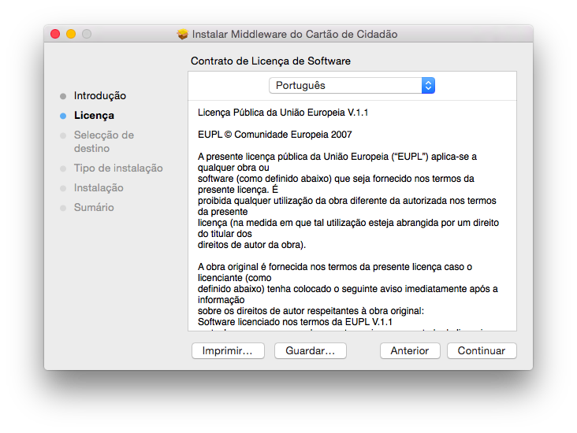{:.center}

3.  A partir deste ponto no assistente deverá premir o botão
    **Continuar** até concluir a instalação.
4.  Após a conclusão deste assistente, o *middleware* estará instalado
    no computador. Neste momento a aplicação utilitária
    “Autenticacão.Gov” já estará disponível na pasta Aplicações /
    *Applications*.

## Remoção do middleware

Para proceder à remoção do *middleware* do Cartão de Cidadão, deverão
ser executados os passos descritos nos pontos seguintes, relativos ao
sistema operativo utilizado.

### Remoção em Microsoft Windows

1.  Aceda ao **Painel de Controlo**.
2.  Selecione a **Opção Adicionar ou Remover Programas**.
3.  Selecione o programa **Cartão de Cidadão**, conforme apresentado na janela seguinte:

      {:.center}

4.  Clique em **Remover**. Confirme todas as janelas de diálogo que irão
    surgir.
5.  Após estes passos, o *middleware* estará removido do computador.
    Recomenda-se que o computador seja reiniciado no final destes
    passos.

### Remoção em Linux

Algumas distribuições de Linux, disponibilizam um gestor de aplicações -
“**Software Center**” - onde é possível remover o software através de um
assistente gráfico. Este ecrã poderá variar consoante a distribuição,
neste manual apresenta-se as imagens da utilização do *Software Center*
em Linux Caixa Mágica 22 LTS.

Em alternativa, o *middleware* poderá também ser [removido recorrendo à linha de comandos](#remo%c3%a7%c3%a3o-atrav%c3%a9s-da-linha-de-comandos).

#### Remoção através do Software Center

Este ecrã varia consoante a distribuição que está a utilizar, no
entanto, as opções são semelhantes em qualquer distribuição. Nos ecrãs
seguintes são apresentados os ecrãs utilizando Linux Caixa Mágica 22 LTS

1.  Abra o *Software Center* (Menu Aplicações → Ferramentas do Sistema →
    Administração → Caixa Magica Software Center).

    {:.center}

2.  Prima o botão **Instalado** na barra superior.

    {:.center}

3.  Digite “pteid” na caixa de pesquisa disponível na barra superior.
    Deverá ser apresentado na zona de resultados o pacote “Cartão de
    Cidadão”.

    {:.center}

4.  Selecione o pacote “Cartão de Cidadão” e prima o botão **Remover**.

    {:.center}

5.  Será pedida a introdução da sua senha de utilizador. É necessário
    que tenha privilégios de administração da máquina.

    {:.center}

6.  Após a conclusão do passo acima a o processo de desinstalação do
    *middleware* está terminado.

#### Remoção através da linha de comandos

1.  Execute o comando de remoção de software no sistema, consoante o
    gestor de pacotes utilizado pelo seu sistema.

    Gestor de pacotes baseado em ficheiros .deb, execute o comando:

        sudo dpkg -r pteid-mw

    Gestor de pacotes baseado em ficheiros .rpm, execute o comando:

        sudo rpm -U pteid-mw

2.  Após este passo, o *middleware* terá sido removido do computador.

### Remoção em MacOS

1.  Abra a aplicação "**Terminal**" no MacOS.
2.  Execute o seguinte comando para desinstalar todos os ficheiros do
    *middleware*.

        sudo /usr/local/bin/pteid_uninstall.sh

# Aplicação Utilitária “Autenticação.Gov”

A aplicação utilitária “Autenticação.Gov” pode ser utilizada para
visualizar e gerir os dados no Cartão de Cidadão e assinar documentos
digitais.

{:.center}

Nesta aplicação poderá efetuar as seguintes operações:

-   Visualização da informação e foto do cidadão;
-   Visualização da morada do cidadão e confirmação da alteração de
    morada;
-   Edição das notas;
-   Imprimir os dados do Cartão de Cidadão;
-   Assinatura digital de documentos PDF e outros ficheiros;
-   Visualização dos certificados do Estado e do cidadão;
-   Registo dos certificados do Estado e do cidadão (específico de
    Microsoft Windows);
-   Gestão de PINs (Testar PIN, Alterar PIN).

O aspeto e comportamentos da aplicação é semelhante nos três tipos de
sistemas operativos, à exceção de algumas funcionalidades de registo de
certificados. Esta está apenas disponível em Windows, visto, esta
funcionalidade nativa, ser específica do sistema operativo Microsoft
Windows.

O atalho para a aplicação fica disponível em localizações diferentes
consoante o tipo de sistema operativo:

-   Em Windows surgirá em: **Iniciar** → **Programas** → **Autenticação.Gov**
-   Em Linux surgirá em: **Aplicações** → **Acessórios** → **Autenticação.Gov**
-   Em MacOS, surgirá na localização escolhida pelo utilizador durante
    o processo de instalação.

## Apresentação da Aplicação

A aplicação é composta por 4 áreas principais de interação:

-   **Menu principal:** São disponibilizadas as três funcionalidade
    básicas da aplicação;
-   **Menu secundário:** São disponibilizadas as funcionalidades
    específicas de cada opção do menu principal;
-   **Menu configurações e ajuda:** São disponibilizados os menus de
    configuração e ajuda;
-   **Área de trabalho:** Área de visualização de dados
    do Cartão de Cidadão e área de trabalho para os menus de assinatura
    e segurança.

{:.center}

## Funcionalidades da aplicação

As funcionalidades da aplicação estão divididas, em três menus
principais: Menu Cartão, Menu Assinatura e Menu Segurança.

### Menu Cartão

Permite visualizar a informação de identidade e foto do cidadão,
visualizar a morada do cidadão e confirmar a alteração de morada, edição
das notas, bem como imprimir os dados do Cartão de Cidadão.

#### Identidade

Permite visualizar os dados de identificação e foto do cidadão presentes
no Cartão de Cidadão.

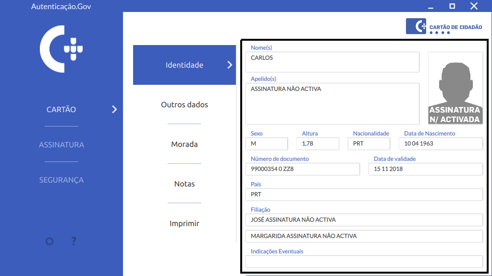{:.center}

#### Outros dados

Permite visualizar outros dados do cartão do cidadão e verificar o
estado do Cartão de Cidadão.

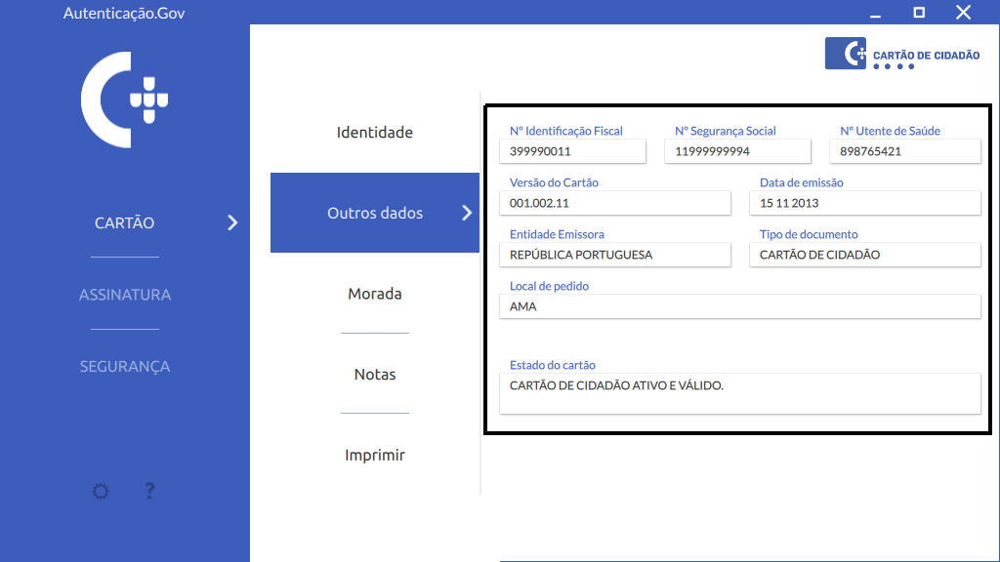{:.center}

#### Morada e Alteração de morada

Dentro do separador “Morada” é possível visualizar a morada atual e
completar o processo de alteração da morada. Esta última funcionalidade
requer uma ligação à Internet. Por favor certifique-se que está ligado
antes de iniciar o processo.

**Nota:** Durante o processo de alteração de morada, o cidadão terá de
se autenticar, por isso deverá ter presente e desbloqueado o seu PIN de
autenticação.

Para concluir um eventual processo de alteração de morada, siga os
seguintes passos:

1.  Clique no botão **Confirmar**.

    {:.center}

2.  Insira o número de processo e o código secreto que recebeu pelo correio, e clique em **Confirmar**.

    {:.center}

3.  Aguarde o processamento do pedido. Será efetuada uma ligação ao
    serviço de alteração de morada e será pedido o seu PIN de
    autenticação para obter os dados da nova morada e em seguida a nova
    morada será escrita no Cartão de Cidadão.

    **Por favor, não retire o cartão do leitor, não desligue a aplicação
    e não desligue a internet, enquanto o processo não estiver
    terminado.**

    {:.center}

4.  Verifique o resultado da operação e siga as instruções:

    - **A morada foi atualizada com sucesso:**

      Caso a operação tenha sucesso, uma mensagem de Confirmação de alteração de morada com sucesso será mostrada.

        {:.center}

    - **Erro. Ocorreu um erro durante a alteração de morada:**

      Caso a aplicação não consiga efetuar a confirmação da alteração de morada será mostrada uma mensagem de erro e respetivo código, que deverá anotar.

        Nas seguintes mensagens de erro:

      - **Processo de alteração de morada não foi concluído**.

        Caso a aplicação não consiga efetuar a confirmação da alteração de morada será mostrada uma mensagem de erro, que deverá anotar. Deverá aguardar cerca de 5 minutos e tentar novamente e, caso o erro persista, contactar a Linha Cartão de Cidadão através do número 211 950 500 ou do E-mail: cartaodecidadao@irn.mj.pt . (Tenha consigo as mensagens de erro e o número de processo de Alteração de Morada)

        {:.center}

      - **Erro na comunicação.**

      - **Verifique se introduziu corretamente o número de processo e código de confirmação.**

      - **Verifique que tem o certificado de autenticação válido.**

        E em outras mensagens, sem descrição do erro, deverá tentar novamente seguindo as instruções e, caso o erro persista, contactar a Linha Cartão de Cidadão através do  número **211 950 500** ou do E-mail: **cartaodecidadao@irn.mj.pt**. (Tenha consigo as mensagens de erro e respectivos códigos de erro e o número de processo de Alteração de Morada).

        A imagem seguinte é um exemplo da mensagem de erro.

        {:.center}

#### Notas

A aplicação permite editar as notas gravadas no cartão do cidadão.

A leitura desta informação não requer qualquer código. Pode, por
exemplo, inserir informação sobre contactos em caso de urgência,
indicações sobre alergias, medicação, grupo sanguíneo ou outra qualquer
informação que entenda pertinente e de acesso livre.

{:.center}

#### Imprimir

A aplicação permite a exportação dos dados do Cartão de Cidadão para um
documento no formato PDF ou a impressão direta do documento.

Para executar estas operações deverá executar os seguintes passos:

1.  No menu principal, selecionar **Cartão** e no menu secundário a opção
    **Imprimir**.
2.  Na área de trabalho deverá selecionar os grupos de campos a incluir
    no documento e selecionar a opção **Imprimir** ou **Gerar PDF**.

    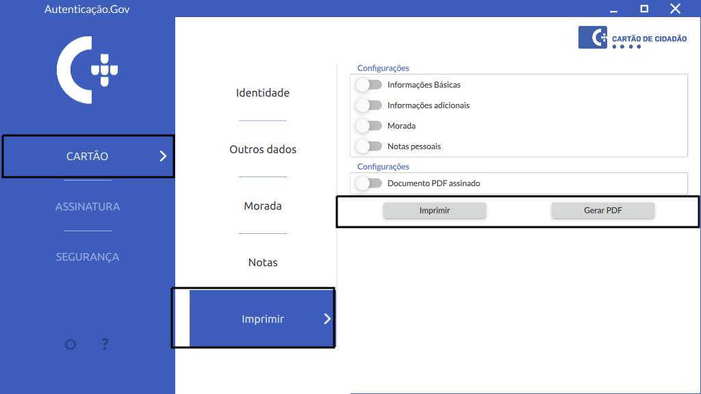{:.center}

    O documento a ser exportado e/ou impresso terá um aspeto gráfico
    conforme a imagem seguinte.

    {:.center}

### Assinatura digital

A aplicação permite assinar digitalmente, de forma nativa, ficheiros PDF. A assinatura digital em documentos PDF foi desenvolvida de acordo com a
especificação da Adobe, podendo assim ser validada posteriormente no
software *Adobe Reader*.

A assinatura digital permite ao titular de um **Cartão de Cidadão** ou
da **Chave Móvel Digital**, por vontade própria, assinar com a chave
pessoal existente no seu Cartão de Cidadão ou com a Chave Móvel Digital.
É possível assinar usando dois modos diferentes:

**Assinatura Simples:** Assinatura digital de um documento PDF.

**Assinatura Avançada:** Assinatura digital de um documento PDF ou outro
qualquer documento com possibilidade de assinar vários documentos ao
mesmo tempo, adicionar atributos profissionais, bem como configurar
outras opções.

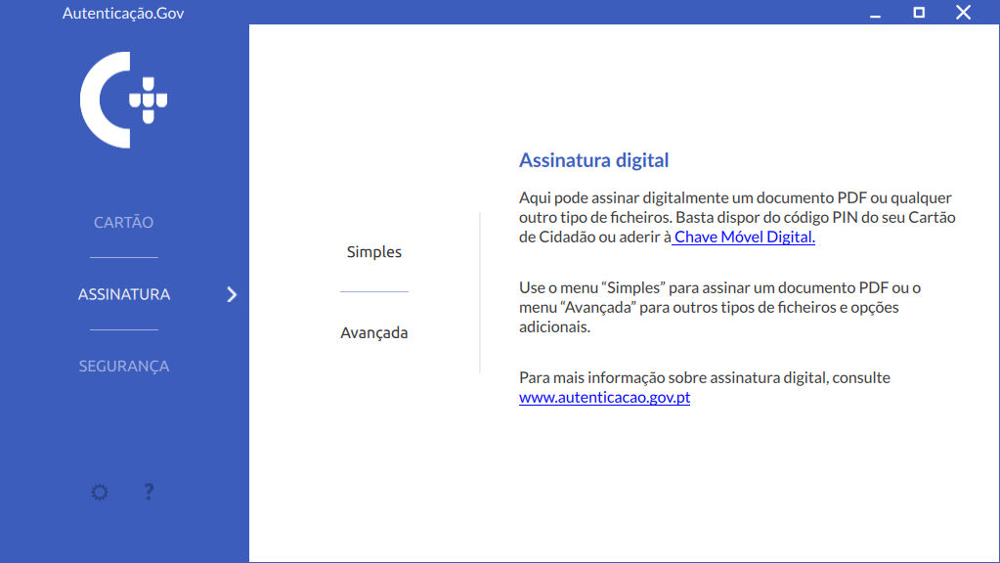{:.center}

#### Simples

Assinatura digital simples de um único documento PDF.\
O ficheiro a assinar pode ser arrastado para a área de pré-visualização. Pode também clicar na área de pré-visualização ou no botão **Adicionar ficheiro** e selecionar manualmente o ficheiro. Será exibida uma janela para selecionar o ficheiro que
pretende assinar.

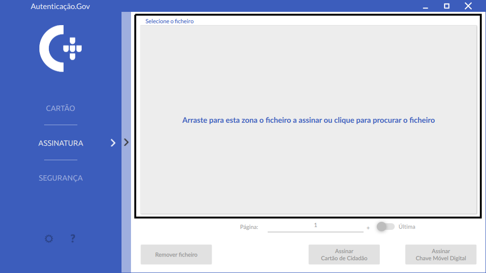{:.center}

Neste modo, assinatura simples, apenas é possível selecionar a página e mover a assinatura digital para o local pretendido, conforme a figura seguinte.

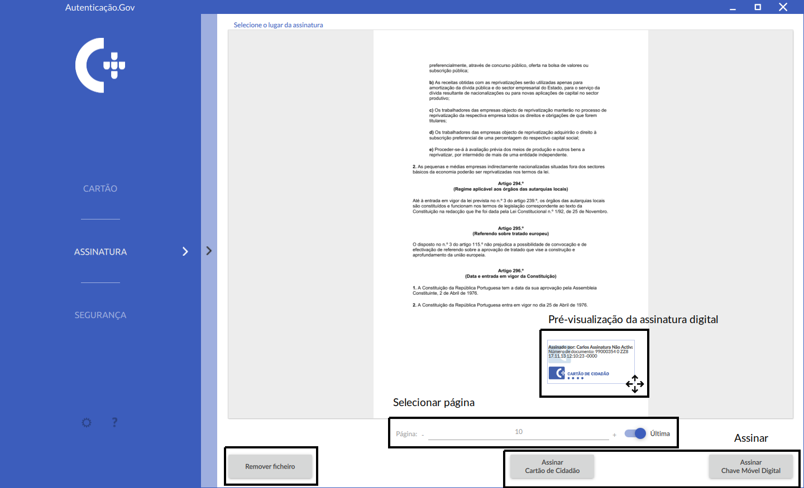{:.center}

Por fim, carregar no botão **Assinar com Cartão de Cidadão** ou **Assinar com Chave Móvel Digital**.

#### Avançada

Assinatura digital de um documento PDF ou outro qualquer documento com possibilidade de assinar vários documentos ao mesmo tempo, adicionar atributos profissionais, bem como configurar outras opções.

Os ficheiros a assinar podem ser arrastados para a área de pré-visualização. Pode também clicar na área de pré-visualização ou no botão **Adicionar ficheiros** e selecionar manualmente os ficheiros. Será exibida uma janela para selecionar os ficheiros que pretende assinar. Os ficheiros selecionados serão apresentados na janela “Escolha os ficheiros”, como podemos visualizar na imagem seguinte.

- **Selecionar ficheiros:** Abre uma nova janela que permitirá selecionar os documentos a serem assinados. É possível adicionar e remover ficheiros individualmente ou todos.
- **Pré-visualização da assinatura:** Permite visualizar o documento a ser assinado, bem como a pré-visualização da própria assinatura. A pré-visualização existe apenas para assinatura de ficheiros PDF.

  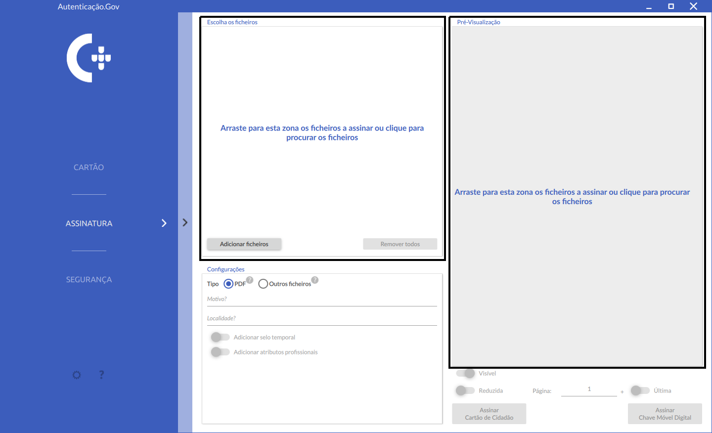{:.center}

- **Configurações:**

    Neste modo, é possível selecionar um conjunto de opções e mover a assinatura digital para o local pretendido. Após a seleção dos ficheiros, deverá selecionar as opções da assinatura. As configurações da assinatura são as seguintes e podem ser visualizadas na imagem seguinte:

    - **Tipo:** Tipo de assinatura – campo obrigatório – permite selecionar assinatura de ficheiros:

        - **PDF:** PAdES (*PDF Advanced Electronic Signatures*)
        - **Outros ficheiros:** Pacote CCSIGN com *XML Advanced Electronic Signatures* (XadES).

    - **Motivo:** Motivo da assinatura – campo opcional – permite ao signatário indicar o motivo da sua assinatura.

    - **Localização:** Local onde a assinatura foi efetuada – campo opcional - permite ao signatário indicar o local onde esta assinatura foi efetuada.

    - **Adicionar selo temporal:** Adiciona um selo temporal, provando a data à qual a assinatura foi efetuada. Esta é a única forma de provar que o documento existia a determinada hora, pois é aplicada ao documento a data e hora que este está a ser assinado, de forma segura. Note-se que a hora apresentada no selo visível é a hora local do computador onde foi efetuada a assinatura e pode não coincidir com a hora do selo temporal (obtida a partir de um servidor remoto).

    - **Adicionar atributos profissionais:** A funcionalidade de assinatura de profissionais permite ao cidadão autenticar-se na qualidade das funções que desempenha na sociedade enquanto profissional qualificado. Na secção [Atributos Profissionais](#atributos-profissionais) é indicado o procedimento para carregar os atributos profissionais.\
    Para mais informações consulte o seguinte *website*:

        <https://www.autenticacao.gov.pt/a-autenticacao-de-profissionais>

    - **Visível:** Permite que a assinatura fique visível no documento PDF.

    - **Página:** Poderá escolher a página onde será apresentada a assinatura.

    - **Última** Poderá escolher a última página para apresentadar a assinatura.

    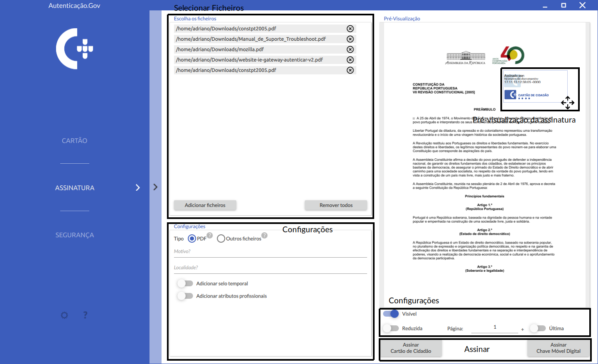{:.center}

Após selecionar as opções pretendidas, na área indicada na figura anterior, arraste a pré-visualização da assinatura para a localização pretendida e de seguida prima o botão **Assinar com Cartão de Cidadão** ou **Assinar com Chave Móvel Digital**.

Após clicar em **Assinar** deverá escolher a localização da pasta e do ficheiro onde guardar o ficheiro assinado (Não é possível substituir o ficheiro original) e seguir o procedimento de assinatura (ver secção [Introdução de chave](#introdu%c3%a7%c3%a3o-de-chave)). Em seguida é apresentado uma mensagem a indicar se a assinatura digital foi efetuada com sucesso.

A imagem seguinte é um exemplo de um ficheiro assinado com a aplicação **Autenticação.Gov**.

{:.center}

#### Introdução de chave

A assinatura digital permite ao titular de um **Cartão de Cidadão** ou
da **Chave Móvel Digital**, por vontade própria, assinar com a chave
pessoal existente no seu Cartão de Cidadão ou com a Chave Móvel Digital.

No caso de pretender assinar com a chave pessoal existente no seu
Cartão de Cidadão, ao selecionar a opção **Assinar com Cartão de Cidadão**, deverá introduzir o PIN de assinatura, conforme a figura
seguinte.

{:.center}

No caso, de pretender assinar com a Chave Móvel
Digital, ao selecionar a opção **Assinar com Chave Móvel Digital**, deverá
introduzir as respetivas credenciais, conforme a figura seguinte.

{:.center}

#### Verificação de assinatura digital em documento PDF em Windows

Após aplicar uma assinatura digital num documento, esta deverá ser
identificada automaticamente ao abrir o documento em *Adobe Reader*. A
imagem seguinte ilustra o *Adobe Reader* com um documento PDF que inclui
a assinatura efetuada no passo anterior:

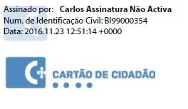{:.center}

Mesmo quando a assinatura não esteja visível (se a opção "Visível" não for selecionada no
momento da assinatura), a assinatura deverá ser sempre validada no
painel de assinaturas, dado que permite a visualização do estado da
assinatura tendo em conta a cadeia de confiança e as propriedades
criptográficas da mesma.

{:.center}

### Segurança

A aplicação permite efetuar operações relativas a segurança do Cartão de
Cidadão.

#### Certificados

Neste menu é possível visualizar os certificados do Estado e do cidadão.

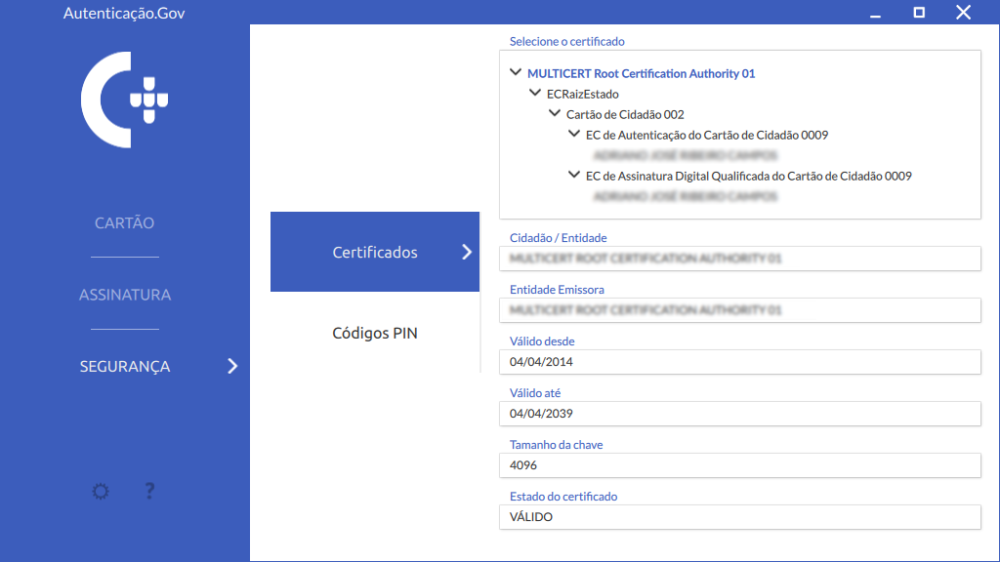{:.center}

#### Código PIN

Neste menu é possível verificar e alterar os códigos PIN do Cartão de
Cidadão.

-   **PIN de Autenticação:** Este PIN é usado para se autenticar em
    sites e aplicações que suportem o Cartão de Cidadão.
-   **PIN de Assinatura:** Este PIN é usado para assinar documentos ou
    transações em aplicações que suportem o Cartão de Cidadão.
-   **PIN de Morada:** Este PIN é usado para alteração e leitura de
    morada.

    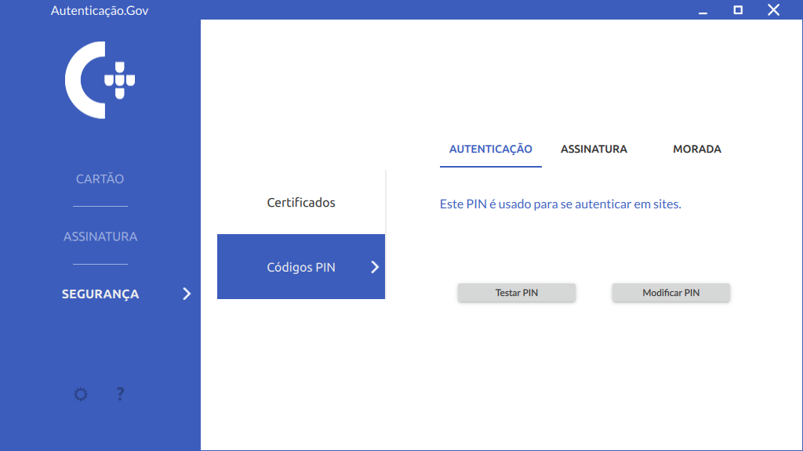{:.center}

    {:.center}

### Configurações

#### Personalização da Assinatura

Neste menu é possível personalizar a assinatura digital, substituindo a
imagem do cartão do cidadão por uma imagem à escolha do utilizador.

O botão **Adicionar assinatura** permite selecionar uma imagem que será utilizada na assinatura personalizada. Após adicionar uma imagem, esta página da aplicação permitirá selecionar a opção **Usar assinatura padrão** ou **Usar assinatura personalizada**, conforme a escolha do utilizador.

O tamanho recomendado para a imagem é de 185 x 41px.

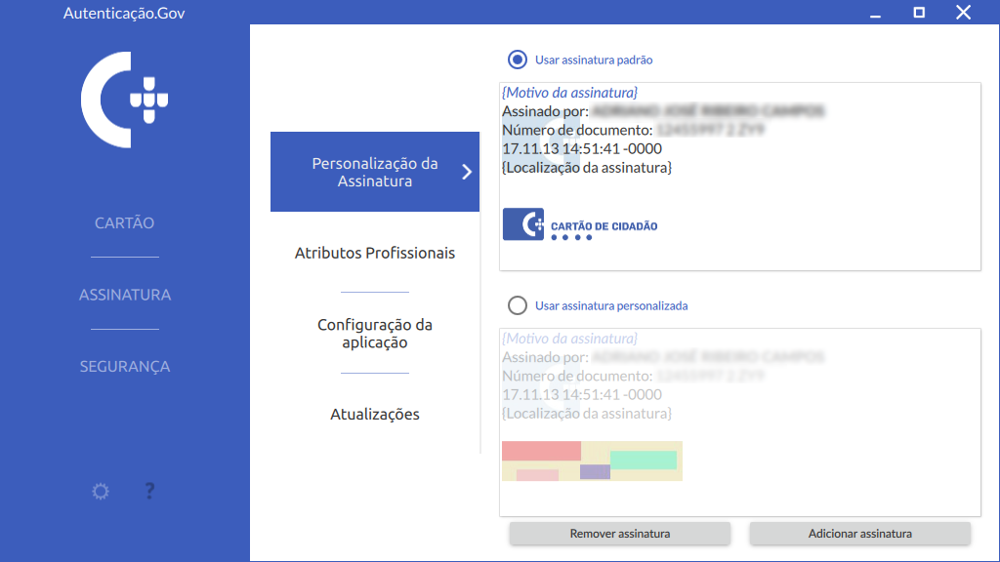{:.center}

#### Atributos Profissionais

O Sistema de Certificação de Atributos Profissionais (SCAP) permite ao cidadão, através do Cartão de Cidadão ou da Chave Móvel Digital, assinar um documento na qualidade das funções que desempenha enquanto profissional.
Para mais informações, consulte o seguinte *website*:

<https://www.autenticacao.gov.pt/a-autenticacao-de-profissionais>

Em primeiro lugar, selecione o tipo de atributos:

-   **No caso dos “Atributos Profissionais”** selecione a(s) entidade(s) fornecedora(s) dos seus atributos profissionais que pretende carregar atributos e clique em **Carregar atributos**.
-   **No caso dos “Atributos Empresariais”** os atributos do utilizador são carregados automaticamente, quando clicar no botão de carregamento de atributos.

    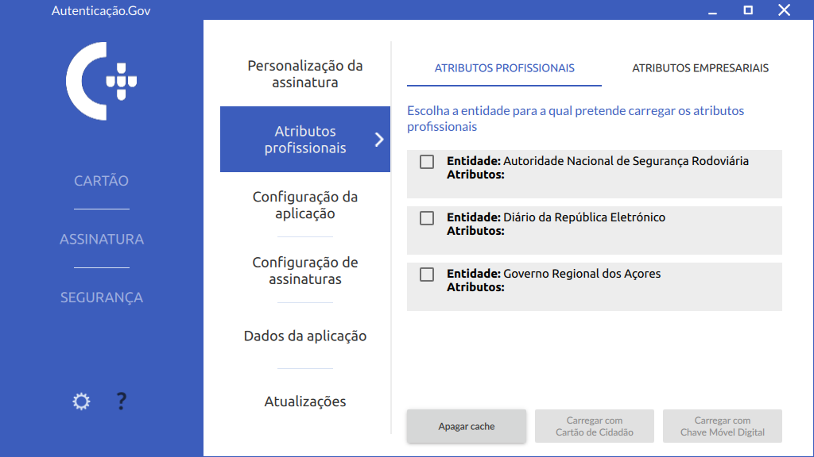{:.center}

Seguidamente, deverá clicar num dos botões de carregamento de atributos, consoante pretenda, respetivamente, carregar os atributos com o Cartão de Cidadão ou Chave Móvel Digital (CMD):

-   **Carregar com Cartão de Cidadão**: após selecionar este botão, deverá
    introduzir o PIN de autenticação e aguardar pelo carregamento de
    atributos.
-   **Carregar com Chave Móvel Digital**: ao selecionar este botão será
    iniciado um processo de autenticação no seu navegador web
    predefinido (por exemplo, Google Chrome, Mozilla Firefox, Safari ou
    outro). Deverá carregar em **Autorizar** e preencher o formulário com
    número de telemóvel associado à sua Chave Móvel Digital e respetivo
    PIN. De seguida, carregue **Autenticar** e introduza o código de
    segurança que recebeu por SMS no telemóvel. Pressione **Confirmar**
    para completar a autenticação.

    Se concluiu a autenticação com sucesso, pode regressar à aplicação e
    aguardar pelo carregamento de atributos.

    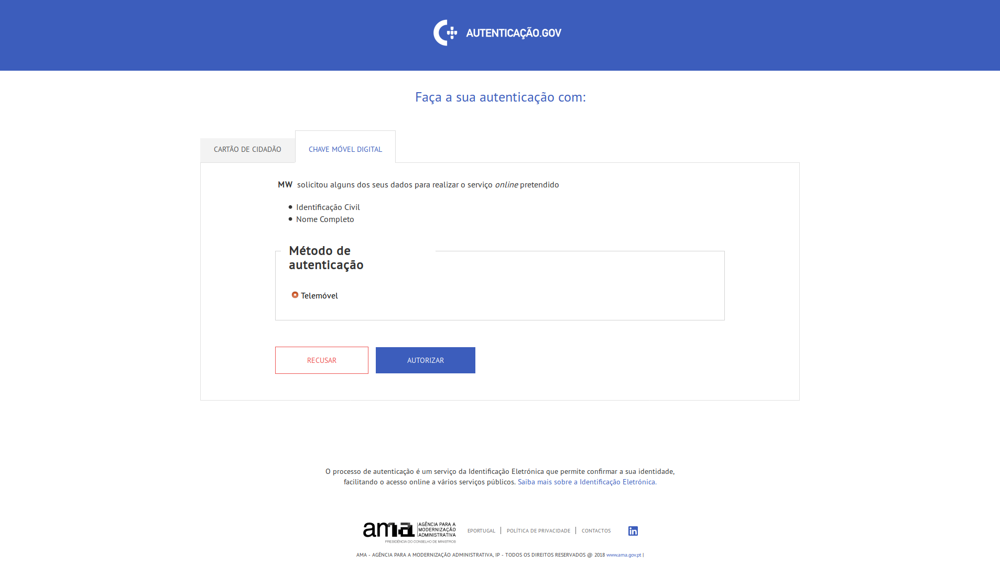{:.center}

#### Configuração da aplicação

Nesta janela é possível configurar alguns aspetos do funcionamento da
aplicação, nomeadamente:

- **Leitor de Cartões:** Permite selecionar o leitor de cartões a utilizar.\
  Existe também uma opção que permite ativar ou desativar a funcionalidade PINPAD (Os leitores com PINPAD são os leitores de cartões que possuem teclado para introdução segura do código PIN) nos leitores. Se esta opção estiver desativada, os leitores com PINPAD terão comportamento idêntico aos leitores sem PINPAD.

- **Início:** Opções relativas ao arranque da aplicação.

- **Atualizações automáticas**: Permite ativar ou desativar a verificação de
novas atualizações quando se inicia a aplicação.

- **Idioma:** Selecionar o idioma da aplicação.

- **Aparência:** Opções relativas à aparência da aplicação.

- **Modo diagnóstico**: Permite ativar ou desativar o modo de diagnóstico da
aplicação. Este modo eleva o nível de detalhe do *log* para *debug*, o
que, em caso de problemas com a aplicação, pode ajudar a equipa de
suporte na resolução do problema.

  Os ficheiros de log por omissão são criados nas seguintes localizações e tem
  como nome o prefixo .PTEID:

      Windows: C:\Program Files\Portugal Identity Card\log\
      MacOS: Directoria Home do utilizador i.e.: /Users/Utilizador/
      Linux: Directoria Home do utilizador i.e.: /home/Utilizador/

- **Aceleração gráfica**: Permite ativar ou desativar a aceleração gráfica na
aplicação.

- **Configurações de rede:** Opções relativas à configuração de servidor
de proxy. Em redes onde o acesso à Internet só é possível através de
servidor de *proxy* HTTP/S será necessário configurar as seguintes
informações de acesso:
    -   **Proxy de sistema (Windows e MacOS)**. Ao selecionar esta opção
        e se estiver definida uma configuração de *proxy* de sistema ou
        um *script* de auto configuração (*Proxy Autoconfig*), esta
        configuração será automaticamente utilizada pelo *middleware*.
    -   **Servidor proxy:** Endereço IP / Hostname / Porto.
    -   **Autenticação proxy:** Credenciais de acesso (se necessário).

A imagem seguinte permite visualizar o menu de configurações da aplicação
(com Modo de diagnóstico ativo)

"){:.center}

#### Configuração de assinaturas

Nesta janela é possível configurar alguns aspetos relativos à assinatura
com o Cartão de Cidadão:

- **Certificados**: Opções relativas ao registo e remoção de certificados
durante a inserção e remoção do cartão.

- **Serviço de Selos Temporais:** Configurar um serviço de selos temporais
personalizado.

- **Microsoft Office (Windows):** Configurações relativas a assinaturas em
aplicações do Microsoft Office.

A imagem seguinte permite visualizar o menu de configurações de assinaturas.

{:.center}

#### Dados da aplicação

Neste separador é possível apagar os dados de cache armazenados das
leituras dos cartões e do carregamento de atributos profissionais e
empresariais.

#### Atualizações

Nesta janela é possível verificar manualmente se existem atualizações
para o *middleware*. Caso existam atualizações, e se o utilizador o
pretender, o download do instalador do *middleware* é feito
automaticamente e em seguida iniciado o processo de instalação.

### Ajuda

A janela ajuda fornece um resumo das funcionalidades da aplicação, indica o caminho para chegar a este mesmo manual e a página de suporte da aplicação.

{:.center}

# Integração com aplicações

O *middleware* permite a interação com outras aplicações do sistema operativo, disponibilizando duas funcionalidades: Autenticação e Assinatura Digital.

A instalação do *middleware* em Windows permite que, ao introduzir um Cartão de Cidadão no leitor, os certificados deste fiquem automaticamente registados no sistema operativo, ficando assim as funcionalidades de autenticação e assinatura disponíveis às aplicações
que utilizam a camada criptográfica do sistema operativo. Alguns exemplos dessas aplicações são: *Microsoft Word*, *Microsoft Excel* e *Microsoft Outlook*.

Nos pontos seguintes será explicada a utilização das funcionalidades de
assinatura digital e autenticação nas seguintes aplicações:

**Assinatura digital:**

- [Suite Microsoft Office](#assinatura-digital-na-suite-microsoft-office)
- [Suite LibreOffice / OpenOffice](#assinatura-digital-na-suite-libreoffice--openoffice)
- [Microsoft Outlook](#assinatura-digital-de-email-com-microsoft-outlook)
- [Mozilla Thunderbird](#assinatura-digital-de-email-com-mozilla-thunderbird)

**Autenticação:**

- [Internet Explorer](#autentica%c3%a7%c3%a3o-em-portais-web)
- [Mozilla Firefox](#assinatura-digital-de-email-com-mozilla-thunderbird)

Além das aplicações acima referidas, o *middleware* disponibiliza
suporte criptográfico às aplicações com interface \#PKCS11 ou suporte
criptográfico nativo do sistema operativo.

No caso das aplicações com suporte \#PKCS11, geralmente é necessário
configurar a localização do ficheiro do *middleware*, que permite o
suporte. A localização deste ficheiro, depende do sistema operativo a
ser utilizado.

**Windows:** C:\\Windows\\System32\\pteidpkcs11.dll\

**Linux:** /usr/local/lib/libpteidpkcs11.so\

**MacOS:** /usr/local/lib/libpteidpkcs11.dylib

## Assinatura digital na suite *Microsoft Office*

Nesta secção é apresentada a assinatura digital de documentos em
ficheiros *Office*, nomeadamente, nas aplicações: *Word*, *Excel* e
*PowerPoint*.

Para assinar digitalmente um documento, deverá efetuar os seguintes
passos:

1.  Aceder ao menu **Ficheiro**.
2.  Na secção **Informações** clicar no botão **Proteger Documento** e
    selecionar a opção **Adicionar uma assinatura Digital**, conforme a
    imagem abaixo:

    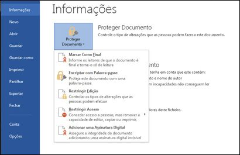{:.center}

3.  Aparecerá uma mensagem específica da aplicação que está a utilizar (*Word*, *Excel* ou *Powerpoint*), clique em **OK**.
4.  Na Caixa de diálogo **Assinar**, introduza o **Objetivo** da assinatura.
5.  Clique em assinar e introduza o seu PIN de assinatura na respetiva
    janela.
6.  O documento ficará assinado digitalmente, e ficará só de leitura de
    forma a impossibilitar alterações ao mesmo.

Poderá encontrar informação mais detalhada no seguinte link: [Adicionar/Remover uma Assinatura Digital nos ficheiros do Office](https://support.office.com/pt-pt/article/Adicionar-ou-remover-uma-assinatura-digital-nos-ficheiros-do-Office-70d26dc9-be10-46f1-8efa-719c8b3f1a2d).

## Assinatura digital na suite *LibreOffice / OpenOffice*

Nesta secção é apresentada a assinatura digital de documentos em
ficheiros *LibreOffice*, nomeadamente, nas aplicações, *Calc*, *Write* e
*Impress*. A versão utilizada neste manual foi a versão *LibreOffice
5.3*. A interface desta funcionalidade é bastante semelhante em todas as
versões a partir de 4.0.0.

Em sistemas operativos Linux, a deteção dos certificados digitais nesta
Suite depende das configurações de segurança do *Mozilla Thunderbird* ou
*Mozilla Firefox*. Assim, para que esta funcionalidade esteja disponível
deverá configurar previamente a integração com o Cartão de Cidadão no
*Mozilla Thunderbird* ou *Firefox*. Ver as instruções em: [Assinatura digital de email com Mozilla Thunderbird](#assinatura-digital-de-email-com-mozilla-thunderbird).

Para assinar digitalmente um documento, deverá efetuar os seguintes
passos:

1.  Aceder ao menu **Ficheiro** → **Assinaturas Digitais**.

2.  Aparecerá a janela com as assinaturas digitais do documento. Caso não exista ainda nenhuma assinatura, a lista aparecerá vazia conforme a imagem abaixo. Clique no botão **Assinar documento...** .

    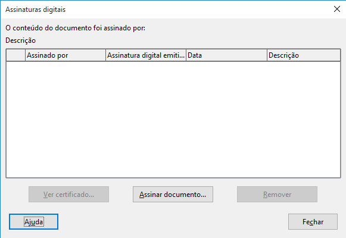{:.center}
3.  Será apresentada uma janela para seleção do certificado. Deverá
    selecionar o certificado que tem o seu nome e emitido por “**EC de
    Assinatura Digital Qualificada do Cartão...**” conforme ilustrado na
    imagem abaixo:

    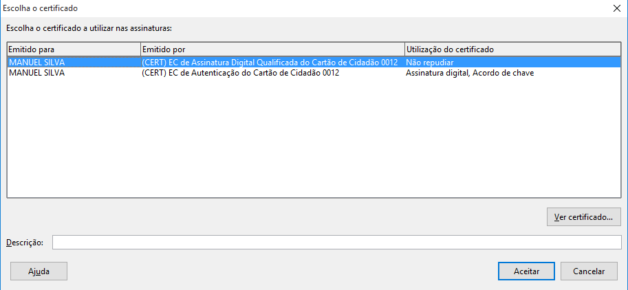{:.center}
4.  Clique em **Aceitar** e introduza o seu PIN de assinatura na respetiva
    janela.

5.  O documento ficará assinado digitalmente.

## Assinatura digital de email com *Microsoft Outlook*

A assinatura eletrónica no *Outlook*, por omissão, obriga a que o
certificado digital inclua o endereço de email, e este corresponda com o
email que se pretende assinar.

Nos certificados existentes no Cartão de Cidadão não existe qualquer
endereço de email. Desta forma, para que seja possível efetuar
assinaturas digitais no *Outlook*, é assim necessário desativar esta
validação através da alteração das configurações no sistema operativo.

  {:.center}

Para **desativar a correspondência com endereço de email do certificado digital**, deve seguir as instruções disponibilizadas no *website* da *Microsoft*:

- Versão PT: <http://support.microsoft.com/kb/276597/pt>

- Versão EN (original): <http://support.microsoft.com/kb/276597/>

Alternativamente, poderá selecionar a opção **Desativar correspondência de e-mails nos certificado no Outlook** nas **Configurações de assinaturas** da aplicação do Cartão de Cidadão.

Para poder assinar digitalmente um email no *Outlook*, é necessário
inicialmente efetuar a respetiva configuração. Os passos descritos de
seguida, estão divididos em **configuração**, consistindo na
configuração inicial necessária, e **assinatura**, consistindo na
assinatura propriamente.

**Nota:** As imagens apresentadas são referentes ao *Microsoft Outlook
2016*.

**Configuração** – Esta operação é realizada apenas uma vez.

1.  Assegurar que a correspondência com endereço de email do certificado
    digital está desativada, conforme instruções acima.
2.  No Outlook, aceder ao menu **Ficheiro** → **Opções**

    {:.center}

3.  Clicar em **Centro de Confiança**.

    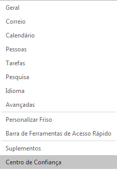{:.center}

4.  Selecionar a secção **Definições do Centro de Fidedignidade**.

    {:.center}

5.  Nesta secção, selecionar a opção **Adicionar a assinatura digital às mensagens a enviar** e clicar no botão **Definições**

    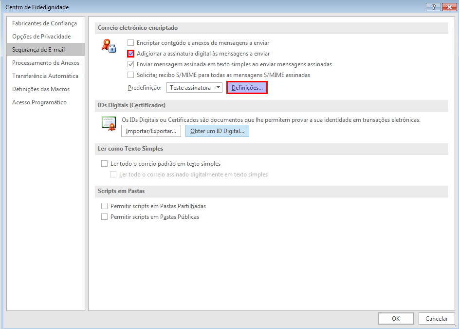{:.center}

6.  Adicione uma descrição a esta configuração, p. ex.: “Assinatura com Cartão de Cidadão” e clique no botão **Escolher** para selecionar o certificado.

    {:.center}

7.  Selecione o seu certificado de assinatura e clique em **OK**.

8.  Clique em **OK** em todas as janelas de configuração abertas. A
    configuração está terminada.

**Assinatura** - a efetuar cada vez que pretenda enviar um email
assinado.

1.  Ao clicar em **Enviar**, será solicitado o PIN de assinatura e o seu
    email será assinado e enviado.

    {:.center}

## Assinatura digital de email com Mozilla Thunderbird

Para poder assinar digitalmente um email no *Thunderbird*, é necessário
inicialmente efetuar a respetiva configuração. Os passos descritos de
seguida, estão divididos em **configuração**, consistindo na
configuração inicial necessária, e **assinatura**, consistindo na
assinatura propriamente dita.

**Configuração** – Esta configuração é necessária efetuar uma única vez
e os passos descritos aplicam-se também à configuração dos certificados
em *Firefox*.

1.  Abra a janela de escrita de email, clique na caixa de opções **Segurança** e clique em **Assinar digitalmente esta mensagem**.

    {:.center}

    Será apresentada uma mensagem informando que é necessário configurar os certificados antes de utilizar as funcionalidades de segurança. Clique em **Sim**.

    {:.center}

3.  No ecrã seguinte, clique no botão **Dispositivos de Segurança**.
4.  Clique no botão **Carregar**, e selecione o módulo **PKCS\#11**, que se
    encontra numa das seguintes localizações:

    **Em Windows:**
    - C:\\Windows\\System32\\pteidpkcs11.dll (Windows
    32-bits)
    - C:\\Windows\\SysWOW64\\pteidpkcs11.dll (Windows 64-bits)

    **Em Linux:** /usr/local/lib/libpteidpkcs11.so

    **Em MacOS:** /usr/local/lib/libpteidpkcs11.dylib

    Após carregado o módulo, deverá ter uma entrada "**CARTAO DE CIDADAO**"
    conforme a imagem abaixo. Clique em **OK**.

    {:.center}

5.  Voltando ao ecrã anterior (**“Configurações”** → **“Segurança”**), clique
    agora na opção **Selecionar**.

    {:.center}

6.  Selecione o Certificado com a descrição "**CARTAO DE CIDADAO:CITIZEN SIGNATURE CERTIFICATE**".

    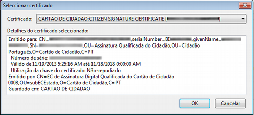{:.center}

7.  Adicionar um certificado da PKI do Cartão de Cidadão. No gestor de certificados do *ThunderBird*, aceder ao separador **Autoridade** e clicar em **Importar...** .
8.  Clique em **OK** em todas as janelas de configuração abertas. A configuração está terminada.

**Assinatura** - a efetuar cada vez que pretenda enviar um email assinado.

1.  Abra a janela de composição de email.
2.  Clique na caixa de opções **Segurança** e clique em **Assinar digitalmente esta mensagem**. Esta opção ficará ativa.

    {:.center}

3.  Ao clicar em **Enviar**, será solicitado o PIN de assinatura e o seu email será assinado e enviado.

## Autenticação em portais WEB

Existem duas formas de se autenticar perante um portal web utilizando o
Cartão de Cidadão:

-   Autenticação por certificado cliente através do navegador.
-   Autenticação por certificado através do portal **Autenticação.gov.pt**.

A forma de autenticação depende totalmente da configuração do website, não sendo possível ao utilizador escolher uma ou outra forma.

A **Autenticação por certificado cliente através do navegador**, tende a
ser descontinuada, visto a apresentar desvantagens na recolha de dados,
no entanto alguns sítios ainda utilizam esta forma.

Para poder utilizar este método de autenticação, tem de ter
obrigatoriamente o *middleware* instalado no seu computador.

Neste caso utilizando Sistema Operativo *Windows* os browsers *Internet
Explorer*, *Microsoft Edge* e *Google Chrome* não exigem nenhuma
configuração uma vez registado o certificado de autenticação do Cidadão.

Para o *Mozilla Firefox* em qualquer Sistema Operativo é necessário
efetuar algumas configurações tal como descrito na secção [Assinatura digital de email com *Mozilla Thunderbird*](#assinatura-digital-de-email-com-mozilla-thunderbird).

{:.center}

A autenticação por certificado através do portal autenticação.gov.pt não exige a instalação do middleware mas sim do plugin **Autenticação.Gov**.

Para mais informação, consulte esta página de ajuda:

- <https://autenticacao.gov.pt/fa/ajuda/autenticacaogovpt.aspx>

De forma a que a configuração do seu computador suporte qualquer uma das
alternativas, recomenda-se que instale o *middleware* no seu computador
e também o plugin **Autenticação.Gov**.

# Resolução de Problemas

## Exibida mensagem de erro quando se tenta adicionar o módulo PKCS\#11 no *Firefox / Thunderbird*

Para que consiga adicionar o módulo PKCS\#11 no Firefox tem de ter um
leitor de cartões instalado no seu computador.

Certifique-se que o leitor está ligado e instalado e um cartão inserido
antes de adicionar o módulo PKCS\#11.

Caso esteja a utilizar uma versão de MacOS ou Linux 64-bit terá de
utilizar uma versão 64-bit do *Firefox* / *Thunderbird*.

## Não é possível adicionar o módulo PKCS\#11 ao *Adobe Acrobat Reader* em *MacOS*

Em versões anteriores do *Adobe Acrobat Reader* para *MacOS* não é possível
adicionar o módulo PKCS\#11. Recomendamos a atualização do *Adobe
Acrobat Reader* para a versão **DC**.

## Impossibilidade de assinatura com *Adobe Reader*, *Microsoft Office* e *LibreOffice*

Deverá aceder ao ficheiro “pteidmdrv.inf”, presente por defeito na
diretoria “ C:\\ProgramFiles\\PTeID Minidriver” (ou na directoria
selecionada durante a instalação). Após ter aberto a directoria, abra
o menu de opções do ficheiro e selecionar a opção **Instalar**.

Após a escolha desta opção, poderá aparecer uma janela de diálogo (Ver
imagem seguinte) com o título “Ficheiros Necessários”, na qual terá de
selecionar a pasta “drivers” que esta na diretoria “C:\\Windows\\System32“.

{:.center}

## O leitor de cartões está instalado mas não é detetado pela aplicação do Cartão de Cidadão

### Windows

1.  Verifique se o leitor de cartões é compatível com o standard PC/SC (consulte a documentação do leitor de cartões ou contacte o fabricante).

2.  Verifique se os controladores do leitor estão corretamente instalados (consulte a documentação do leitor de cartões).

3.  Verifique se o serviço “Cartão Inteligente” (Smart Card) está iniciado:\
    a\) Aceda ao **Painel de Controlo** | **Ferramentas de Administração**\
    b\) Clique em **Serviços**\
    c\) Verifique se o serviço “**Cartão Inteligente**” (Smart Card) está iniciado (Started).
    Caso não esteja, clique com o botão direito no serviço e clique em **Start**.\
    d\) Desligue o leitor do computador.\
    e\) Encerre a aplicação do Cartão de Cidadão.\
    f\) Volte a inserir o leitor e abra novamente a aplicação.

### Linux

1.  Verifique se o leitor de cartões é compatível com o standard PC/SC (consulte a documentação do leitor ou contacte o fabricante).
2.  Verifique se os controladores do leitor estão corretamente instalados (consulte a documentação do leitor).
3.  Verifique se o **pcsc daemon** está instalado e em execução:

    a\) Numa janela de terminal execute o seguinte comando:

        ps aux

    b\) Procure uma referência ao processo pcscd.\
    c\) Caso não esteja listado por favor inicie o serviço através do
comando:

        sudo /etc/init.d/pcscd start

    d\) Caso obtenha uma mensagem de erro é possível que o daemon não esteja
instalado. Utilize o seu gestor de pacotes para instalar o pcscd (por
vezes já vem incluído no pacote pcsc-lite).

## Não são detetados quaisquer certificados durante a tentativa de assinatura na suite *LibreOffice / Apache OpenOffice*

A suite *LibreOffice / OpenOffice* em Linux, utiliza as configurações da aplicação *Mozilla Firefox* (ou como alternativa, *Thunderbird*) para a deteção dos certificados.

Para que os certificados passem a ser detetados na *Suite LibreOffice / Apache OpenOffice*, terá que efetuar a respetiva configuração no *Mozilla Firefox*, caso tenha esta aplicação instalada. Caso não tenha, poderá configurar o *Mozilla Thunderbird* para poder assinar documentos no *LibreOffice*.

Para mais informações consultar a página de ajuda:

-   <https://help.libreoffice.org/Common/Applying_Digital_Signatures/pt>

## Problemas com placas gráficas integradas em *Windows*

No caso de existirem problemas gráficos, recomenda-se testar desabilitar a aceleração gráfica por hardware. No menu Definições / Configuração da aplicação / Aceleração é possivel ativar ou desativar a aceleração gráfica na aplicação.

No caso da aplicação não arrancar, o procedimento para desabilitar a aceleração gráfica por hardware consiste em adicionar às variáveis de ambiente do sistema a variável **QT_OPENGL** com o valor **software**. Em alternativa é possivel configurar essa opção usando as configurações do software Autenticação.gov.

Em **Windows** na chave de registo:
HKEY_CURRENT_USER\Software\PTEID\configuretool\graphics_accelaration

    graphics_accelaration = 1 // Aceleração gráfica activada

    graphics_accelaration = 0 // Aceleração gráfica desactivada

Em **Linux**, no ficheiro $HOME/.config/pteid.conf na secção “configuretool”

    graphics_accelaration = 1 // Aceleração gráfica activada

    graphics_accelaration = 0 // Aceleração gráfica desactivada

Em **MacOS**, no ficheiro $HOME/Library/Preferences/pteid.conf na secção “configuretool”

        graphics_accelaration = 1 // Aceleração gráfica activada

        graphics_accelaration = 0 // Aceleração gráfica desactivada

# Instruções de configuração em ambientes empresariais

## Configurações através de chaves de registo Windows

As configurações do software Autenticação.gov são guardadas em *Windows*
em chaves de registo sendo que as alterações feitas pelo utilizador no
interface gráfico se sobrepõem aos valores predefinidos e ficam
guardadas em sub-chaves de:

    HKCU\Software\PTEID

**Nota:** Não se devem nunca remover ou alterar os seguintes registos:

    HKLM\Software\PTEID\general\install_dirname

    HKLM\Software\PTEID\general\certs_dir

Pode-se, no entanto, configurar de forma padronizada uma instalação
adicionando alguns valores no registo do *Windows* para todos os
utilizadores da máquina após a instalação do software, usando as chaves listadas
na tabela seguinte que devem ser criadas como sub-chaves da chave raiz:

    HKLM\Software\PTEID

| Chave            | Valor                  | Tipo                                 | Descrição                                                                                                                                          |
|------------------|------------------------|--------------------------------------|----------------------------------------------------------------------------------------------------------------------------------------------------|
| logging          | log_level              | string (debug, info, warning, error) | Nível de detalhe do log do Middleware. Valor por omissão: error                                                                                    |
| logging          | log_dirname            | string                               | Directoria onde são gerados os ficheiros de log do Middleware. Valor por omissão: C:\Program Files\Portugal Identity Card\log                      |
| logging          | log_prefix             | string                               | Prefixo do nome dos ficheiros de log. Valor por omissão:.PTEID_                                                                                    |
| general          | install_dirname        | string                               | Directoria onde é instalado o Middleware.  Valor por omissão: C:\Program Files\Portugal Identity Card                                              |
| general          | cache_dirname          | string                               | Directoria onde é guardada a cache do Middleware.  Valor por omissão: C:\Users\[User]\AppData\Roaming\.pteid-ng                                    |
| general          | scap_host              | String                               | Hostname do serviço de Atributos Profissionais (SCAP) Valor por omissão:scap.autenticacao.gov.pt                                                   |
| general          | scap_port              | Número (1 a 65535)                   | Porto do serviço de Atributos Profissionais (SCAP)                                                                                                 |
| general          | use_pinpad             | Número (0 / 1)                       | Usar funcionalidade de PINPAD Valor por omissão: 1 (ativo)                                                                                         |
| configuretool    | start_with_windows     | Numérico (0 / 1)                     | Arrancar a aplicação com o Windows Valor por omissão: 1 (ativo)                                                                                    |
| configuretool    | registrate_certificate | Numérico (0 / 1)                     | Registar certificados no Windows com a inserção do cartão.  Valor por omissão: 1 (Sim)                                                             |
| configuretool    | remove_certificate     | Numérico (0 / 1)                     | Remover certificados do Windows com a remoção do cartão.  Valor por omissão: 0 (Não)                                                               |
| proxy            | use_system_proxy       | Numérico (0 / 1)                     | Utilizar servidor de proxy definido no Windows/ MacOS.  Valor por omissão: 0 (Não)                                                                 |
| proxy            | proxy_host             | string  (hostname ou endereço IP)    | Endereço do servidor de proxy                                                                                                                      |
| proxy            | proxy_port             | Numérico (1 a 65535)                 | Porto TCP do servidor de proxy                                                                                                                     |
| certificatecache | cert_cache_validity    | Numérico (0 a 65535)                 | Tempo de cache local (em segundos) do estado de validade dos certificados Valor por omissão: 60                                                    |
| xsign            | tsa_url                | string                               | Servidor de timestamps usado na assinatura de documentos no formato http(s)://HOST:PORTO Valor por omissão:http://ts.cartaodecidadao.pt/tsa/server |

## Configurações através de ficheiro de configuração em Linux e MacOS

As configurações do software Autenticação.gov são guardadas em Linux e
MacOS são efectuadas num ficheiro de configuração. Este ficheiro de
configuração está localizado no seguinte caminho:

**Linux:** $HOME/.config/pteid.conf

**MacOS:** $HOME/Library/Preferences/pteid.conf

onde **$HOME** indica a directoria Home do utilizador de sistema.

O formato do ficheiro é do tipo .conf com a respectiva secção de
configuração a ser indicada por uma tag. Os valores que se podem
especificar em cada tag são os que foram indicados na tabela anterior
referente às [Configurações através de chaves de registo Windows](#configura%c3%a7%c3%b5es-atrav%c3%a9s-de-chaves-de-registo-windows).

## Instalação automatizada em ambientes Windows

Para instalar o software de forma automatizada é necessário seguir o
seguinte procedimento (com permissões de administrador):

1.  Adicionar o certificado de *codesigning* da AMA – Agência para a
    Modernização Administrativa à Store “Trusted Publishers” associada
    ao “Local Computer” através da ferramenta MMC ou através do seguinte
    comando:

        certmgr -add AMA\_codesigning.cer -c -s -r localMachine TrustedPublisher

    O certificado pode ser obtido a partir do instalador MSI visualizando
    a assinatura do ficheiro no menu de contexto em:

    **Properties** → **Digital Signatures** → **Details**

2.  Se o sistema operativo for *Windows 7* deverá ser instalado um
    *Hotfix* fornecido pela *Microsoft* para resolver uma
    incompatibilidade com o certificado de *codesigning* do software. Para
    tal seguir as instruções deste artigo:

    https://support.microsoft.com/en-us/help/2921916/the-untrusted-publisher-dialog-box-appears-when-you-install-a-driver-i

3.  Tendo já obtido o instalador em formato MSI podemos instalar o
    software sem interacção com o utilizador usando o seguinte comando:

        msiexec /i Autenticacao.gov-xxx.msi /qn

    Se se pretende evitar o reinício do sistema após a instalação deve
    ser adicionado ao comando o parâmetro */norestart* .

## Informação sobre servidores de Proxy

### Configuração em *Windows*

Se a máquina em questão tiver um proxy correctamente configurado no Windows, seja por
IP/Hostname + Porto ou por script de autoconfiguração (PAC file) não é necessária qualquer
configuração no MW.

O software tem neste momento uma limitação com alguns tipos de
servidores de proxy designadamente com autenticação NTLM ou Kerberos.
Para utilizar as funcionalidades que exigem acesso à Internet
(confirmação de morada, validação de certificados, assinatura com
atributos profissionais ou assinatura com Chave Móvel) será necessário
nestes ambientes uma reconfiguração de rede ou o uso de uma proxy aberta
ou com autenticação Basic.

### Configuração em *MacOS*

Em MacOS é suportada a proxy do sistema mas apenas se for configurada por IP/Hostname + Porto

_________________

Desenvolvido pelo Estado Português 
(Agência para a Modernização Administrativa, IP e Instituto dos Registos e do Notariado, IP) 
© Copyright (C) 2010-2019
