# Autenticação.gov desktop application user manual <!-- omit in toc -->

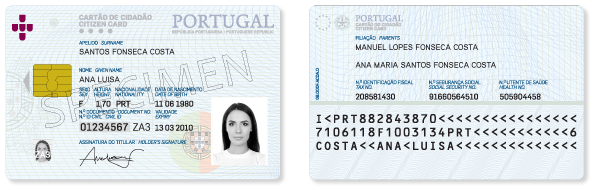

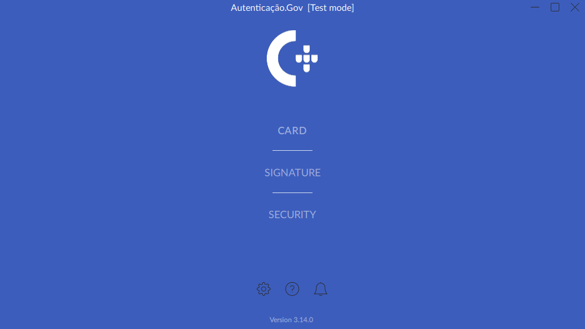

# Table of Contents

- [Introduction](#introduction)
- [What's new ?](#whats-new)
- [**Downloading, installation and removal of the application.**](#downloading-installation-and-removal-of-the-application)
  - [Officially supported operating systems](#officially-supported-operating-systems)
  - [Downloading the application installation package](#downloading-the-application-installation-package)
  - [Application installation](#application-installation)
    - [Installation on Microsoft Windows](#installation-on-microsoft-windows)
    - [Installation on Linux](#installation-on-linux)
    - [Installation on Mac OS](#installation-on-mac-os)
    - [Installation on ChromeOS](#installation-on-chromeos)
  - [Removing the application](#removing-the-application)
    - [Removal from *Microsoft Windows 7*](#_heading=h.z8cko4o53ivq)
    - [Removal from *Microsoft Windows 10 or 11*](#_heading=h.kaaa0yaudjtc)
    - [Removal from Linux and ChromeOS](#removal-from-linux-and-chromeos)
    - [Removal from MacOS](#removal-from-macos)
  - [Application update](#application-update)
    - [Linux update](#linux-update)
- [**Autenticação.Gov Utility Application**](#autenticação.gov-utility-application)
  - [Application Presentation](#application-presentation)
  - [Application features](#application-features)
    - [Card Menu](#card-menu)
    - [Digital signature](#digital-signature)
    - [Security](#security)
    - [Configurations](#configurations)
    - [Help](#help)
    - [Notification Centre](#notification-centre)
    - [Contactless Access](#contactless-access)
- [**Integration with applications**](#integration-with-applications)
  - [Integration with Windows applications](#integration-with-windows-applications)
  - [Integration with applications via the PKCS#11 interface](#integration-with-applications-via-the-pkcs11-interface.)
  - [Digital signatures in common applications](#digital-signatures-in-common-applications)
    - [Digital signature in the *Microsoft Office* suite](#_heading=h.4pyr0kgolzfi)
    - [Digital signature in the *LibreOffice / OpenOffice* suite](#_heading=h.buuqvm1lhecn)
    - [Digital e-mail signature with *Microsoft Outlook*](#_heading=h.7i6nv1lj6u37)
    - [Digital signature in *Adobe Acrobat Reader*](#_heading=h.a2of7nc5rjlk)
    - [Digital signature in *Adobe Acrobat Reader* on MacOS (as from version 3.11.0)](#_heading=h.4ctk8xmogvvd)
    - [Digital signature with Digital Mobile Key](#digital-signature-with-digital-mobile-key)
    - [Digital e-mail signature with Mozilla Thunderbird](#digital-e-mail-signature-with-mozilla-thunderbird)
    - [Digital signature of DWF files](#digital-signature-of-dwf-files)
    - [Digital signature of DWG files](#digital-signature-of-dwg-files)
  - [Authentication at WEB portals](#authentication-at-web-portals)
    - [Configure authentication for *Mozilla Firefox*](#_heading=h.sv0q7sh5zvii)
- [**Problem-Solving**](#problem-solving)
  - [An error message is displayed when attempting to add the PKCS#11 module to *Firefox /* *Thunderbird*](#_heading=h.wngnymlfv7t2)
  - [It is not possible to add the PKCS#11 module to *Adobe Acrobat Reader* in *MacOS*](#_heading=h.skdees10fz7i)
  - [Unable to sign in *Adobe Reader*, *Microsoft Office* and *LibreOffice* with Citizen's Card](#_heading=h.c0gc8h4os1os)
  - [The card reader is installed but is not detected by the Citizen's Card application.](#the-card-reader-is-installed-but-is-not-detected-by-the-citizens-card-application)
    - [Windows](#windows)
    - [Linux](#linux)
  - [No certificates were detected during the signing attempt in the *Libre-* *Office / Apache OpenOffice* suite](#_heading=h.b844l9z07aws)
  - [Graphics issues in the application](#graphics-issues-in-the-application)
  - [Issues with integrated graphics cards](#issues-with-integrated-graphics-cards)
  - [It is not possible to move/drag the application (Linux on Wayland)](#the-application-interface-does-not-support-move-or-drag-operations-linux-in-wayland)
  - [Application won't start](#application-start-up-failure)
  - [Issues with the new chain of trust](#issues-with-the-new-chain-of-trust)
  - [Issues validating signatures](#issues-validating-signatures)
  - [Issues with unsupported PDF files.](#issues-with-unsupported-pdf-files)
  - [Error in communication when signing with a Digital Mobile Key](#error-in-communication-when-signing-with-a-digital-mobile-key)
  - [Online services used by the application](#online-services-used-by-the-application)
  - [Obtaining the report for analysis via the Configurations menu](#obtaining-the-report-for-analysis-via-the-configurations-menu)
  - [Removing metadata from PDF files](#removing-metadata-from-pdf-files)
  - [File properties of the file signed by AutoCAD](#properties-of-the-file-signed-by-autocad)
- [**Command-line interface**](#command-line-interface)
  - [Consult help and version](#consult-help-and-version)
  - [Shortcut to configure graphics rendering mode](#shortcut-to-configure-graphics-rendering-mode)
  - [Shortcut to signature submenu](#shortcut-to-signature-submenu)
- [**Configuration instructions in business environments**](#configuration-instructions-in-business-environments)
  - [Configurations via Windows registry keys](#configurations-via-windows-registry-keys)
  - [Configuration via configuration file on Linux and MacOS](#configurations-via-configuration-file-on-linux-and-macos)
  - [Automated installation in Windows environments](#automated-installation-in-windows-environments)
  - [Information about proxy servers](#information-about-proxy-servers)
    - [Configuration in *Windows*](#_heading=h.u5k51mdcva59)
    - [Configuration in *MacOS*](#_heading=h.of3hwgki6ddz)

# Introduction

This manual aims to describe all the features provided by the
Autenticação.gov application for computers.

The installation of the Autenticação.gov application for computers
includes Citizen's Card middleware. This *middleware* constitutes the
software layer between the computer and the Citizen's Card.
Authentication and electronic signature features are provided through
the latter to the operating system and other electronic signature and
authentication features and applications.

The Autenticação.gov computer application allows management of the
Citizen's Card. The application enables information viewing, note
editing, personal *PIN* modification and the digital signature of
files.

This manual comprises the following fundamental areas of use:

- The first section (in chapter two) covers downloading, installing, and
  removing the application;

- The second section (in chapter three) describes the features of the
  Citizen's Card management application and the digital file signing
  function;

- The third area (in chapters four and five) documents the integrations
  of *middleware* with the operating system and applications;

- The fourth section (in chapter six) documents the automated
  installation in Windows environments and configuration in business
  environments;

# What's new?

> **Support for the new Citizen's Card**
>
> Since version 3.12.0 of the application, the new Citizen's Card is
supported, enabling proximity reading (*contactless*) by using an
appropriate card reader.
>
> There is still the option to read the card via the contact chip
interface, but ensuring that the card is inserted correctly into the
reader as in the new Citizen's Card the chip contacts are located on
the back of the document.
>
> Reference to the new section [Contactless Access is advised](#contactless-access)
>
> Since version 3.14.0 of the application, the "Travel Data" component
of the new Citizen's Card and other contactless chip-based
identification documents can be read such as the Portuguese Residence
Permit ("Título de Residência") and identity cards from other
European countries. There is a description of this feature in the
[Travel data section.](#travel-data)

# Downloading, installation and removal of the application

This section provides instructions for installing and removing the
Autenticação.gov application for computers.

## Officially supported operating systems

- Windows systems:

  - Microsoft Windows 7

  - Microsoft Windows 8

  - Microsoft Windows 8.1

  - Microsoft Windows 10

  - Microsoft Windows 11

- Linux Systems:

  - Fedora 38 and later versions

  - OpenSUSE Leap 15.2 and later versions

  - Ubuntu 20.04 and later versions

  - Other Linux distributions with support for Flatpak packages and
    Intel x86_64 architecture.

- Apple MacOS Systems:

  - Mac OS High Sierra (10.13) and later versions

## Downloading the application installation package

To obtain the application installation package, access the official
website at [Autenticação.gov application for
computers](https://www.autenticacao.gov.pt/web/guest/cc-aplicacao)
and download the correct version for your operating system.

By clicking the link, an attempt is made to identify the operating
system using the data provided by the browser, and a hyperlink is
displayed in the content area on the right, allowing the downloading
of the installation package appropriate for the system.

In the case of *Linux* operating systems, distribution cannot be
identified and a list of supported distributions for the detected
architecture is displayed.

This page contains a list of all officially supported operating system
installer packages and user manuals.

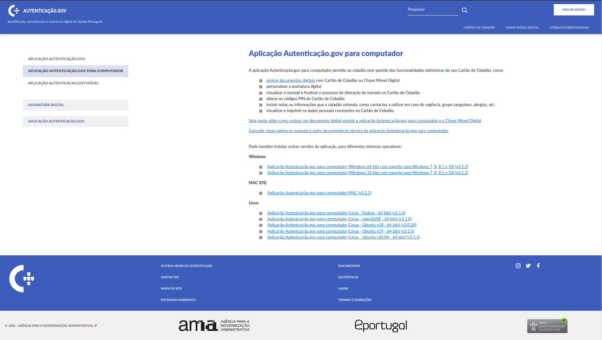

After downloading the correct version, proceed to the next step:
Application installation.

## Application installation

The instructions below assume that the application installation file
is previously downloaded online. If this is not the case, follow the
steps described in the previous section: Downloading the application
installation package.

To install the Autenticação.gov application on the computer, follow
the steps described in the following points, depending on the
operating system in use.

### Installation on Microsoft Windows

1.  Run the installation package: After downloading the installation
    file, double-click on it.

2.  On the first interactive screen, you must tick the box to accept the
    application's terms and conditions. For easy installation, press
    **Instalar** (move on to step 5). For advanced installation, press
    **Avançadas**. Advanced installation allows configuration of the path
    to the installation folder and the features to be installed.

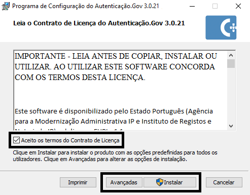

3.  After selecting **Avançadas,** choose the folder where the
    application is to be installed. To change the default folder, click
    on **Alterar** in the window that appears, navigate to the
    destination folder and press **OK**. To continue the installation in
    the destination folder, press the **Seguinte** button.

4.  A screen should appear to choose the software features to be installed. The
    features are represented in a tree structure where each feature has
    a button to include or exclude it from the installation. When a
    feature is selected, the description is displayed and the disk space
    required for its installation. To install the selected features,
    click **Instalar**.

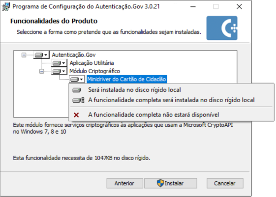

5.  After this wizard finishes, it prompts a computer restart.

6.  At the next *Windows* startup, the software installation will be completed.

### Installation on Linux

1.  **Installation via command line. Flatpak package installation**

As from version 3.9.0 of the application, a new package format for
Linux was introduced. The Flatpak format supports a larger number of
Linux distributions in a uniform way.

To install this version of the application, the procedure is as
follows:

1.  Any native version of the pteid-mw package installed on the system
    shall be uninstalled. For example, on Ubuntu use the command: `sudo apt remove pteid-mw`

2.  The Flatpak software shall be installed following the specific
    instructions for your Linux distribution:
    [https://flatpak.org/setup](https://flatpak.org/setup/)

3.  The pcsc-lite/pcscd package shall be installed in the system using
    the distribution's native packages. The application works without
    this component; only the features requiring access to the Citizen's
    Card depend on the pcscd.

4.  Run the command flatpak install pteid-mw-linux.x86_64.flatpak in the
    directory where the downloaded flatpak package is located.

### Notes on communicating with the card

1.  The Flatpak software shall be version 1.3.2 or a later version to
    allow the application to access the Citizen's Card. This
    requirement is met by distributions such as Ubuntu 20.04 and 22.04,
    OpenSUSE Leap 15.3 and 15.4, amongst others.

2.  In Ubuntu 22.04, run an extra command to ensure successful access to
    the SD card: sudo systemctl enable pcscd.socket

### Installation on Mac OS

1.  Run the installer: after downloading the installation file,
    double-click it. A screen similar to the one shown below appears:

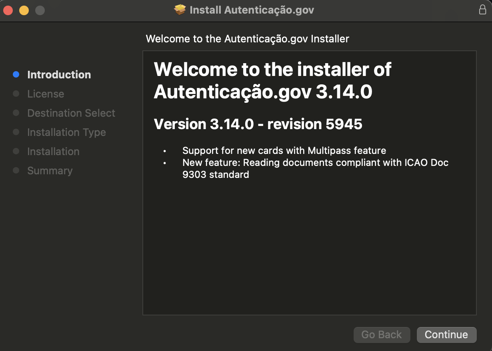

2.  Choose the **Continue** option. Then read and accept the software
    licence terms.

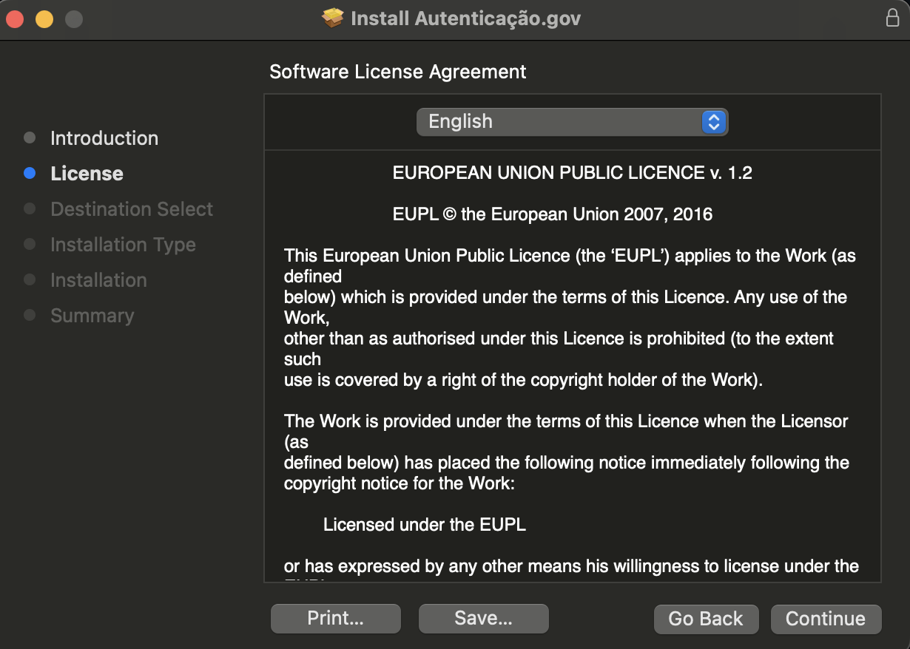

3.  From this point on in the wizard, press the **Continue** button
    until the installation is complete.

4.  After completing this wizard, the application is installed on the
    computer. The Autenticacão.Gov utility application shall now be
    available in the Applications folder.

### Installation on ChromeOS

1.  The Flatpak software shall be installed following the specific
    instructions for ChromeOS: [https://flatpak.org/setup/Chrome%20OS](https://flatpak.org/setup/Chrome%20OS)

2.  Download the Linux installer in Flatpak format from the [official
    page.](https://www.autenticacao.gov.pt/web/guest/cc-aplicacao)

3.  Run the command flatpak install pteid-mw-linux.x86_64.flatpak in the
    directory where the downloaded flatpak package is located.

4.  After installation, the application is run with the command flatpak
    run pt.gov.autenticacao

**Note: The app's feature is currently limited on ChromeOS and only the Digital Mobile Key is used.**

## Removing the application

To remove the Citizen's Card application, the steps described in the
following points, relating to the operating system used, shall be
followed.

### Removal from *Microsoft Windows 7*

<!-- -->

1.  Access the **Control Panel**.

2.  Select the **Add or Remove Programmes option**.

3.  Select the **Autenticação.Gov** programme as shown in the following
    window:

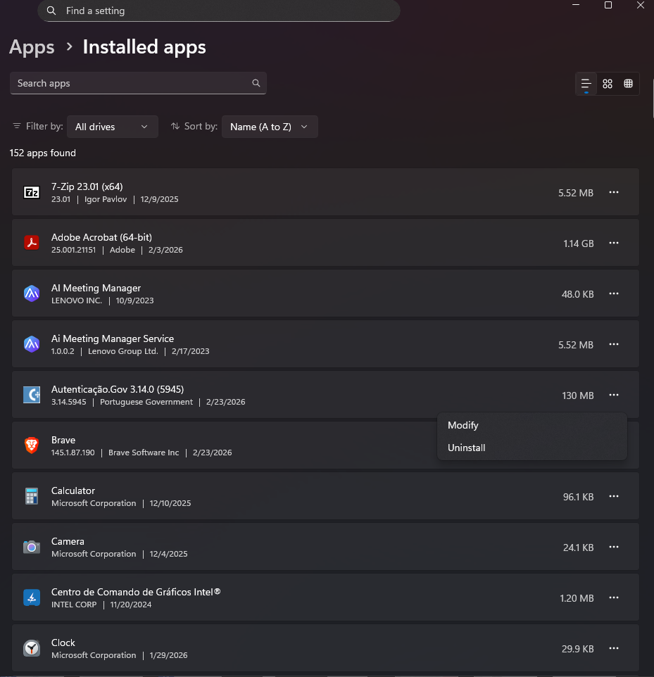

4.  Click on **Uninstall**. Confirm all dialog boxes.

5.  After these steps, the application shall be removed from the
    computer. It is advised to restart the computer after these steps.

### Removal from *Microsoft Windows 10 or 11*

### Via the Control Panel

1.  Access the **Control Panel**.

2.  Select the **Add or Remove Programmes option**.

3.  Select the **Autenticação.Gov** programme as shown in the following
    window:

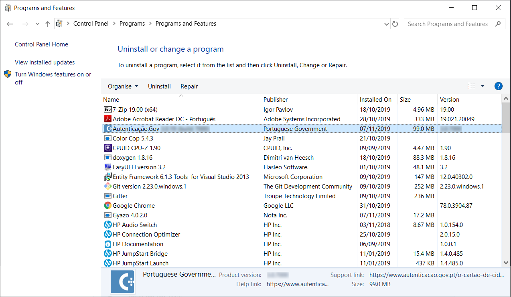


4.  Click on **Uninstall**. Confirm all dialog boxes.

5.  After these steps, the application shall be removed from the
    computer. It is advisd to restart the computer after these steps.

<!-- -->

2.  **Through *Windows Settings***

    1.  Access **Start Menu** -> **Windows Settings**.

    2.  Press the **Applications** button (Uninstall, defaults, optional
        features):

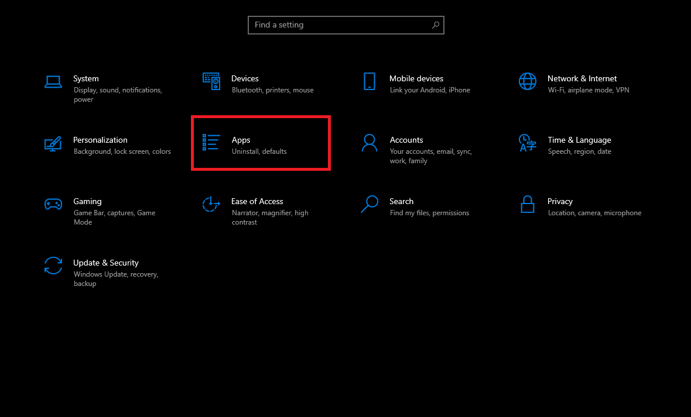

3.  Search for the Autenticação.Gov application and press **Uninstall**,
    as shown in the following figure:

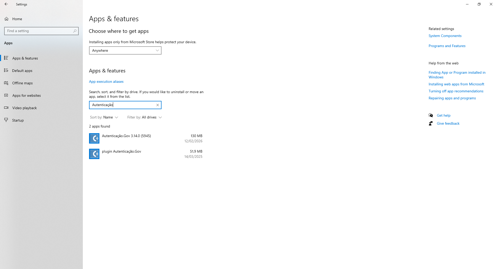

4.  Click on **Uninstall**. Confirm all dialog boxes.

5.  After these steps, the application shall be removed from the
    computer. It is advisd to restart the computer after these steps.

**Note**: the directory and log files located in the installation folder (by default in `C:\Program Files\Portugal Identity Card\log\`) shall not be removed
upon uninstalling the Autenticação.Gov application.

### Removal from Linux and ChromeOS

1.  **Removal via command line. Flatpak package removal.**

    1.  Verify the Flatpak installation status: successful installation
        is indicated by the presence of an entry with the ID
        pt.gov.autenticacao on the list returned by the command flatpak
        \--columns=app list

2.  If affirmative, remove the package with the following command:
    flatpak remove pt.gov.autenticacao

### Removal from MacOS

1.  Open the "**Terminal**" application on MacOS."

2.  Run the following command to uninstall all application files.

sudo /usr/local/bin/pteid_uninstall.sh

## Application update

### Linux update

Upon transferring the installation file via the menu
**Configurations** -> **Updates** of the application, the
installation file is found in the **Transfers** directory, by default under `~/Downloads`.

The latest version of the application can always be downloaded from
the [official page](https://www.autenticacao.gov.pt/web/guest/cc-aplicacao).

After downloading the installation file, follow the steps set out in
the section "Installation via command line" to complete the update.

# Autenticação.Gov Utility Application

The Autenticação.Gov utility application is used to view and manage
data on the Citizen's Card and to sign digital documents.


The following operations can be performed on this application:

- Viewing of identity information and photo of the citizen;

- Viewing the citizen's address;

- Viewing and editing the card notes;

- Printing the Citizen's Card data;

- Digital signature of PDF documents and other files;

- Viewing of citizen card digital certificates;

- Registration of Portuguese Root authority certificates (specific to
  Microsoft Windows);

- PIN Management (Test PIN, Change PIN).

The application's appearance and behaviour are similar across all
three operating systems, except for some features only available on
Windows, as they are native features or specific Windows environment
configurations.

The shortcut to the application shall be available in different
locations depending on the operating system type:

- In Windows, it shall appear in: **Start Autenticação.Gov Programmes**

- In Linux, it will appear in: **Autenticação.Gov Accessories
  Applications**

- On MacOS, it will appear in the location chosen by the user during the
  installation process.

## Application Presentation

The application comprises 4 main areas of interaction:

- **Main menu:** The three basic features of the application are
  provided;

- **Secondary menu:** The specific features of each option on the main
  menu are provided;

- **Configurations and help menu:** The configurations and help menus
  are provided;

- **Working area:** Data viewing area for the Citizen's Card and
  workspace for signature and security menus.

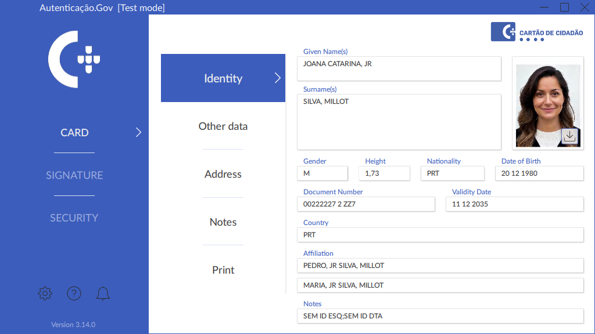f

## Application features

The application features comprise three main menus: Card Menu,
Signature Menu and Security Menu.

### Card Menu

To view the citizen's identity information and photo, view the
citizen's address, edit notes, and print the Citizen's Card data.
The application enables the export of the citizen's photo to a file.

1.  **Identity** Provides viewing of the citizen's identification data
    and photo to be found on the Citizen's Card. A photo of the citizen
    can also be exported via this page.

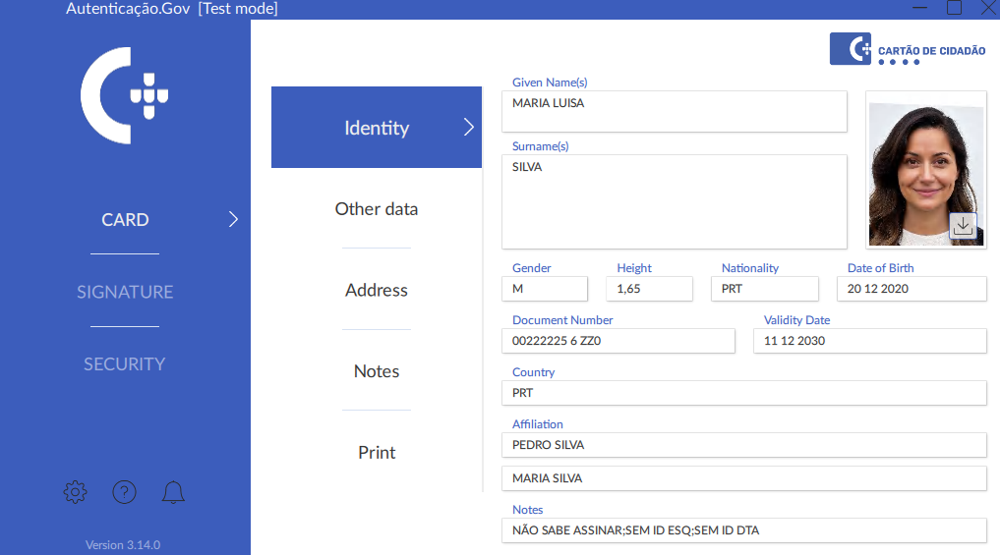

2.  **Other data** Provides viewing of other data from the Citizen's
    Card and checking of the status of the Citizen's Card.

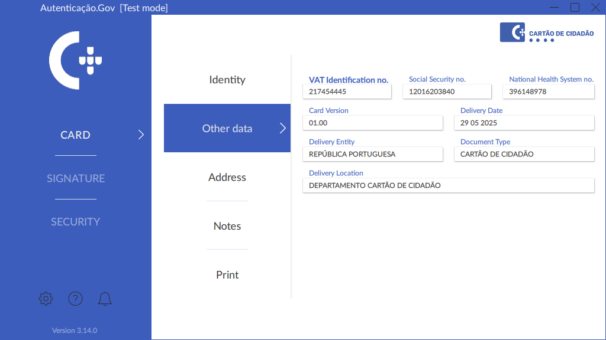

### Address and Change of Address

> ⚠ **IMPORTANT: Consulting Citizen's Card Address.**
>
> Currently, the address on the Citizen's Card is read from the central
services. This requires a working internet connection to read the
address. It shall be ensured that there is no *firewall* or other
*software* on the local network preventing connection to the addresses
morada.cartaodecidadao.pt or morada2.cartaodecidadao.pt .

On the Address tab, view the current address and access 
[gov.pt](https://eportugal.gov.pt/servicos/confirmar-a-alteracao-de-morada-do-cartao-de-cidadao) 
to complete the address change process.

Both features require an internet connection. Ensure connection before
starting the process.

To complete the address change process, visit the following webpage:
[Confirm the change of
address.](https://eportugal.gov.pt/servicos/confirmar-a-alteracao-de-morada-do-cartao-de-cidadao)

4.  **Notes** The application allows editing of the notes recorded on
    the Citizen's Card.

Reading this information does not require any code. For example,
contact information shall be included for emergencies, details about
allergies, medication, blood type, or any other information deemed
relevant and freely accessible.

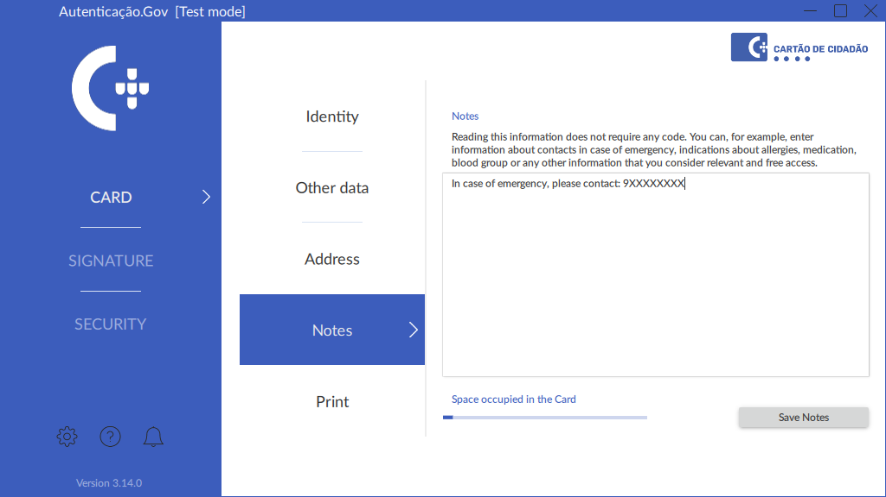

5.  **Print** The application allows Citizen's Card data to be exported
    to a PDF document or the document to be printed directly.

To perform these operations, follow the steps below:

1.  On the main menu, select **Card** and on the secondary menu the
    **Print** option.

2.  In the workspace, select the field groups to be included in the
    document and select the **Print** or **Generate PDF** option.

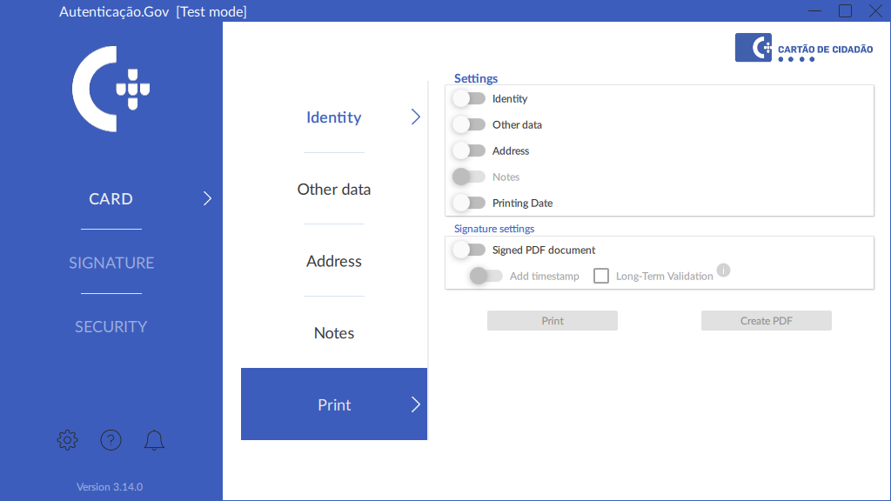

The document to be exported and/or printed shall have a graphic
appearance as shown in the following image.

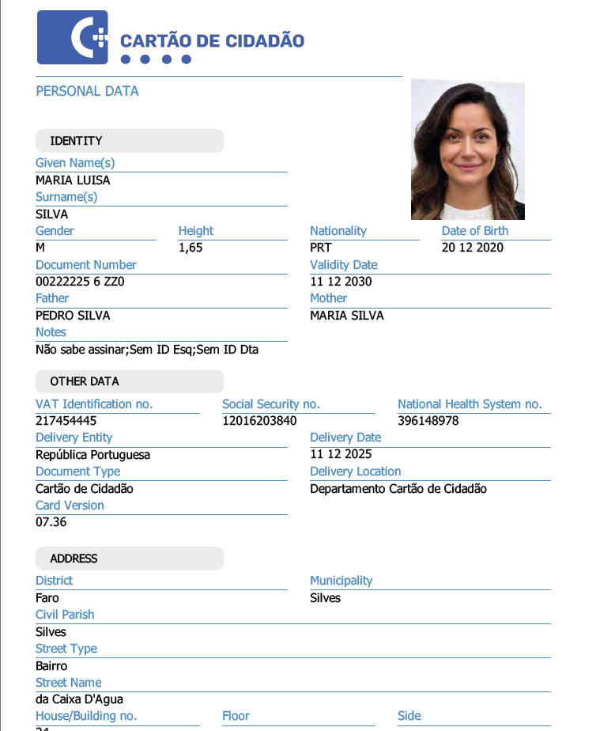

### Travel data

In the Travel Data section, data is
read from various types of identification documents with *contactless*
chips:

1.  Citizen's Cards of the model being issued since June 2024

2.  Portuguese Residence Permits

3.  Identity cards/documents or residence permits from other countries

This is a dataset readable from documents complying with Regulation
(EU) 1157/2019 of the European Parliament and of the Council, or more
broadly, the International Civil Aviation Organisation (ICAO) standard
9303. Access control to the data in these documents requires the entry
of a 6-digit numeric code printed on the physical document. In some
types of documents, this code is called CAN (*Card Access Number* ).

If the data is correctly read from the document's chip and its
digital signature is validated, the following message is displayed in
green: "Document data is authentic"

In cases where the field "Name of document holder" is shown instead
of "Full name of document holder," the document chip only contains
the name appearing in the optically readable zone (MRZ) of the
document. This name format adheres to a series of international rules
under the ICAO Doc 9303 standard with a limit on the number and type
of characters and so it may be truncated and lack national characters
such as cedillas, accents or other diacritics.

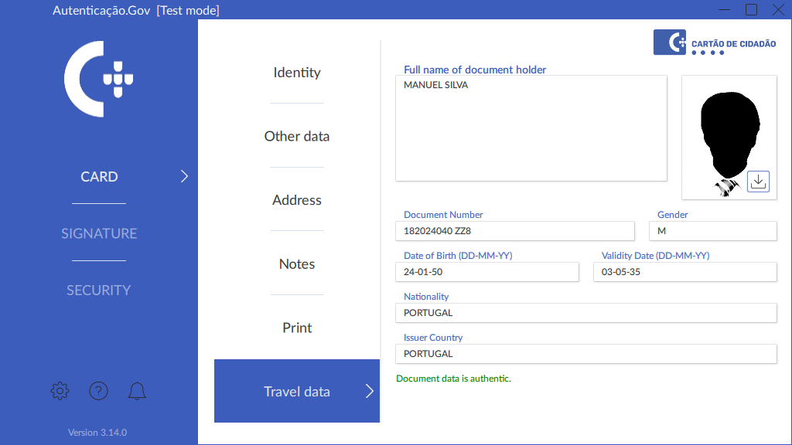

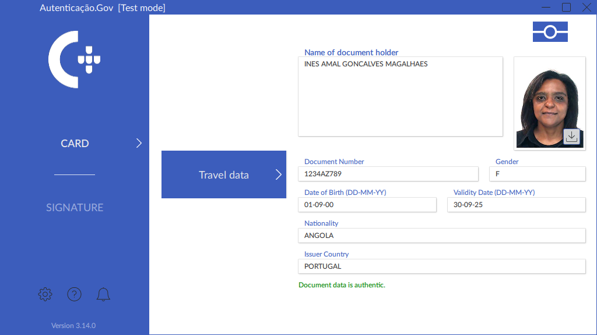

###  Digital signature

A digital signature enables the holder of a **Citizen's Card** or
**Digital Mobile Key** to sign, of their own free will, using the
personal key on their Citizen's Card or the Digital Mobile Key.

**On the Signature menu** a PDF document or any other document is
signed, with the possibility of signing multiple documents at the same
time, adding professional attributes, as well as configuring other
options. The digital signature in PDF documents was developed
according to Adobe specifications, and can thus be validated later
using *Adobe Reader* software.

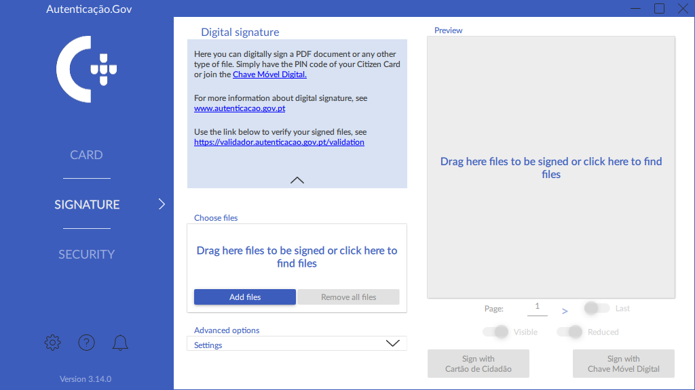

The files to be signed can be selected by dragging them to the preview
area or by using the keyboard shortcut **CTRL+V** (paste). The preview
area may also be clicked or the button

**Add files** and the files selected manually. A window will appear to
select the files to be signed. The selected files will be displayed in
the Choose files section, as shown in the following image.

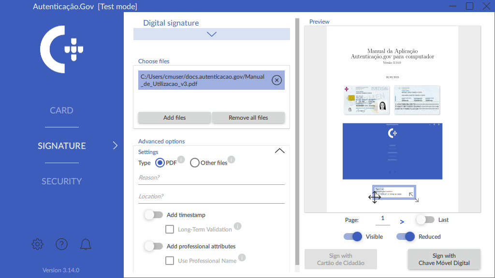

### Choose the files:

- The **Add files** button opens a new window allowing selection of the
  documents to be signed.

- Remove files individually using the button next to each file name, or
  all files by pressing the button **Remove all**.

- **In ChromeOS**, to make the files appear for selection, the following
  procedure is necessary:

* Drag the file you wish to sign to the **Linux Files**
folder.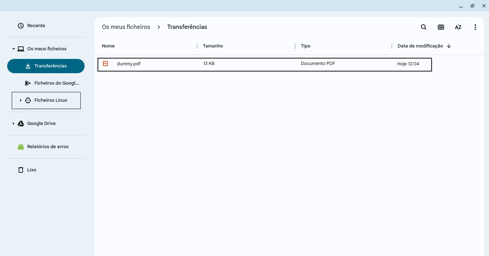

* After dragging the file, it will appear upon clicking the **Add
files** button.

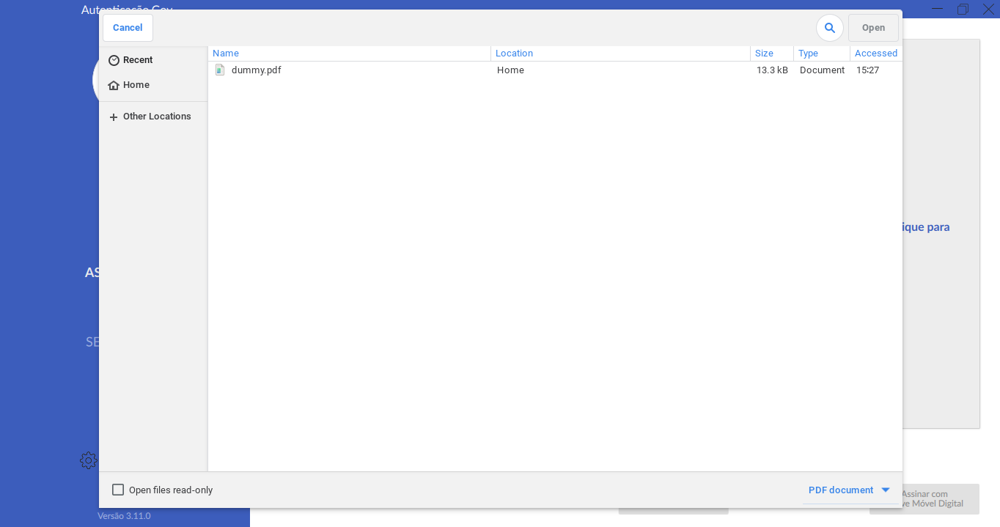

- **Signature preview:** The document to be signed is viewed and the
  position and size of the signature stamp adjusted, moving it to the
  desired location with the desired dimensions. There is only a preview
  for **PDF**, type signatures and any of the files of a multi-signature
  can be previewed by clicking on the file name in the application.

### Advanced options - Configurations:

After selecting the files, the signature options shall be selected.
The signature configurations are as follows:

- **Type:** Signature type, required field, allows file signature
  selection:

* **PDF:** PAdES (*PDF Advanced Electronic Signatures*).

* **Other files:** ASiC package with *XML Advanced Electronic
Signatures* (XAdES). This package is a ZIP file created according to
the ASiC (Associated Signature Container) specification developed by
ETSI (European Telecommunications Standards Institute) and following
EU standards. The file contains the signed information (original
files) and the respective signature in XAdES format.

- **Reason:** The signature reason is an optional field allowing the
  signatory to indicate the reason for their signature. Available for
  **PDF** type signatures.

- **Location:** Location where the signature was provided - optional
  field - allowing the signatory to indicate where the signature was
  provided. Available for **PDF** type signatures.

- **Adding a timestamp:** It adds a timestamp, proving the date on which
  the signature was provided. This is the only way to prove that the
  document existed at a specific time, as the date and time of signature
  are securely applied to the document. The time shown on the visible
  stamp is the local time of the computer where the signature was
  provided , not having to match the time on the timestamp (obtained
  from a remote server). Available for signature types **PDF** and
  **Other Files**. [See Timestamp Service on the Signature configurations page](#signature-configuration)
* **Long-term validation:** With this option enabled, the data
required to validate the digital signature are included in the final
signed file. In this way, it is possible to prove in the future that
upon signature, the card certificate (or Digital Mobile Key) and its
chain were not revoked or expired. This level is advised for documents
filed for a long period of time. The signature with long-term
validation complies with the PAdES-LTA profile specification.

- **Add professional attributes:** The professional signature feature
  enables authentication based on the user's qualified professional
  standing and institutional roles within society. The [Professional
  Attributes](#Professional-Attributes) section includes the procedure
  for loading professional attributes. Available for **PDF** type
  signatures.

Further information on professional attributes is at the following
*website*:
<https://www.autenticacao.gov.pt/a-autenticacao-de-profissionais>

- **Visible:** The signature is visible in the PDF document. Available
  for **PDF** type signatures.

- **Page:** The page shall be selected where the signature is to be
  displayed. Available for **PDF** type signatures.

- **Last:** The last page to display the signature is chosen. Available
  for **PDF** type signatures.

- **Smaller:** Allows the use of a smaller signature stamp. The smaller
  stamp always displays the following fields in the same order: "Full
  Name", "NIC" (*Civil Identification Number*) and "Signature Date",
  unless there is not enough space (long full names). In this case,
  fields are added if possible until the space is filled, in the same
  order. Available for **PDF** type signatures.

Upon selecting the desired options, in the area indicated in the
previous figure, drag the signature stamp preview to the desired
location and then press the button **Sign with Citizen's Card** or
**Sign with Digital Mobile Key**.

The **Sign with Citizen's Card** button is only available when the
Citizen's Card is inserted into the card reader and correctly read by
the application.

After clicking on **Sign,** choose the folder and file name where you
will save the signed file and follow the signing procedure (see
section **Key introduction**). A message is then displayed indicating
that the digital signature was successful.

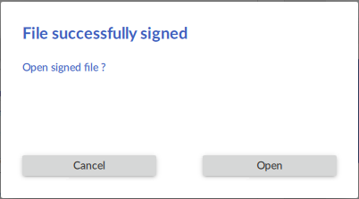

The image below is an example of a file signed with the
**Autenticação.Gov** application.

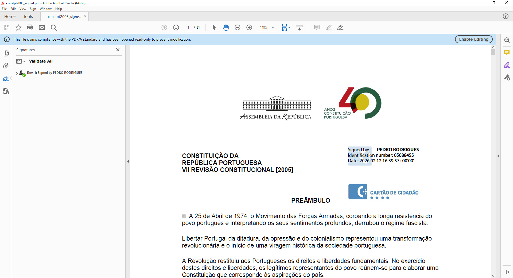

If there any issues validating signatures, check whether the issue is
related with the topic [Issues with the new chain of trust](#issues-with-the-new-chain-of-trust)

1.  **Key introduction** A digital signature enables the holder of a
    **Citizen's Card** or **Digital Mobile Key** to sign, of their own
    free will, using the personal key on their Citizen's Card or the
    Digital Mobile Key.

If signing with the personal key on the Citizen's Card, upon
selecting the **Sign with Citizen's Card** option, the signature PIN
must be entered as shown in the following figure.

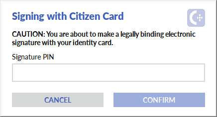

If signing with the Digital Mobile Key, upon selecting the **Sign with
Digital Mobile Key** option, enter the credentials as shown in the
following figure.

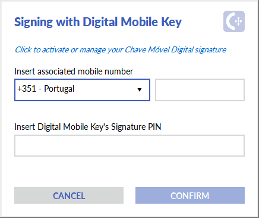

2.  **Verification of signed PDF document on Windows or MacOS** Upon
    applying a digital signature to a document, it should be
    automatically identified when opening the document in *Adobe*
    *Acrobat Reader*. The image below illustrates *Adobe* *Acrobat
    Reader* with a PDF document that includes the signature provided in
    the previous step:

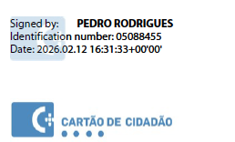

Even when the signature is not visible (if the "Visible" option is
not selected when signing), the signature is always validated in the
signature panel, allowing viewing of the signature status taking into
account the chain of trust and its cryptographic properties.

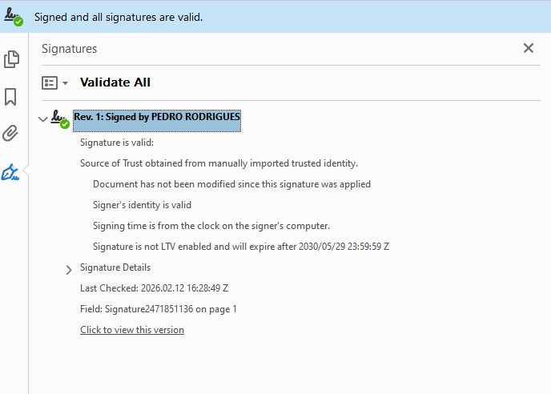

**Note**: When using the Adobe Reader function "lock content after
signing," avoid digitally signing the document again. Although it is
permitted to add more signatures according to the PAdES standard,
Adobe Reader invalidates the first signature in this process.

### Security

The application offers some features related to security on the
Citizen's Card.

1.  **Certificates** This menu allows verification of the Citizen's
    certificates and the chain of trust formed by the various
    Certification Entities of the Citizen's Card and the Portuguese
    State.

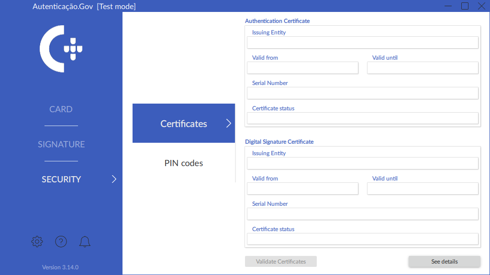

The status message presented in "Certificate Status" fields is a
result of a validation bythe Citizen Card Infrastructure, requiring an
internet connection. This validation is triggered when pressing the
*Validate Certificates* button.

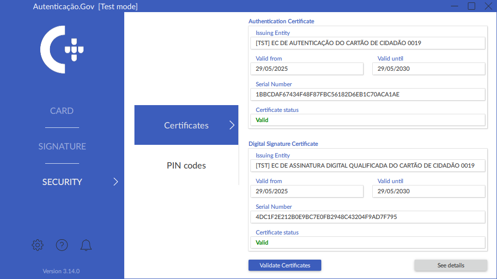

Consult the certificates chain and the details of each certificate by
pressing the *View details* button, visible in the previous image.

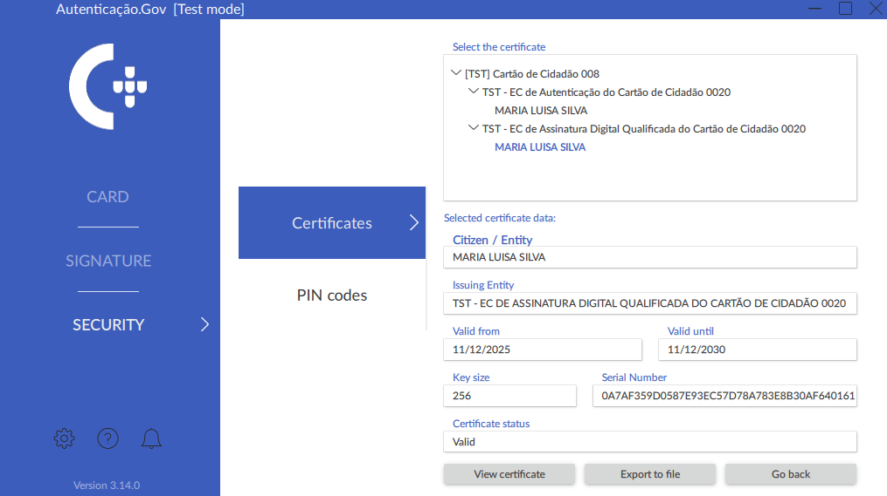

2.  **PIN code** On this menu, the PIN codes for the Citizen's Card are
    viewed and changed.

- **Authentication PIN:** This PIN is used to authenticate at websites
  and applications supporting the Citizen's Card.

- **Signature PIN:** This PIN is used to sign documents or transactions
  in applications supporting the Citizen's Card.

- **Address PIN:** This PIN is used for address verification.

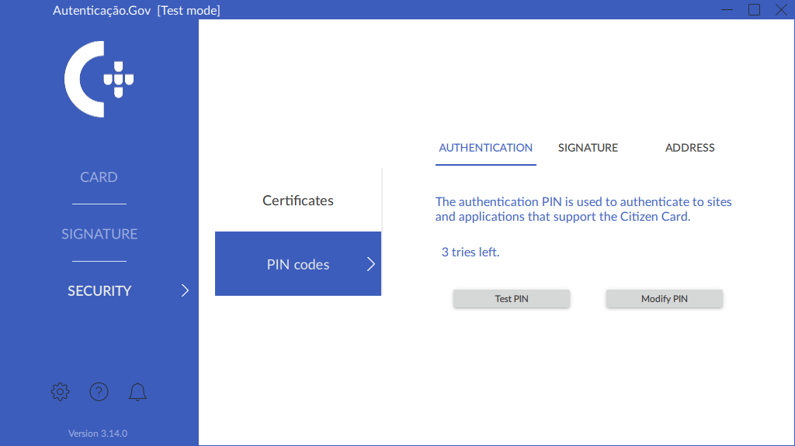

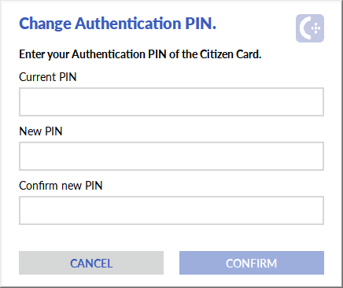

### Configurations

1.  **Signature Customisation** On this menu, the digital signature can
    be customised, replacing the image of the Citizen's Card with an
    image of the user's choice.

The **Add signature** button allows selection of an image to be used
in the customised signature. After adding an image, the **Use standard
signature** or **Use a customised signature** option is selected, at
the discretion of the user.

The minimum recommended image size is 351 x 77px.

The inclusion of the signature date and the civil identification
number in the signature is optional. To this end, simply select the
desired checkboxes on this menu.

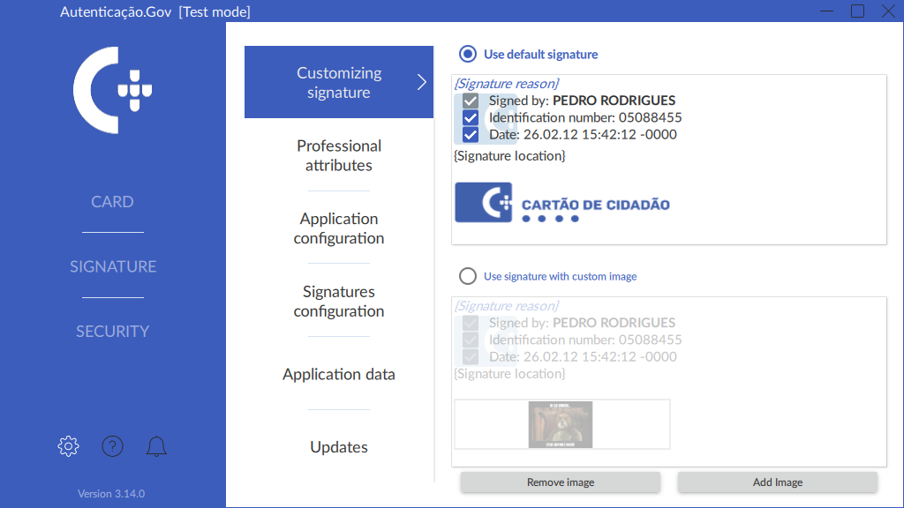

### Professional Attributes 

    The Professional Attributes Certification System (SCAP) is for citizens,
    to sign a document in their capacity as professionals using their
    Citizen's Card or Digital Mobile Key. Further information is at the
    following *website*:

<https://www.autenticacao.gov.pt/a-autenticacao-de-profissionais>
Firstly, select the type of attributes:

- **In the case of Professional Attributes,** select the entity(ies)
  providing the professional attributes to be uploaded and click **Load
  attributes**.

- **In the case of Business Attributes,** user attributes are loaded
  automatically when clicking the attribute load button.

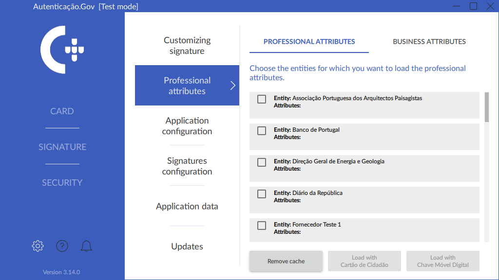

One of the attribute loading buttons is then clicked, depending on
whether loading the attributes with the Citizen's Card or Digital
Mobile Key (CMD), respectively:

- **Load with Citizen's Card:** upon selecting this button, enter your
  authentication PIN and wait for the loading of the attributes.

- **Load with Digital Mobile Key**: selecting this button shall initiate
  an authentication process on the default web browser (for example,
  Google Chrome, Mozilla Firefox, Safari, or other). Press **Authorize**
  and fill out the form with the mobile phone number associated with the
  Digital Mobile Key and its PIN. Then press **Authenticate** and enter
  the security code received on the mobile phone by SMS or notification
  from the Autenticação.gov app. Press **Confirm** to complete the
  authentication.

If authentication was successful, return to the application and wait
for the attributes to load.

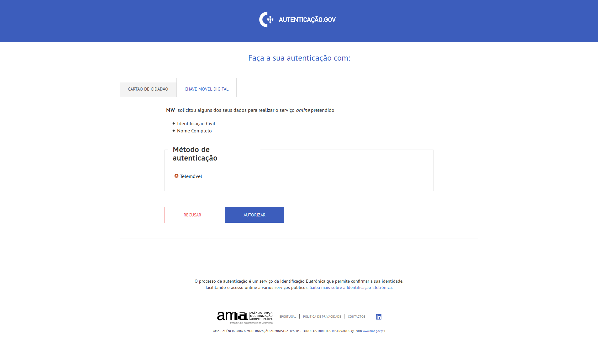

### Application configuration

In this window, configure some operating aspects of the application, namely:

- **Card Reader:** Selection of card reader to be used. There is also an
  option enabling or disabling the PINPAD feature on the readers.
  Readers with PINPAD are card readers who have a physical keypad for
  entering the PIN code securely.. If this option is disabled, readers
  with PINPAD will behave identically to readers without PINPAD.

- **Start:** Application launch options.

- **Automatic updates**: Enable or disable the verification of new
  updates when the application starts. This option only enables or
  disables the verification of new application versions. It has no
  influence on the updating of certificates, carried out automatically,
  whenever necessary, when the application starts.

- **Language:** Select the application language.

- **Appearance:** Options related to the application's appearance. This
  section provides an option allowing the enabling and disabling of
  transition animations between menus.

- **Application scale:** Options related to text size and other
  application components.

- **Diagnostic mode**: Enable or disable the application's diagnostic
  mode. This mode raises the log detail level to *debug*, helping the
  support team to resolve any issues with the application.

**On all operating systems, to help obtain log files, there is a new
feature allowing the creation of a "Diagnostic Report". Simply press
the "Create report" button.** Upon pressing the **Create report**
button, a compressed folder (zip file) is created on the Desktop
containing all the log files. Send this folder (zip file), attached to
a description of the issue, to the support contact. For further
information, see the chapter
[Obtaining Report for analysis on the Configurations menu](#obtaining-the-report-for-analysis-via-the-configurations-menu)

The *log* files by default are created at the following locations and
are named with the prefix
.PTEID:

- **Windows**: In the log folder in the installation folder (by default,

C:\Program Files\Portugal Identity Card ), usually:

C:\Program Files\Portugal Identity Card\log\

- **MacOS**: User's Home Directory, for instance:

/Users/Utilizador/

- **Linux**: User's Home Directory, for instance:

/home/User/

**If application start is unsuccessful,** activate the diagnostic mode
using the Autenticação.gov software configurations via Registry keys
on Windows or a configuration file on Linux and MacOS.

- On**Windows**, the registry key:

### HKEY_CURRENT_USER\Software\PTEID\logging\log_level;

- On **Linux**, the key called "log_level" in the logging section of
  the file:

### $HOME/.config/pteid.conf ;

- On **MacOS**, the key named "log_level" in the logging section of
  the file:

### $HOME/Library/Preferences/pteid.conf.

The key may have the following values:

- debug(if there are issues with the application, the support team can
  help resolve the issue)

- info

- warning

- error (default value)

In a business environment, change the following configuration as
described in the chapter [Configuration instructions in business
environments.](#configuration-instructions-in-business-environments)

- **Graphics acceleration**: The application's graphics rendering mode
  is activated. The *"Hardware (Graphics card)"* option should afford
  a better performance, but if there are any issues, an alternative
  option may have to be configured (see section [Graphical issues in the
  application.)](#graphics-issues-in-the-application)

- **Network configurations:** Proxy server configuration options. In
  networks where internet access is only possible through an HTTP/S
  proxy server, the following access information shall be configured:

  - **System proxy (Windows and MacOS)**. Upon selecting this option and
    if a system proxy configuration or an autoconfiguration script is
    defined (*Proxy Autoconfig),* this setting shall be used
    automatically by the application and other applications using
    Citizen's Card middleware.

  - **Proxy server:** IP address / Hostname / Port.

  - **Proxy authentication:** Access credentials (if required).

The following image shows the application's configurations menu.

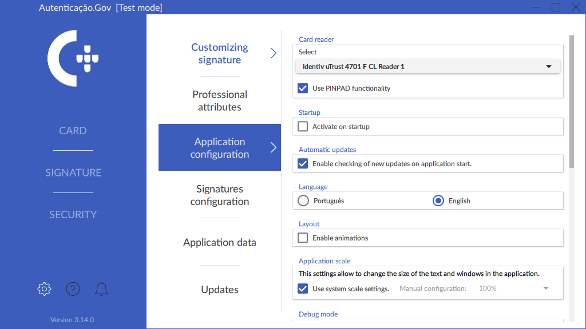

### Signature configuration
In this window, configure some aspects related with signing with the Citizen's Card:

- **Certificates**: Options regarding the registration and removal of
  certificates during card insertion and removal.

The certificate registration and removal options require this
application to be running (minimised or maximised).

- **Timestamp Service:** Set up a customised timestamp service.

The application allows the selection of a different server for
obtaining time stamps, as the default TSA server for Citizen's Card
[http://ts.cartaodecidadao.pt/tsa/server](http://ts.cartaodecidadao.pt/tsa/server) 
has a limit of 20 requests in each 20-minute period. If
this amount is exceeded, service access  will be blocked for 24 hours,
allowing for any other consequences in case of repeated blocking
situations. (For further information on the Citizen's Card timestamp
service, visit
[https://pki.cartaodecidadao.pt](https://pki.cartaodecidadao.pt)).

To use a different server, simply enter the server's URL in the text
box.

Further to this configuration, both PDF document signatures (PAdES)
and XAdES format signatures shall use this newly configured server to
obtain timestamps when signing.

- **Microsoft Office (Windows):** Signature configurations in Microsoft
  Office applications.

- **Digital Mobile Key (Windows):** Registration of the certificate
  associated with the Digital Mobile Key account. Further information is
  available in the section [Digital signature with Digital Mobile
  Key.](#digital-signature-with-digital-mobile-key)

- **New State Root Certificate (Windows):** Installation of the root
  certificate of the new Citizen's Card certificate chain in the Windows
  Trusted Root certificates store. Further information is available in
  the section [Issues with the new chain of
  trust.](#issues-with-the-new-chain-of-trust)

The following image shows the signature configurations menu.

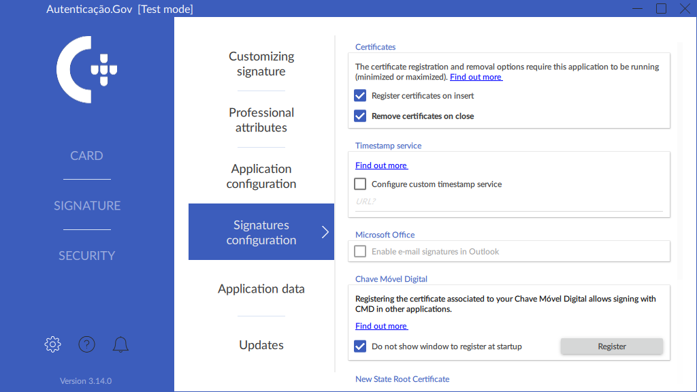

1.  **Application data** On this tab, the user can delete cached data
    stored from card readings and the loading of professional and
    business attributes.

Stored data relating to the Citizen's Card includes identity data,
photo, and the authentication and signature certification chain.

For professional and business attributes, a list of pre-loaded
attributes is stored.

There is also the option to disable the card data cache by
deactivating the "Use card data cache" option.

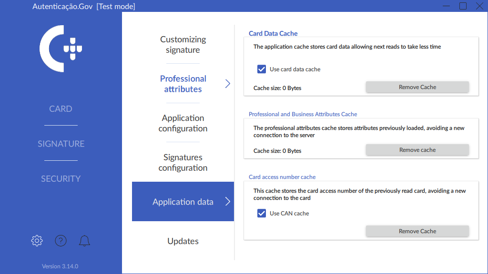

2.  **Updates** In this window, you can manually check if there are any
    updates for the application. Automatic download of the application
    installer and subsequent initiation of the installation process,
    subject to available updates and user preference.

### Help

The help window provides a summary of the application's features,
indicating the path to this manual, and the application's support
page.

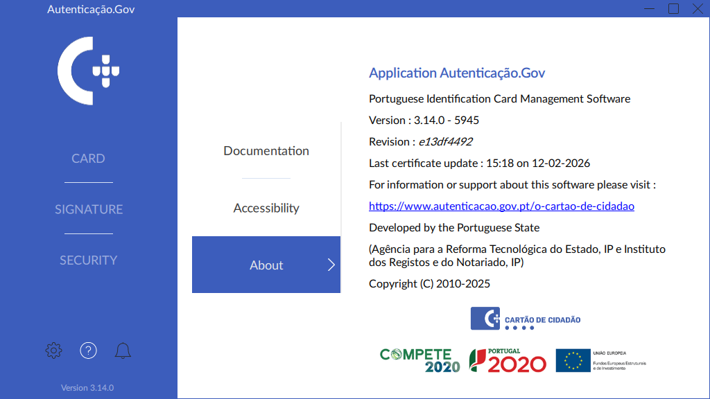

### Notification Centre

Provision of information about news, configurations and updates, in
the form of notifications, opening automatically when the application
starts in the event of new notifications.

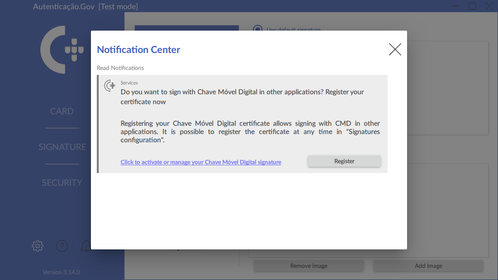

Configurations may have mandatory notifications whose interaction is
necessary to use the application, such as the use of the cache:

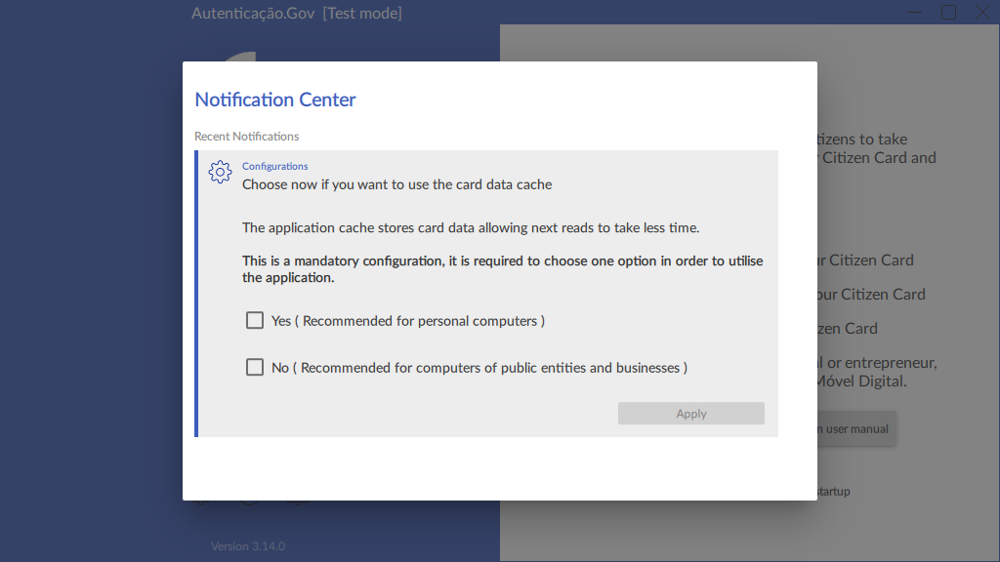

### Contactless Access

**Important:** This feature has been available since version 3.12.0 of
the application.

To use the contactless interface of the new Citizen's Card, a new
dialog box is displayed on the page currently in use, for example,
the Identity, Address, Certificates, or Signature page. This window
requires entry of the card access code, to prevent unauthorised access
during *contactless* reading.

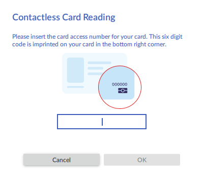

The card access code is the 6-digit code located in the bottom right
corner of the new Citizen's Cards.

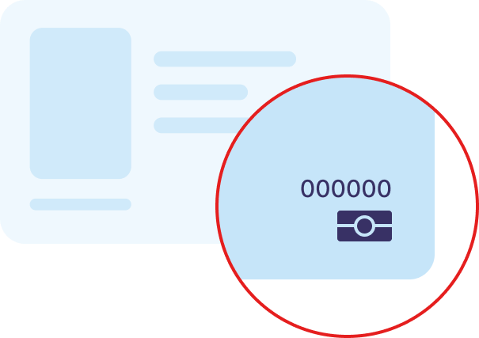

This code shall not be required for subsequent uses of the application
with the same card.

However, if you do not want the access code to be saved, you can
disable this option in the "Application Data" tab within the
application's Configurations menu.

**NOTE:** Using the card via the contactless interface for signing or
authenticating in external applications such as Adobe Acrobat Reader
requires the user to read it at least once in the Autenticação.gov
application and that the "Save access codes" option is enabled under
Configurations.

# Integration with applications

The Citizen's Card middleware, installed with the Autenticação.Gov
application, allows integration with other operating system
applications, providing two features: Authentication and Digital
Signature.

The *middleware* provides cryptographic support to applications via
native cryptographic support in the Windows operating system or via
the PKCS#11 interface.

## Integration with Windows applications

### Integration with applications with the Citizen's Card

Automatic registration of Citizen's Card certificates in the
operating system upon insertion into the card reader with the
installation of middleware in Windows, ensuring the availability of
authentication and signature features for applications using the
system's cryptographic layer

Some examples of these applications include: *Microsoft Word*,
*Microsoft Excel*, *Microsoft Outlook* and *Adobe Acrobat Reader*.

For certificates to be automatically registered, the\
following is required:

- The option "Register certificates on insert" available in the
  [Signatures configurations](#signature-configuration)
  [tab](#signature-configuration) is active.

- Open the local Autenticação.Gov application before inserting the card.
  It is advisable to read the card at least once in the app.

### Integration with applications using the Digital Mobile Key:

Integration with applications is also possible with the Digital Mobile
Key through the digital signature component. Follow the procedure
described under [Digital signature with Digital Mobile
Key](#digital-signature-with-digital-mobile-key)
[.](#digital-signature-with-digital-mobile-key)

Upon signing with a Digital Mobile Key, the verification message sent
to the user follows one of the following two formats:

- In the case of applications such as *Adobe Acrobat Reader* or
  *Microsoft Office*:

    **Código de segurança: \<code\>.
    Assinatura de documento** **\<document title/e-mail>\".**

Example:

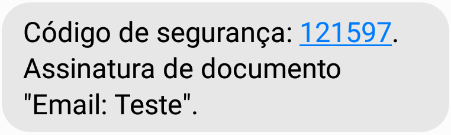

- In the case of other applications supporting digital signatures, or
  when there is no verification of the document name:

### Security code: \<code\>.

**Document signature "Application: \<Application name\>Id: \<last 8
digits of the hash of the content to be signed\>".**

Example:

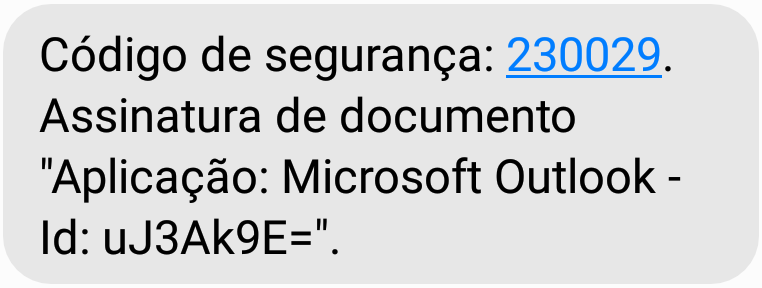

## Integration with applications via the PKCS#11 interface.

For applications supporting PKCS#11, configure the middlewarefile
location to enable support. The location of this file depends on the
operating system being used.

**Windows:** C:\Windows\System32\pteidpkcs11.dll **Linux:**
/usr/local/lib/libpteidpkcs11.so **MacOS:**
/usr/local/lib/libpteidpkcs11.dylib

## Digital signatures in common applications

An explanation shall be provided in the following sections of the use
of digital signature features in the following applications:

### Digital signature:

- [Microsoft Office Suite](#digital-signature-in-microsoft-office-suite)

- [LibreOffice/OpenOffice Suite](#digital-signature-in-the-libreoffice--openoffice)

- [Microsoft Outlook](#digital-e-mail-signature-with-microsoft-outlook)

- [Adobe Acrobat Reader](#digital-signature-in-adobe-acrobat-reader) on Windows

- [Adobe Acrobat Reader on MacOS (as from version 3.11.0)](#digital-signature-in-adobe-acrobat-reader-on-macos)

- [Adobe Acrobat Reader on MacOS with PKCS#11](#digital-signing-in-adobe-acrobat-reader-on-macos-with-pkcs11)

- [Mozilla Thunderbird with PKCS#11](#digital-e-mail-signature-with-mozilla-thunderbird)

### Digital signature in *Microsoft Office suite*

A description is provided in this section of the digital signing of
documents in *Office* files, specifically, in the following
applications: *Word*, *Excel* and *PowerPoint*.

Digital signing of document, following these steps:

1.  Access the **File** menu.

2.  In the **Information** section, click the button **Protect
    Document** and select the option **Add a Digital Signature**, as
    shown in the image below:

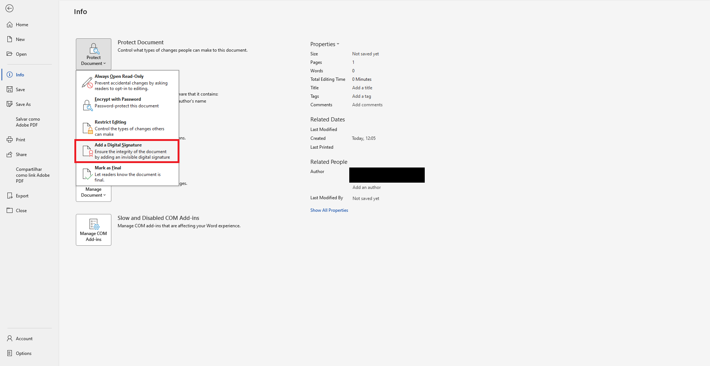

3.  A specific message appears from the application being used (*Word*,
    *Excel* or *Powerpoint*), click **OK**.

4.  In the dialog box **Sign**, enter the signature purpose as
    shown in the image below:

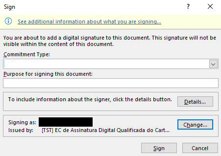

5.  Click on sign and enter the signature PIN in the respective window.

6.  The document will be digitally signed and read-only, making it
    impossible to alter it.

More detailed information at the following link: [Add/Remove a Digital
Signature](https://support.office.com/pt-pt/article/Adicionar-ou-remover-uma-assinatura-digital-nos-ficheiros-do-Office-70d26dc9-be10-46f1-8efa-719c8b3f1a2d)
[in Office
files.](https://support.office.com/pt-pt/article/Adicionar-ou-remover-uma-assinatura-digital-nos-ficheiros-do-Office-70d26dc9-be10-46f1-8efa-719c8b3f1a2d)

### Digital signature in the *LibreOffice / OpenOffice*

This section presents the digital signing of documents in
*LibreOffice* files, specifically, in the applications *Calc*, *Write*
and *Impress*. The version used in this manual was *LibreOffice 5.3*.
The interface for this feature is quite similar across all versions
from 4.0.0 onwards.

In Linux operating systems, the detection of digital certificates in
this Suite depends on the security configurations of *Mozilla
Thunderbird* or *Mozilla Firefox*. For this feature to be available,
first configure the integration with the Citizen's Card in *Mozilla
Thunderbird* or *Firefox*. See the instructions in: [Digital signature
of e-mail with Mozilla
Thunderbird.](#digital-e-mail-signature-with-mozilla-thunderbird)

For the digital signing of a document, follow these steps:

1.  Access the **Digital Signatures File** menu.

2.  A window will appear displaying the document's digital signatures.
    If there are no signatures yet, the list will appear empty as shown
    in the image below. Click the **Sign document button\...**

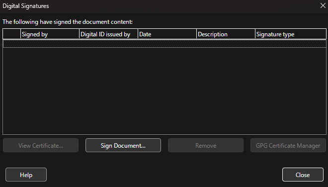

3.  A window appears for selecting the certificate. Select the
    certificate with your name and issued by **the Citizen's Card
    Qualified Digital Signature CA (*certificate authority*)** as
    illustrated in the image below:

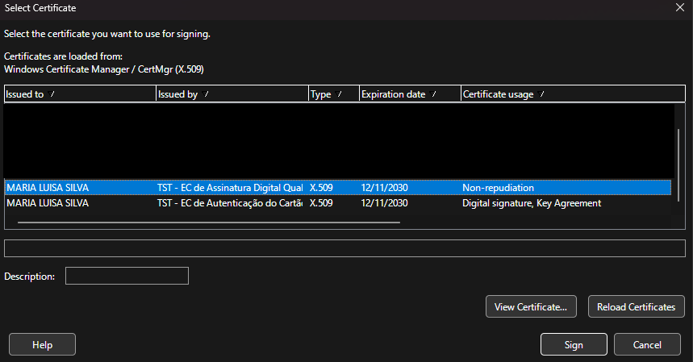

4.  Click on **Accept** and enter your PIN signature in the respective
    window.

5.  The document will be digitally signed.

### Digital e-mail signature with *Microsoft Outlook*

The digital signature in *Outlook* by default requires the digital
certificate to include the e-mail address, with this address matching
the e-mail to be signed.

The certificates included on the Citizen's Card and the Digital
Mobile Key do not contain any e-mail address. To make it possible to
carry out digital signatures in *Outlook* with the Citizen's Card and
Digital Mobile Key, this validation needs to be disabled.

In the application, this validation can be disabled by selecting the
option **Allow e- mail signatures in Outlook** on the submenu
**Signature configuration** of the Autenticação.gov application for
computers.


Alternatively, to **disable matching with the digital certificate
email address**, follow the instructions provided at the *Microsoft*
website:

- PT version: <http://support.microsoft.com/kb/276597/pt>

- EN version (original): <http://support.microsoft.com/kb/276597/>

For the digital signing of an e-mail in *Outlook*, first carry out the
respective configuration. The steps below are divided into
**configuration**, consisting of the initial configuration required,
and **signature**, consisting of the signature itself.

**Note:** The images shown refer to *Microsoft Outlook 16*.

**Configuration** This operation is performed only once.

1.  Ensure that correspondence with the digital certificate's email
    address is disabled, as instructed above.

2.  In Outlook, access the **File - Options menu**

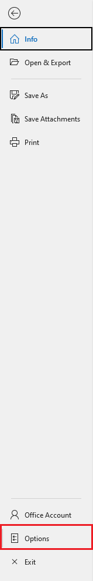

3.  Click **Trust Centre**.

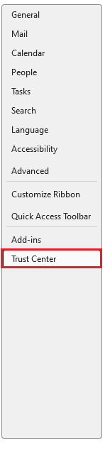

4.  Select the **Trust Centre** **Settings** section.

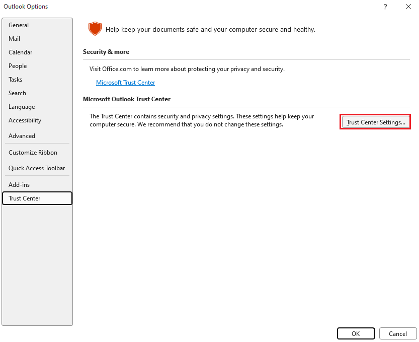

5.  In this section, click the **Settings button**

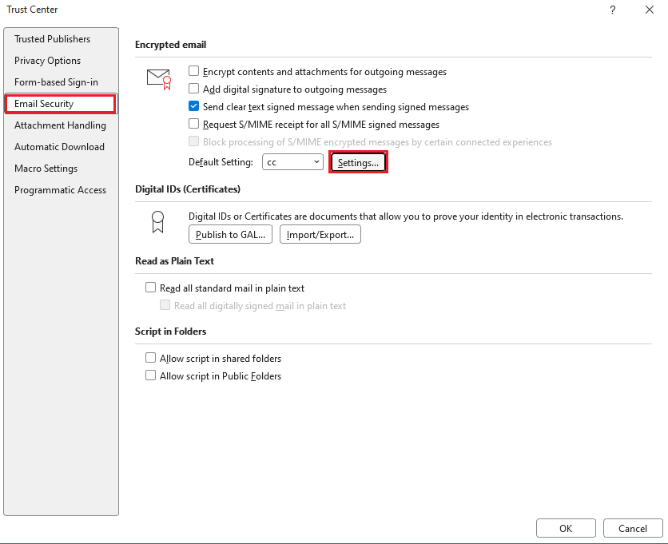

6.  Add a description for this configuration for example: "Signature
    with Citizen's Card" and click the **Choose** button to select the
    certificate. Select the Citizen's Card or [Digital Mobile
    Key](#digital-signature-with-digital-mobile-key) signature
    certificate.

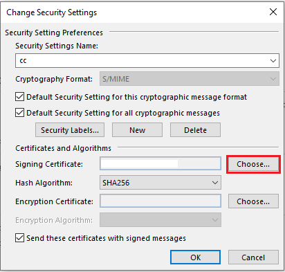

7.  In the configuration **Hash algorithm,** choose **SHA256** and click
    **OK**.

8.  Click **OK** in all open configuration windows. The configuration is
    complete.

**Signature** - to be performed for each signed e-mail sent.

1.  In the **Options** tab of the message creation window, click
    **Sign** to activate the signature.

2.  Upon clicking **Send**, the signature PIN shall be requested and the
    e-mail shall be signed and sent.


### Digital signature in *Adobe Acrobat Reader*

**Note: to** sign a document on *Adobe Acrobat Reader* on MacOS, follow the instructions in the section [Digital signature in *Adobe Acrobat Reader* in MacOS (since version 3.11.0)](#digital-signature-in-adobe-acrobat-reader-on-macos)

**Note:** signing with professional attributes is only possible in the
Autenticação.Gov application. To sign a PDF document in *Adobe Acrobat
Reader*:

1.  Some PDF documents were created by their author with signature
    fields. Identify the signature field to where your signature should
    be placed and click it. Proceed to point 4 of this procedure.
    Alternatively, create a new signature field in the desired location.
    For that goalaccess the **Tools** tab and select **Certificates**.

2.  Click **Digitally Sign** in the horizontal bar above the document.

3.  Click and drag the mouse to determine the position of the signature
    stamp in the document.

4.  Ensure the Citizen's Card is inserted into the reader and select
    the respective signature certificate, issued by the Citizen's Card
    X Qualified Digital Signature CA (where "X" is a 4-digit number,
    for example 0010), and click**Continue**.

5.  Click **Sign** and choose the name and folder to save the signed
    document.

6.  Finally, enter the signature PIN. The window for entering the PIN
    should be entitled "Windows Security" and display the message
    "Enter digital signature PIN".

### Digital signature in *Adobe Acrobat Reader* on MacOS.

The Citizen's Card supports native MacOS applications, via the
PteidToken module, implementing the CryptoTokenKit framework.

The initial configuration of this module in Acrobat Reader is much
easier than in previous versions. To sign a document in *Adobe Acrobat
Reader* in MacOS, firstly enable the use of the CryptoTokenKit module
as follows:

1.  In *Adobe Acrobat Reader,* access the **Preferences...**.menu

2.  Select the **Signatures** category and in the "Creation and
    appearance" section press **More...**.

3.  Click the "Enable CryptoTokenKit structure support" checkbox.

Having previously signed with a CC using earlier versions of
Autenticação.gov, also ensure that Acrobat Reader is running in native
mode if the computer has an Apple M1 processor or successor. Consult
the following help page:

- <https://helpx.adobe.com/pt/acrobat/kb/apple-silicon-m1-processor-support.html>

After this configuration which is required before first use, insert
the Citizen's Card into the reader and the signature certificate
shall then be available in the **Certificates menu feature.**

### Digital signing in *Adobe Acrobat Reader* on MacOS with PKCS#11.

- 1.  In *Adobe Acrobat Reader*, look for **Preferences**.

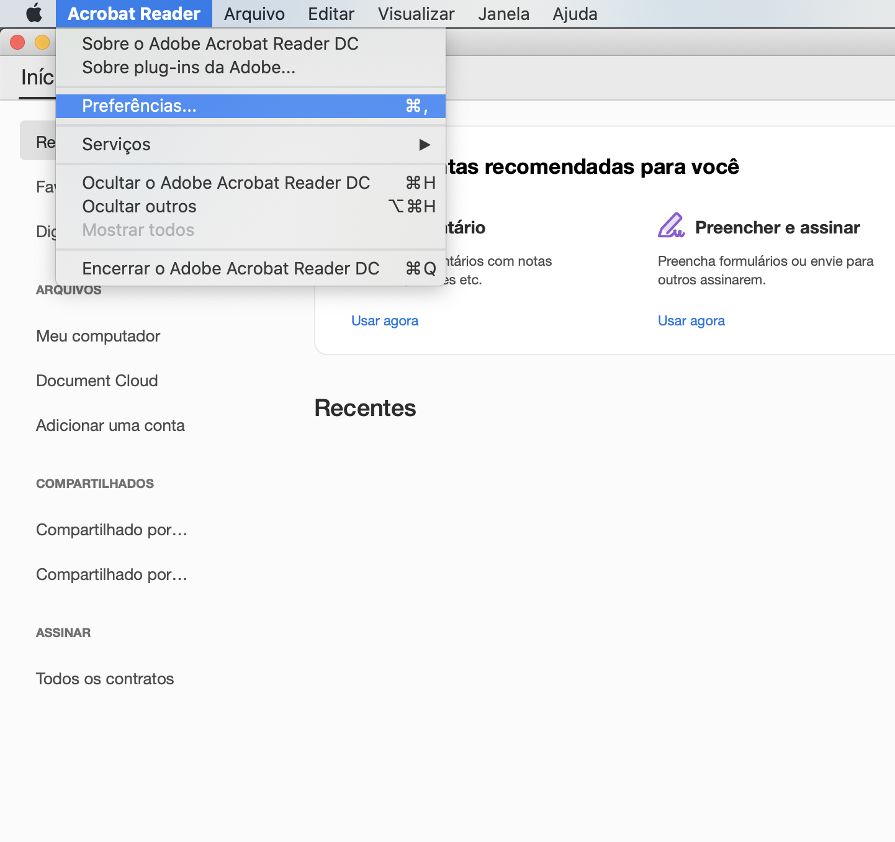


2. Select the category **Signatures** and in section "Identity and Trust Certificates" pressione **More...**.

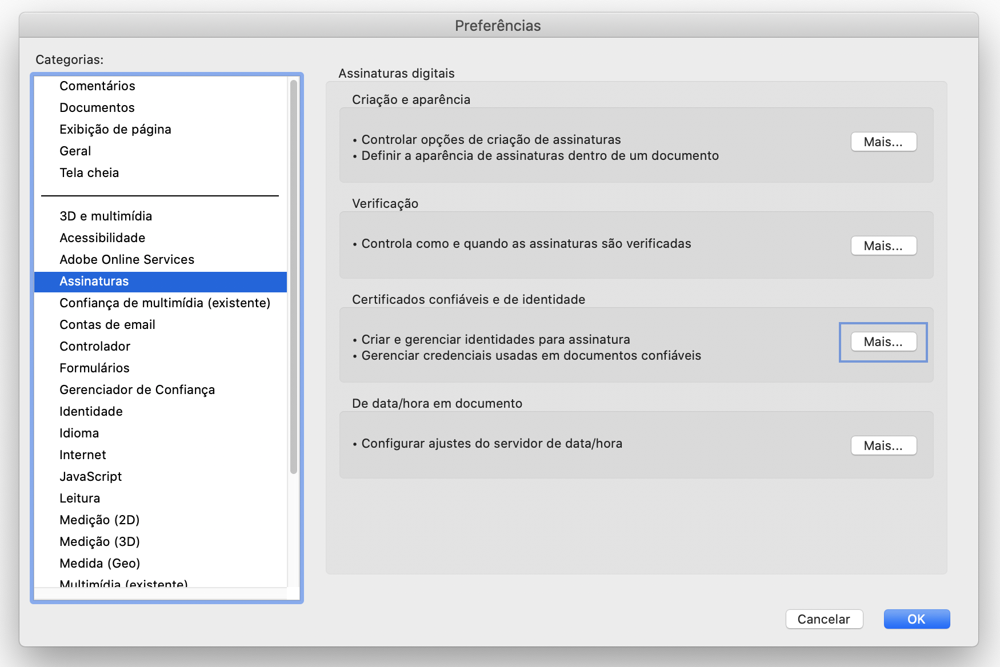

3. In section "Digital IDs" select **PKCS#11 Modules and Tokens** and click **Attach Module**.

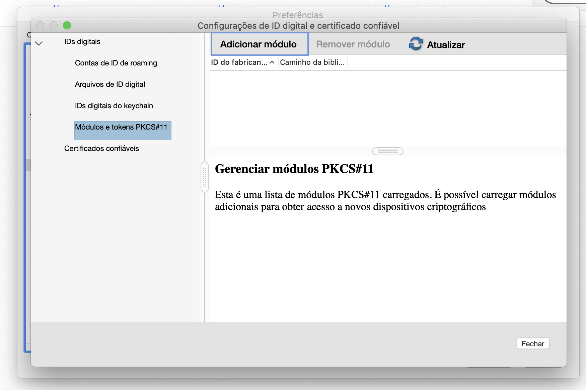

4. In the text field, enter the library path: `/usr/local/lib/libpteidpkcs11.dylib` and click **OK**.

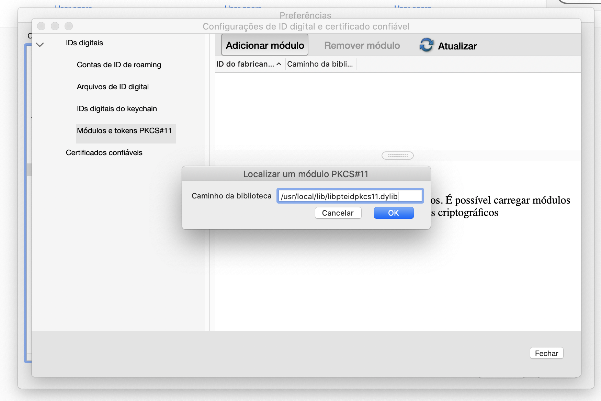

If your Citizen Card is inserted in the reader and the module has been successfully added, when you click **Update** the certificates will become available and visible as shown in the following image. If the certificates are not available as shown, make sure the card is inserted in the reader, restart *Adobe Acrobat Reader*, and check again.

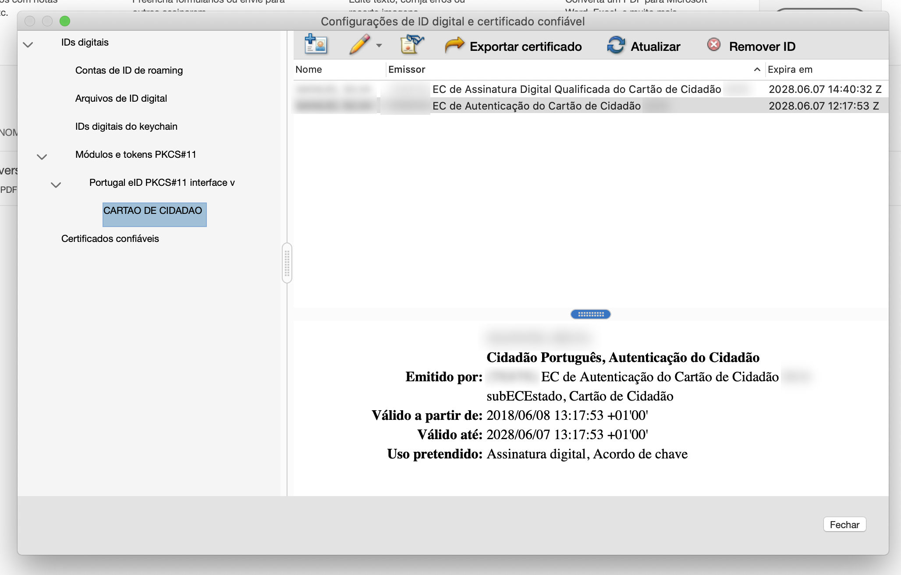

1.  Access the **Tools** tab and select **Certificates**.

2.  Click **Digitally Sign** in the horizontal bar above the document.

3.  Click and drag the mouse to determine the position of the signature
    stamp in the document.

4.  Select the respective signature certificate, issued by the
    **Citizen's Card X Qualified Digital Signature CA** (where "X" is
    a 4-digit number, for example 0010), and load **Continue**.

5.  Click **Sign** and choose the name and place to save the signed
    document.

6.  Finally, enter the signature PIN.

### Digital signature with Digital Mobile Key

Sign documents or e-mails with the Digital Mobile Key in Windows in
applications such as *Microsoft Word*, *Microsoft Excel*, *Microsoft
Outlook* and *Adobe Acrobat Reader*. The procedure is very similar to
those described in the previous sections but two aspects differ:

**Certificate registration** Registration of the certificate
associated with the Digital Mobile Key in Windows.

1.  In the [Signature configuration tab](#signature-configuration) of
    the Autenticacão.Gov application, there is a section dedicated to
    configuring the Digital Mobile Key with the **Register** button.
    Press the button to open a certificate registration window.

2.  Enter the mobile phone number associated with your Digital Mobile
    Key account and the Digital Mobile Key Signature PIN and press
    **OK**.

3.  If the credentials entered in the previous step were correct, a code
    is received by mobile phone. Enter it to complete the certificate
    registration process. This code shall be sent by SMS or via a
    notification from the Autenticação.gov mobile application.

In the event of non-registration of the certificate after reactivating
the Digital Mobile Key Signature, or if the currently registered
certificate has expired, repeat the registration procedure.

**Signature** similar to signing with the Citizen's Card, with the
following differences:

- During configuration or at the time of signing, choose the certificate
  issued by **EC de Chave Móvel Digital de Assinatura Digital Qualificada do Cartão de Cidadão X**
  (where "X" is a 5-digit number, for example, 00001 or 00002).

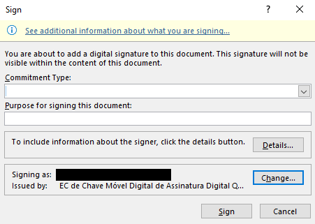

- Upon confirmation of the signature request within the application, a
  window appears where, just as in the certificate registration, the
  Digital Mobile Key signing PIN is entered. Upon entering the correct
  PIN, an SMS is received with a confirmation code to be entered in the
  window to complete the signature.

### Digital e-mail signature with Mozilla Thunderbird

For the digital signing of an e-mail in *Thunderbird*, first carry out
the respective configuration. The steps described below are divided
into **configuration**, consisting of the necessary initial
configuration, and **signature**, consisting of the signature itself.
The printscreens match version 91 of Mozilla Thunderbird.
>
**Configuration** This configuration is carried out only once, and the
steps described also apply to configuring certificates in *Firefox*.

1.  Open **Preferences** and select the **Privacy and security** tab.
    Navigate to the section

### Security - Certificates.

2.  Press the **Security devices** button.

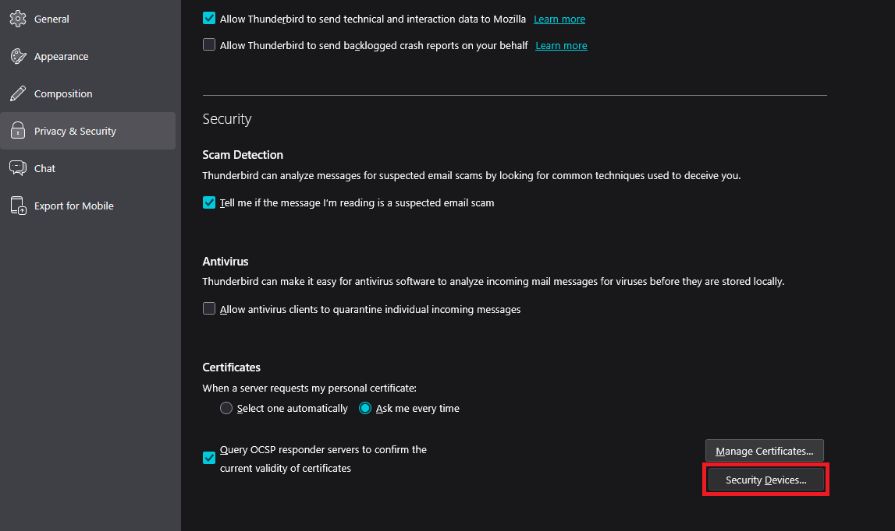

3.  Click the **Load** button.

4.  In the new window, fill in the module name (for example,
    "Citizen's Card") and the path to the **PKCS#11**module, located
    in one of the following locations (recommendation: copy the path to
    the module, according to your operating system, from the following
    list):

### In Windows:

- C:\Windows\SysWOW64\pteidpkcs11.dll (Windows 32-bits)

- C:\Windows\System32\pteidpkcs11.dll (Windows 64-bits)

**In Linux:** /usr/local/lib/libpteidpkcs11.so

**In MacOS:** /usr/local/lib/libpteidpkcs11.dylib

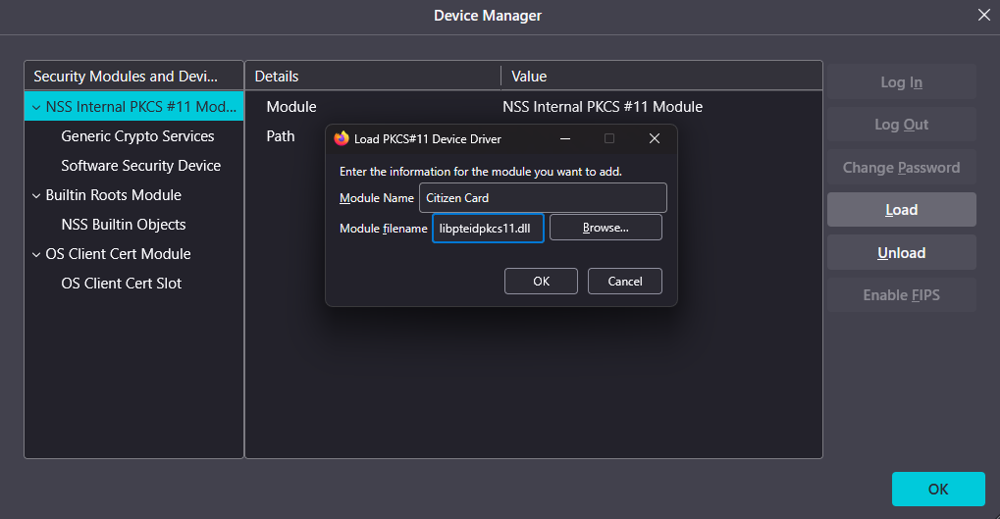

5.  Press **OK** in all windows.

6.  Open **Account settings** and select the e-mail account.

7.  Select the **End-to-end encryption** tab.

8.  In the **S/MIME** section, press the **Select** button in the field
    with the indication *"Personal certificate for digital
    signature"*.

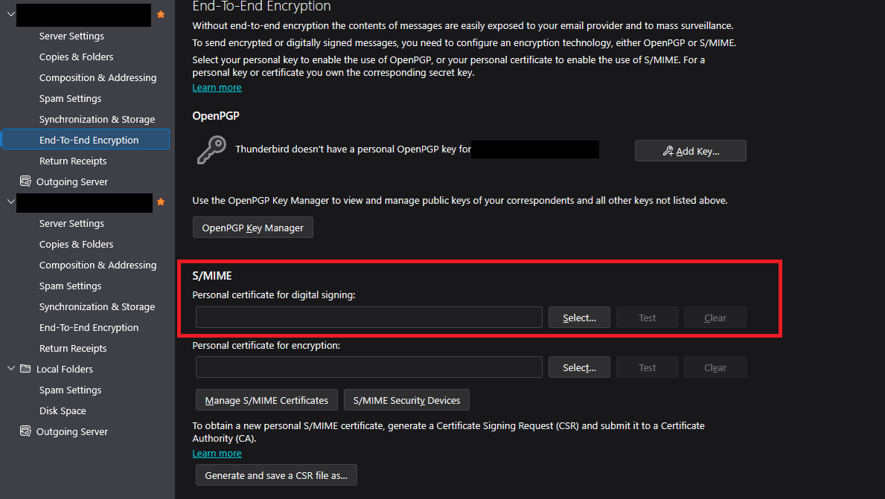

9.  Select the certificate with the description "**CITIZEN'S CARD:
    CITIZEN SIGNATURE CERTIFICATE** and click **OK**.

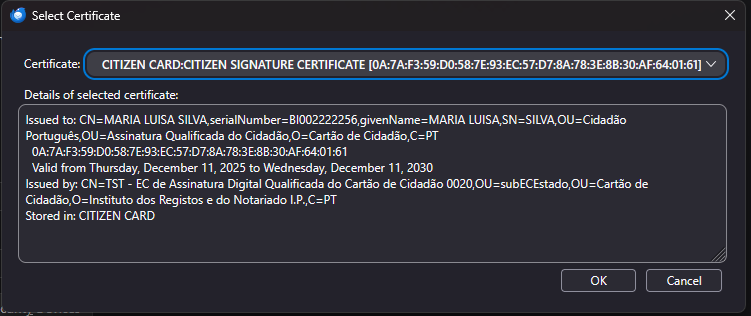

10. With Thunderbird 102 or later, in the **End-to-end encryption** tab,
    select the "Add my signature by default" box.

11. For Thunderbird to use the Citizen's Card certificate for signing,
    register and trust the root certificate of the Portuguese State's
    certification chain.

    - For cards issued from April 2020 onwards, the certificate to be
      registered is the certificate "ECRaizEstado 002" (*State Root
      CA*), available at: <http://trust.ecee.gov.pt/ecraiz002.crt>

    - For cards issued before April 2020, the certificate to be
      registered is the certificate "ECRaizEstado" available at:
      <http://trust.ecee.gov.pt/ecraiz.crt>

To import the root certificate, click "Manage certificates\..." in
the window used in point 1 and select the "Authorities" tab. Import
the correct root certificate for the card and for the question "Do
you trust "ECRaizestado/EcRaizEstado 002" for the following
purposes?" select the option: "Trust this CA to identify e-mail
users."

**Signature** - to be performed for each signed e-mail sent. Only
required for Thunderbird versions prior to version 102.

1.  Open the e-mail composition window.

2.  Upon clicking **Send**, the signature PIN shall be requested and the
    e-mail shall be signed and sent.

### Digital signature of DWF files

**NOTE: DWF file signature only supports signing with a Citizen's
Card**

1.  Firstly, install on your computer the **Autodesk Design Review
    2013** (the latest versions do not offer the digital signature
    feature).

2.  Open the DWF file in the application.

3.  Access the menu in the upper left field:

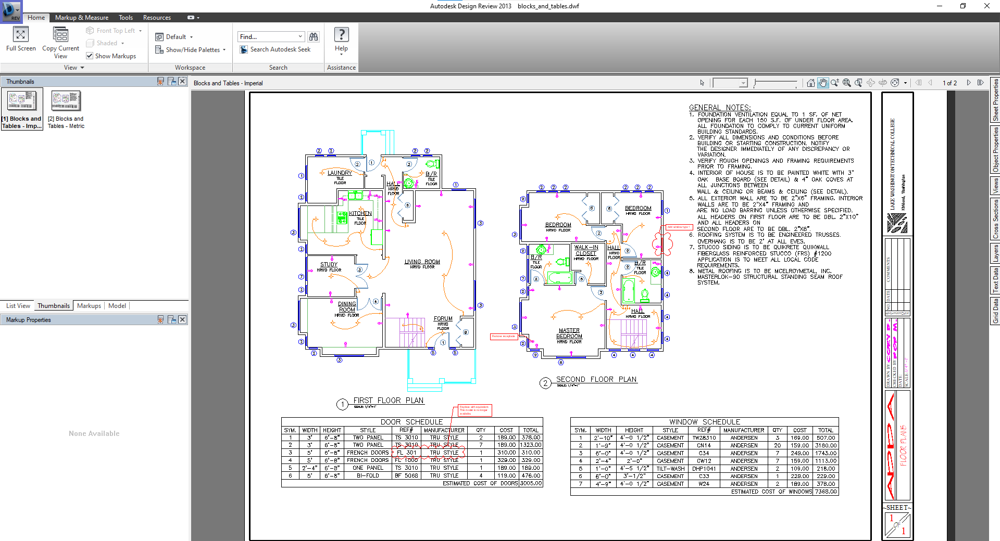

4.  Access the **Security** option:

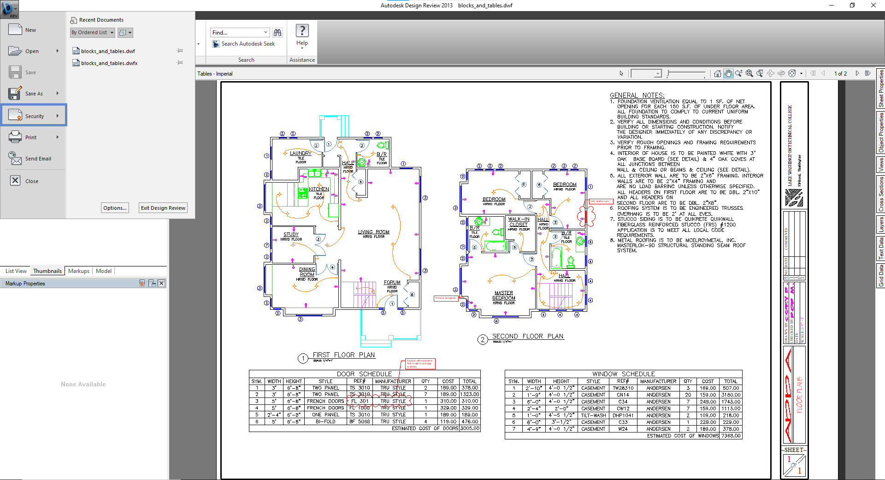

5.  Select the **Add Digital Signature** option:

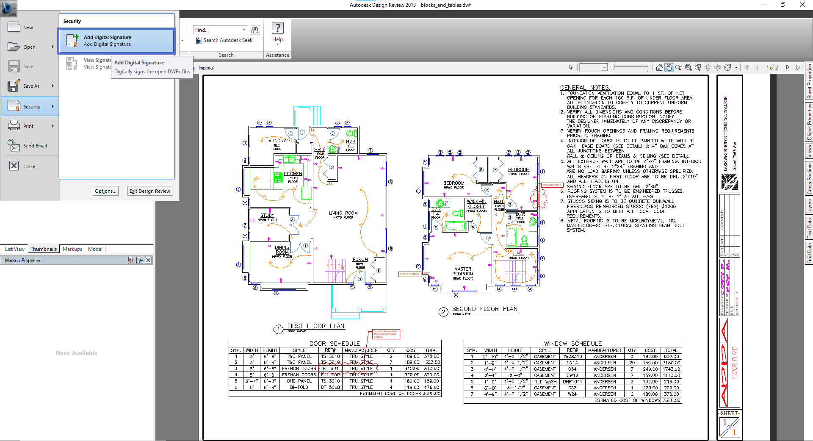

6.  This window will display the computer's current certificates; click
    **More Options** to select another certificate. Make sure the
    selected certificate matches the digital signature certificate.
    Finally, just press **OK**:

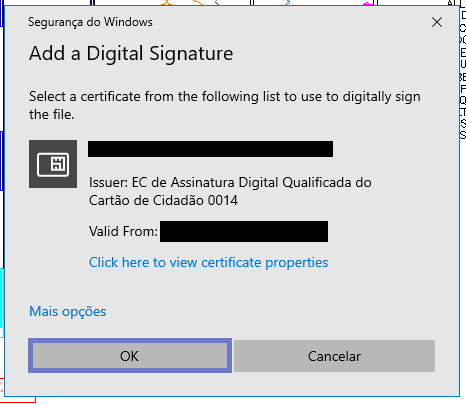

7.  Enter the signature PIN requested in the window:

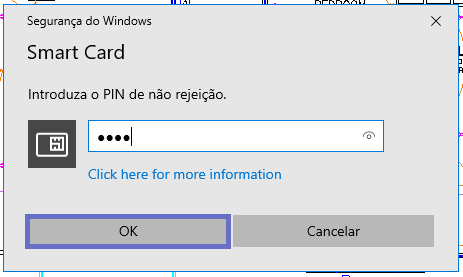

8.  After this procedure, the digital signature process is complete and
    a window will appear confirming that the signature is valid.

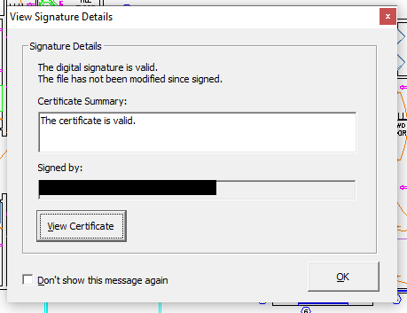

### Digital signature of DWG files

1.  Firstly, you must have an updated version of the application
    installed on the computer.

**AutoCAD** version tested was version **AutoCAD 2022**).

2.  Open the DWG file in AutoCAD

3.  Access the menu in the upper left field:

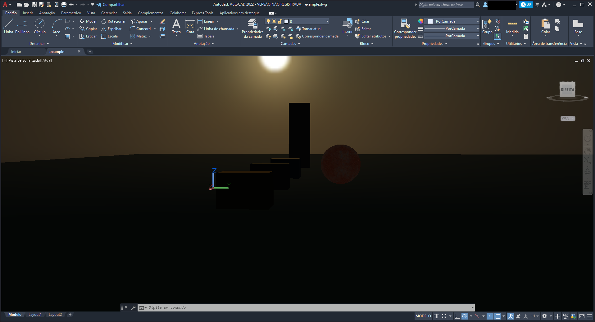

4.  Access the **Save as** option and select **Drawing**:

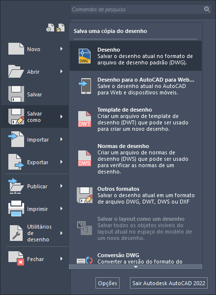

5.  Access the **Tools** option select **Digital signatures\...**:

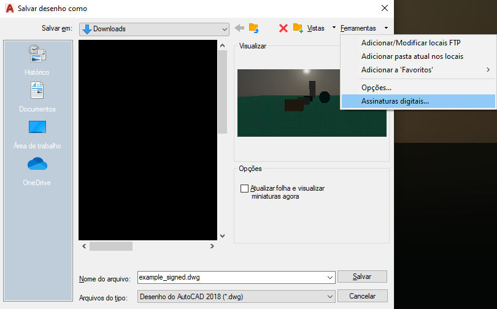

6.  Activate the checkbox **Attach a digital signature after saving the
    drawing.**. This window displays the computer's existing
    certificates; select **Digital Mobile Key CA\...** if signing with
    the Mobile Key, or **Citizen's Card Qualified Digital Signature
    CA\...** if signing with the Citizen's Card. Finally, just press
    **OK**:

**NOTE**: To sign using a Digital Mobile Key, follow the procedure of
this section [Digital signature with Digital Mobile
Key](#digital-signature-with-digital-mobile-key) .

- Digital Mobile Key:

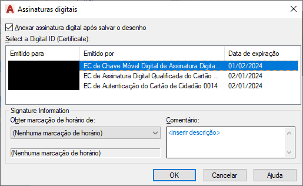

- Citizen's Card:

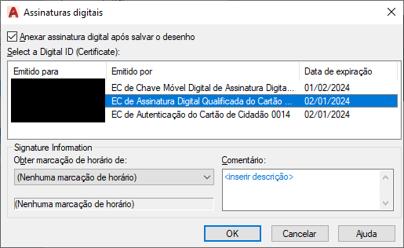

7.  If signing with the Citizen's Card, simply enter the signature PIN
    (referred to in the window as the non-repudiation PIN) and press
    **OK**. If signing with a Digital Mobile Key, the Digital Mobile Key
    signature pin shall be requested and, after entering it correctly,
    the confirmation code shall be requested, sent to the registered
    mobile phone number.

    - Digital Mobile Key:

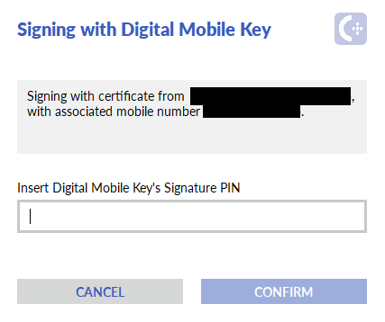

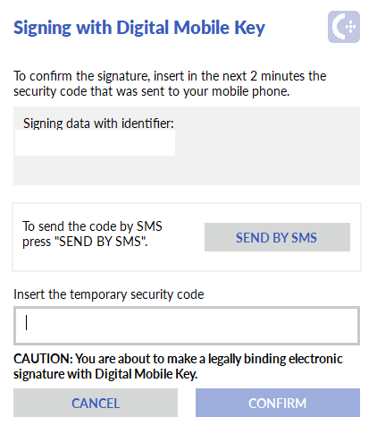

- Citizen's Card:

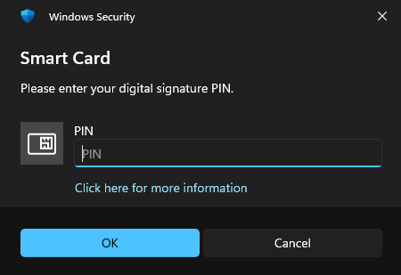

8.  After this procedure, the digital signature process is complete.
    Confirm the signature by right-clicking on the document, selecting
    **Properties** and accessing the **Digital Signature** menu:

    - Digital Mobile Key:

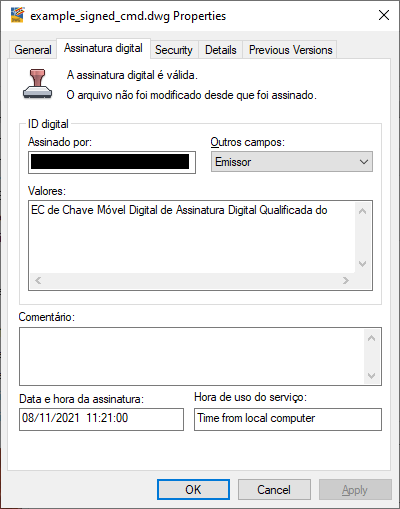

- Citizen's Card:

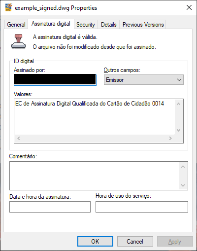

If the **Digital Signature** tab is not present, see the section
[Properties of the file
signed](#properties-of-the-file-signed-by-autocad) [by
AutoCAD.](#properties-of-the-file-signed-by-autocad)

## Authentication at WEB portals

There are two forms of authentication at a web portal using the
Citizen's Card:

- TLS authentication with client certificate via browser.

- Authentication via certificate through **Autenticação.gov.pt** portal

The authentication method depends entirely on the website's
configuration; the user cannot choose one method over another.

**Client-side certificate authentication via browser** is being
deprecated, as it presents disadvantages in data collection; however,
some websites still use this method.

To use this authentication method, the application must be installed
on the computer.

Use the Windows Operating System; the browsers *Internet Explorer*,
*Microsoft Edge* and *Google Chrome* do not require any configuration
once the Citizen authentication certificate is registered.

For *Mozilla Firefox* on any operating system, the configurations
described in "[Configure authentication for *Mozilla Firefox*](#configure-authentication-for-mozilla-firefox) should be performed.

Authentication via certificate through the autenticacao.gov.pt portal
does not require the installation of the application, but rather the
**Autenticação.Gov** plugin.

For further information, consult this help page:

- <https://autenticacao.gov.pt/fa/ajuda/autenticacaogovpt.aspx>

For a computer configuration to support either option, the
installation of the application and **Autenticação.Gov** plugin are
advised.

### Configure authentication for *Mozilla Firefox*

To configure *Mozilla Firefox*, load the PKCS#11 module from the
Citizen's Card. In version 73.0.1 (similar for other versions):

1.  Under *Mozilla Firefox* options, access **Privacy and Security**.
    You can access it directly by entering about:preferences#privacy on
    the address bar.

2.  Scroll to the bottom of the page and, in the **Certificates**
    section, press **Security devices...** to open the "Device
    Manager" window.


3.  Press **Load**. Fill in the module name, for example "PKCS#11 of
    the Citizen's Card" (avoid "ç" and "ã"). Then click **Search
    \...** and scroll to the PKCS#11 module of the Citizen's Card,
    located as described in the section [Integration with
    applications.](#integration-with-applications)

**Note:** in MacOS, copy and paste the following name into the
"Module file name" field: /usr/local/lib/libpteidpkcs11.dylib

4.  Press **OK** in the open windows to finish.

# Problem-Solving

### An error message is displayed when attempting to add the PKCS#11 module to *Firefox / Thunderbird*

To add the PKCS#11 module to Firefox, a card reader is installed on
the computer.

Make sure the reader is switched on and installed and a card is
inserted before adding the PKCS#11 module.

If using a 64-bit Linux or MacOS version, use a 64-bit version of
*Firefox* / *Thunderbird*.

### It is not possible to add the PKCS#11 module to *Adobe Acrobat Reader* in *MacOS*

In earlier versions of *Adobe Acrobat Reader* for *MacOS*, it is not possible to 
add the PKCS#11 module. 
We recommend updating *Adobe Acrobat Reader* to the DC version.

### Incompatibility of Citizen's Card signatures with Adobe Reader, *Microsoft Office* or *LibreOffice*

Access the file pteidmdrv.inf , by default in the directory
C:\Program Files\Portugal Identity

(or in the directory selected during installation). After opening the
directory, open the file options menu and select **Install**.

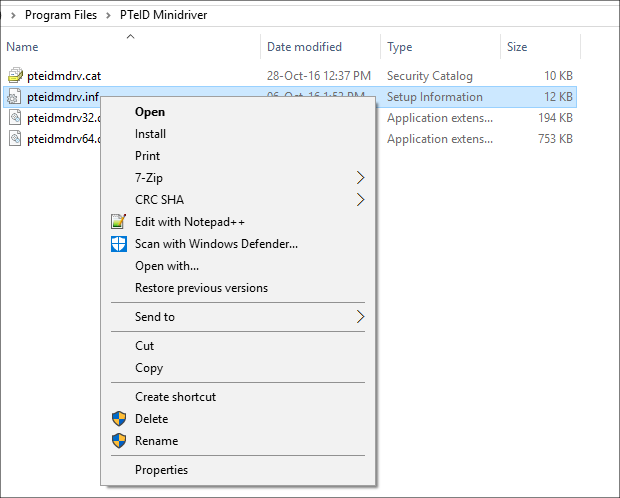

After selecting this option, a dialog box appears (see image below)
entitled "Required Files," where the "drivers" folder located in
the directory is selected.

C:\Windows\System32 .

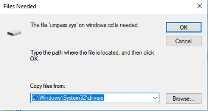

If there are issues, check whether they are related with the
topic[Issues with the new chain](#issues-with-the-new-chain-of-trust)
[of trust.](#issues-with-the-new-chain-of-trust)

## The card reader is installed but is not detected by the Citizen's Card application

### Windows

1.  Check whether the card reader is compatible with the PC/SC standard
    (consult the card reader documentation or contact the manufacturer).

2.  Check that the card reader drivers are correctly installed (refer to
    the card reader documentation).

3.  Check whether the Smart Card service is initiated:

    a)  Access to **Control Panel** and then go to **Administration
        Tools**

    b)  Click **Services**

    c)  Check whether the **Smart Card** service is initiated. If not
        initiated, right-click on the service and click**Start**.

    d)  Disconnect the reader from the computer.

    e)  Close the Citizen's Card application.

    f)  Reinsert the reader and reopen the application.

4.  If using a connection to a remote machine and the card reader is to
    be shared, check whether:

    a)  The card reader is being connected to the local computer

    b)  The **Smart Card** was selected from the list of local devices
        and resources to be used for the remote connection (See image
        below).

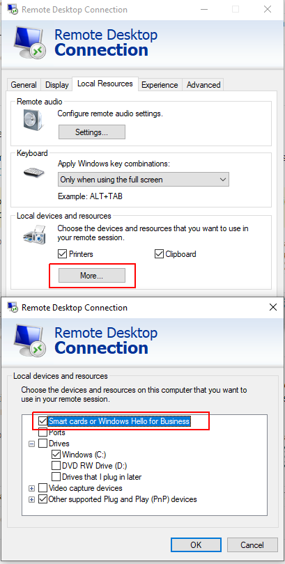

### Linux

For Ubuntu 22.04 systems, refer to note 2 of the [Linux
installation](#installation-on-linux) section

1.  Check whether the card reader is compatible with the PC/SC standard
    (consult the reader documentation or contact the manufacturer).

2.  Check that the reader drivers are correctly installed (refer to the
    reader documentation). Most smartcard readers today are supported by
    the open-source CCID driver. Additional information is available at:
    <https://ccid.apdu.fr/>

3.  Check whether **pcscd daemon** is up and running:

    a\)  In a terminal window, execute the following command:

    `ps -e | grep pcscd`

    b\)  Search for a reference to the pcscd process.

    c\)  If not listed, start the service using the command: sudo systemctl
    start pcscd

    d\)  If an error message is received, pcscd may not be installed. Use your
    Linux distribution package manager to install pcscd (sometimes it is
    included in a package called pcsc-lite).


### Failure to detect certificates during signature attempts within *LibreOffice / Apache OpenOffice***

The *LibreOffice / OpenOffice* suite in Linux uses the *Mozilla
Firefox application configurations* (or alternatively, *Thunderbird*)
for certificate detection.

For certificate detection in *LibreOffice / Apache OpenOffice Suite*,
carry out the respective configuration in *Mozilla Firefox* if this
application is installed. Otherwise, configure *Mozilla Thunderbird*
to sign documents *in LibreOffice*.

For further information, consult this help page:

- <https://help.libreoffice.org/Common/Applying_Digital_Signatures/pt>

## Graphics issues in the application

The rendering mode configured in the application during installation
provides the best performance in most cases: hardware rendering.
However, this mode requires a working OpenGL driver in the system for
the computer's graphics card.

In the event of graphics issues, changing the graphics rendering mode
is advised. Change it in the Graphics Acceleration section of the
[Application configuration submenu.](#application-configuration)

**In the event of application startup failure,** change this option in
three different ways:

1.  In the application's installation folder (which, by default, is
    `C:\Program Files\Portugal Identity Card` ) there are three
    shortcuts to open the application by changing the graphics rendering
    mode. The shortcuts are clickable icons with the application's
    symbol and the following names:

    - **Autenticação.Gov Software** for Software rendering (OpenGL);

    - **Autenticação.Gov Hardware** for Hardware rendering (graphics
      card);

    - **Autenticação.Gov Direct3d** for Software rendering (ANGLE,
      emulating OpenGL by using Direct3D);

In the event of graphical problems, or application start failure, try
all three options and choose that which works best. The last option
selected will be saved, restarting the application by clicking the
icon on the desktop or in the start menu.

2.  Using the Autenticação.gov software configurations (via Registry
    Keys in Windows or configuration file in Linux and MacOS).

    - In **Windows**, the registry key:
	**HKEY_CURRENT_USER\Software\PTEID\configuretool\graphics_acceleration**;

    - In **Linux**, the key "graphics_acceleration" in the configuretool
  section of the file:
   **$HOME/.config/pteid.conf**;

    - In **MacOS**, the key called "graphics_acceleration" in the
  configuretool section of the file:
  **$HOME/Library/Preferences/pteid.conf**.

The key may have the following values:

- 0 for Software rendering (OpenGL);

- 1 for Hardware rendering (graphics card);

- 2 (Exclusive to Windows) for Software rendering (ANGLE, emulating
  OpenGL by using Direct3D).

3.  Using the [Command-line interface.](#command-line-interface)

In business environments, change this configuration as described in
the chapter [Configuration instructions in business environments](#configuration-instructions-in-business-environments)

## Issues with integrated graphics cards

When experiencing issues with graphics cards, refer to the topic
[Graphics issues in the application.](#graphics-issues-in-the-application)

## The application interface does not support move or drag operations (Linux in Wayland)

In Linux systems using a Wayland-based graphics interface system,
several interaction problems have been detected, including the
inability to move the window by dragging it from the title bar.

The following temporary solution is advised, assuming there is a
XWayland component:

Use the parameter -platform xcb , or the environment variable
QT_QPA_PLATFORM=xcb to force the application to run in X11 mode, using
XWayland.

$ eidguiV2 -platform xcb

or

$ QT_QPA_PLATFORM=xcb eidguiV2

## Application start-up failure

When the application fails to start up,, change the application
options using the Autenticação.gov software configurations (via
Registry Keys in Windows or the configuration file in Linux and
MacOS).

One potential cause of issues is related with the computer's graphics
card; see the topic [Graphics issues in the application.](#graphics-issues-in-the-application)

## Issues with the new chain of trust

Citizen's Card certificates have been issued since 4 April 2020,
under the new chain of trust of the Portuguese State. The root
certificate of the new chain, if not provided by the operating system,
is installed to ensure that the certificates of cards issued after
said date are automatically trusted by the Windows operating system,
as well as by some applications not using the list of trusted services
published by the European Union.

Install the certificate from the Windows Store through the Citizen's
Card application in the [Signature configuration submenu.](#signature-configuration) Click the **Install certificate**
button in the section **New State Root Certificate**. The certificate
shall be added to the Trusted Root Certification Authorities Store
associated with the Current User. **Note:** The automatic certificate
installation feature is only available as from version 3.4.0 of the
application onwards; earlier versions require the manual method
described below.

Alternatively, install the certificate manually by following the
instructions in the SCEE (*State Electronic Certification System*)
chain installation manual available at
[https://www.ecce.gov.pt/certificados/](https://www.ecce.gov.pt/certificados/).
Follow the specific instructions for the State Electronic
Certification Entity Certificate - ECRaizEstado 002 (steps 4.1 to 4.10
of the manual).

## Issues validating signatures

In the event of validation problems in Adobe Acrobat Reader, for
example, when receiving the message "Signature validity is UNKNOWN"
in a signature generated with the Mobile Key or Citizen's Card, using the
alternative [ARTE Signature Validation Service](https://validador.autenticacao.gov.pt/validation) is advised.

This service validates signatures according to European
standards for qualified electronic signatures. The documents submitted
**are not saved** on the server after processing.

## Issues with unsupported PDF files

The Autenticação.Gov application currently does not support the
following types of PDF files:

- Encrypted PDF files;

- PDF files containing XFA forms (created, for example, in the *Adobe
  LiveCycle* application).

The signing of these files with the Citizen's Card or Digital Mobile
Key is possible using an external application, for example, *Adobe
Acrobat Reader*. Follow the steps described in the section [Digital
signature in *Adobe Acrobat Reader*](#digital-signature-in-adobe-acrobat-reader) .

## Error in communication when signing with a Digital Mobile Key

These incidents usually involve citizen connection to a corporate
network. In this eventuality, there is probably a security gateway or
HTTPS proxy on the network filtering HTTPS traffic and interfering
with the connection to the signature service using a Digital Mobile
Key.

Ask your company or organisation network administrator or IT support
team to configure an exception to the HTTPS traffic filtering for the
**Digital Mobile Key Signature** service. The necessary information is
in the section below [Online services used by the
application.](#online-services-used-by-the-application) We advise you
to add the addresses of the various online services used by the
application to the exceptions list.

## Online services used by the application

Some application features require a connection to online services to
function correctly. It shall thus be ensured that there is no
*firewall* or other *software* on the local network preventing
connection to these services.

The *hostnames* and respective ports used are listed below by feature.

** Authentication with Digital Mobile Key:**

- cmd.autenticacao.gov.pt (port 443)

**Certificate validation:**

OCSP Servers:

- ocsp.ecee.gov.pt (port 80 and 443)
- ocsp.multicert.com (port 80)
- ocsp.root.cartaodecidadao.pt (port 80)
- ocsp.auc.cartaodecidadao.pt (port 80)
- ocsp.asc.cartaodecidadao.pt (port 80)
- ocsp.asc.pki2.cartaodecidadao.pt (port 80)
- ocsp.asc.pki2.cartaodecidadao.pt (port 80)
- ocsp.root.pki2.cartaodecidadao.pt (port 80)

CRL Servers:

- crls.ecee.gov.pt (port 80)
- pkiroot.multicert.com (port 80)
- pki.cartaodecidadao.pt (port 80)
- pki2.cartaodecidadao.pt (port 80)

**Signature with Professional Attributes:**

- scap.autenticacao.gov.pt (port 443)
- autenticacao.gov.pt (port 443) (only for loading with CMD)

**Reading online address:**

- morada.cartaodecidadao.pt (port 443)
- morada2.cartaodecidadao.pt (port 443)

**Application update:**

- autenticacao.gov.pt (port 443)
- aplicacoes.autenticacao.gov.pt (port 443)

**Certificate and news updates:**

- raw.githubusercontent.com
  - When downloading the file at
    https://raw.githubusercontent.com/amagovpt/autenticacao.gov/master/pteid-mw-pt/_src/eidmw/news.json
    
- github.com
  - URLs in the following format:
    https://github.com/amagovpt/autenticacao.gov/blob/master/pteid-mw-pt/_src/eidmw/misc/certs/FILENAME

**Documentation:**

- URLs in the following format:
  https://amagovpt.github.io/docs.autenticacao.gov/FILENAME

**Timestamp (by default):**
- ts.cartaodecidadao.pt (port 80)

## Obtaining the report for analysis via the Configurations menu

To enable the technical analysis of issues with the
**Autenticação.gov** application, a **Support Report** is created.
This **Support Report** contains log files with information about the
application's operation, essential for diagnosing any issues.

To obtain the **Support Report**:

1.  Open the application and navigate to the menu. **Configurations -> Application Configurations**.

2.  In the "Diagnostic Mode" section, select the option **Activate diagnostic mode**.

3.  Restart the application.

4.  After restarting, the application indicates the active diagnostic
    mode in the application's top bar, and the bar colour changes to
    red. See image below.

5.  Repeat the action that resulted in the error/issue. With the
    diagnostic mode enabled, the information about the error/issue
    contained in the log files shall be more detailed.

6.  Navigate back to the menu **Configurations ->Application Configurations**.

7.  Press the **Create report** button. Upon pressing the **Create
    report** button, a zip file containing the application's log files
    is created on the Desktop, with a name of the type:
    **Autenticacao.gov_logs_DATA.zip**.

8.  Finally, send this zip file, along with a detailed description of
    the issue, to the support contact at the e-mail
    [**cartaodecidadao@irn.mj.pt**](mailto:cartaodecidadao@irn.mj.pt).

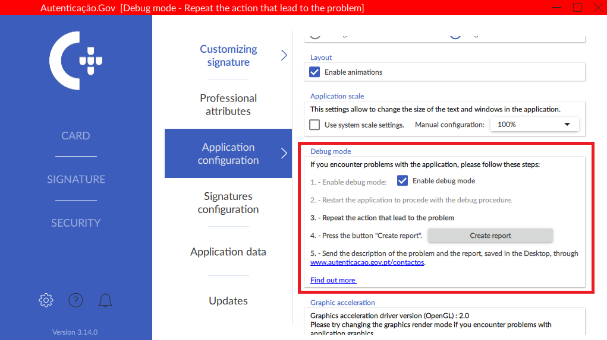

## Removing metadata from PDF files

Removing metadata from PDF files, for example through the "Print to
PDF" option on some browsers, can remove existing digital signatures
in the file, even if the visual seal remains.

Consequently, any required metadata removal using this or a similar
process, must precede the digital signing process.

## Properties of the file signed by AutoCAD

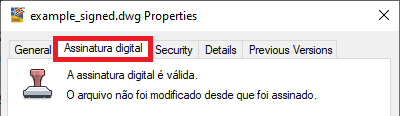

If the **Digital Signature** tab is absent from the signed file
properties, the procedures outlined in the following webpage must be
implemented: [Autodesk]{.underline}

# Command-line interface

When run from the command line, the Autenticação.gov desktop
application supports several modes and options described in the
following subsections.

## Consult help and version

The *\--help* (or *-h)* option allows the viewing of the available
options on the command line for each mode. The installed version can
be viewed with *\--version* (or *-v*).

Example (Linux):

$ eidguiV2 -h

## Shortcut to configure graphics rendering mode

Configure the graphics rendering mode using one of the following
options:

- *-w*: (Exclusive to Windows) for Software rendering (ANGLE, emulating
  OpenGL by using Direct3D).

- *-s*: for Software rendering (OpenGL);

- *-*c: for Hardware rendering (Graphics card) (Default value);

In the event of graphics issues, or application start failure, try all
three options and choose that which works best. The last option chosen
shall be saved, restarting the application by clicking the icon on the
desktop, in the start menu, or even via the command line without
specifying this parameter.

When experiencing issues with graphics cards, refer to the topic
[Graphics issues in the
application.](#graphics-issues-in-the-application) Example (Linux):

$ eidguiV2 -c

Example (Windows):

$ "C:\Program Files\Portugal Identity Card\pteidguiV2.exe" -c

## Shortcut to signature submenu

Through the command-line interface, the application can be started
directly from the digital signature submenu.

The shortcut to the signature submenu (*sign*) requires the paths to
the files to be loaded for signing.

The following options are supported:

- *\--destination DESTINATION* (*-d DESTINATION*): configures the
  destination folder for the signed file. Destination folder shall not
  be requested from the user upon signing.

- *\--tsa*: activates the signature with timestamp;

- *\-- reason REASON* (*-r REASON*): configures the 'reason' field of
  the signature;

- *\-- location LOCATION* (*-l LOCATION* ): configures the 'location'
  field of the signature.

Examples (Linux):

$ eidguiV2 sign -d /home/user/Documents/ficheiro.pdf

$ eidguiV2 sign \--tsa -m "motivo" -l "localidade" -d
/home/user/Documents/ \ ficheiro1.pdf \... ficheiroN.pdf

Example (Windows):

> "C:\Program Files\Portugal Identity Card\pteidguiV2.exe" sign^
-d C:\Users\USER\Documents ficheiro.pdf

**Note:** Parameters containing whitespace characters must be enclosed
in quotation marks. For example (Linux):

$ eidguiV2 sign -d /home/user/Documents/ "ficheiro para
assinar.pdf"

# Configuration instructions in business environments

## Configurations via Windows registry keys

The Autenticação.gov software configurations are saved in *Windows* in
registry keys. Changes made by the user to the graphics interface
override the default values and are stored in sub-keys of:

`HKCU\Software\PTEID`

A standardised installation is configured by adding some values to the
*Windows* registry for all computer users after software installation,
using the keys listed below, sub-keys of the root key:
**`HKLM\Software\PTEID`**

**Note:** The following registry entries MUST never be removed or altered:

`HKLM\Software\PTEID\general\install_dirname`

`HKLM\Software\PTEID\general\certs_dir`

The following registry entries can be added:

- `HKLM\Software\PTEID\logging\log_level`
  - **Type:** String (`debug`, `info`, `warning`, `error`)
  - **Description:** Level of detail in the Middleware and application logs.
  - **Default value:** `error`

- `HKLM\Software\PTEID\logging\log_dirname`
  - **Type:** String
  - **Description:** Directory where middleware and application log files are generated.
  - **Default value:** `C:\Program Files\Portugal Identity Card\log`

- `HKLM\Software\PTEID\logging\log_prefix`
  - **Type:** String
  - **Description:** Prefix for the name of the log files.
  - **Default value:** `.PTEID_`

- `HKLM\Software\PTEID\general\admin_config`
  - **Type:** Number (`0` / `1`)
  - **Description:** Enable (`1`) or disable (`0`) the administrator configuration, forcing the use of the proxy configured by the administrator in the proxy registration section in HKLM. Consequently, user-entered values are ignored and the proxy configuration is disabled in the application settings.
  - **Default value:** `0` (disabled)

- `HKLM\Software\PTEID\general\cache_dirname`
  - **Type:** String
  - **Description:** Directory where the Middleware and application cache is stored.
  - **Default value:** `C:\Users[User]\AppData\Roaming\.pteid-ng`

- `HKLM\Software\PTEID\general\cache_enabled`
  - **Type:** Number (`0` / `1`)
  - **Description:** Enable (`1`) or disable (`0`) the cache for Citizen's Card data.
  - **Default value:** `1` (active)

- `HKLM\Software\PTEID\general\scap_host`
  - **Type:** String
  - **Description:** Hostname of the Professional Attributes Service (SCAP).
  - **Default value:** `scap.autenticacao.gov.pt`

- `HKLM\Software\PTEID\general\scap_port`
  - **Type:** Number (`1` to `65535`)
  - **Description:** Professional Attributes Service port (SCAP).

- `HKLM\Software\PTEID\general\use_pinpad`
  - **Type:** Number (`0` / `1`)
  - **Description:** Use PINPAD feature.
  - **Default value:** `1` (Yes)

- `HKLM\Software\PTEID\general\auth_pin_cache_normal`
  - **Type:** Number (`0` / `1`)
  - **Description:** Authentication PIN caching via Minidriver.
  - **Default value:** `0` (No). For versions prior to `3.1.0`, the default value is `1`.
  - **Configurable from version:** `3.1.0`

- `HKLM\Software\PTEID\configuretool\start_autoupdate`
  - **Type:** Number (`0` / `1`)
  - **Description:** Check for software or certificate updates upon application start-up and notify the user.
  - **Default value:** `1` (Yes)

- `HKLM\Software\PTEID\configuretool\graphics_accelaration`
  - **Type:** Number (`0` / `1` / `2` (only in Windows))
  - **Description:** Graphics rendering mode. `0` for software rendering (OpenGL), `1` for hardware rendering (graphics card), or `2` for software rendering (ANGLE emulating OpenGL using Direct3D).
  - **Default value:** `1` (Graphics card)

- `HKLM\Software\PTEID\configuretool\start_with_windows`
  - **Type:** Number (`0` / `1`)
  - **Description:** Start the application with Windows.
  - **Default value:** `1` (Yes)

- `HKLM\Software\PTEID\configuretool\registrate_certificate`
  - **Type:** Number (`0` / `1`)
  - **Description:** Register certificates in Windows by inserting the card. The certificate registration and removal options require this application to be running (minimised or maximised).
  - **Default value:** `1` (Yes)

- `HKLM\Software\PTEID\configuretool\remove_certificate`
  - **Type:** Number (`0` / `1`)
  - **Description:** Remove Windows certificates by removing the card.
  - **Default value:** `0` (No)

- `HKLM\Software\PTEID\proxy\use_system_proxy`
  - **Type:** Number (`0` / `1`)
  - **Description:** Use the proxy server defined in Windows/MacOS.
  - **Default value:** `1` (Yes)

- `HKLM\Software\PTEID\proxy\proxy_host`
  - **Type:** String (hostname or IP address)
  - **Description:** Proxy server address.

- `HKLM\Software\PTEID\proxy\proxy_port`
  - **Type:** Number (`1` to `65535`)
  - **Description:** TCP port of proxy server.


- `HKLM\Software\PTEID\certificatecache\cert_cache_validity`
  - **Type:** Number (`0` to `2147483647`)
  - **Description:** Local cache time (in seconds) of the certificate validity status.
  - **Default value:** `60`

- `HKLM\Software\PTEID\xsign\tsa_url`
  - **Type:** String
  - **Description:** Timestamp server used for signing documents in the format `http(s)://HOST:PORTO`
  - **Default value:** `http://ts.cartaodecidadao.pt/tsa/server`

## Configurations via configuration file on Linux and MacOS

The Autenticação.gov software configurations are saved in a
configuration file on Linux and MacOS. This configuration file is
located at the following path:

**Linux:** `$HOME/.config/pteid.conf`

**MacOS:** `$HOME/Library/Preferences/pteid.conf`

where **HOME** indicates the system user's Home directory.

The file format follows the [INI format](https://en.wikipedia.org/wiki/INI_file) with the respective
configuration section indicated by a tag. The values specified in each
section/tag are those indicated in the previous table for
[Configurations via Windows registry keys.](#configurations-via-windows-registry-keys)

For example, to manually enable diagnostic mode, the following 2 lines should be added to the file:
```
[logging]
log_level=debug
```

## Automated installation in Windows environments

To install the software automatically, follow this procedure (with
administrator privileges):

1.  Add the *codesigning* certificate of AMA (Agency for Administrative
    Modernization) to Store Trusted Publishers associated with the Local
    Computer via the MMC tool or via the following command:

`certmgr -add AMA\_codesigning.cer -c -s -r localMachine TrustedPublisher`

The certificate is obtained from the MSI installer by viewing the file
signature in the context menu at:

### Properties -> Digital Signatures -> Details

2.  If the operating system is *Windows 7,* a *Hotfix* provided by
    *Microsoft* is installed to resolve any mismatch with the software
    codesigning certificate. Follow the instructions in this article:

[https://support.microsoft.com/en-us/help/2921916/the-untrusted-publisher-dialog-box-appears-](https://support.microsoft.com/en-us/help/2921916/the-untrusted-publisher-dialog-box-appears-when-you-install-a-driver-i)
[when-you-install-a-driver-i](https://support.microsoft.com/en-us/help/2921916/the-untrusted-publisher-dialog-box-appears-when-you-install-a-driver-i)

3.  Having already obtained the installer in MSI format, install the
    software without user interaction using the following command:

msiexec /i Autenticacao.gov-xxx.msi /qn

To avoid restarting the system after installation, the parameter
*/norestart* is added to the command.

## Information about proxy servers

### Configuration in *Windows*

If the computer in question has a proxy correctly configured in
Windows, either by IP/Hostname + Port or via an auto-configuration script (PAC file), no
configuration is required in the application.

The current software version does not support certain proxy server
configurations, specifically those requiring NTLM or Kerberos
authentication. To use features that require internet access (address
reading,, certificate validation, signature with professional
attributes or signature with Mobile Key), in these environments a
network reconfiguration or the use of an open proxy or one with Basic
authentication shall be necessary.

### Configuration in *MacOS*

In MacOS, system proxy is supported, but only if configured by
IP/Hostname + Port.

# User Notes

Drawn up by the Portuguese State

(Agência para a Modernização Administrativa, IP and Instituto dos
Registos e do Notariado, IP (*Institute of Registries and Notaries*))

© Copyright (C) 2010-2021 false
